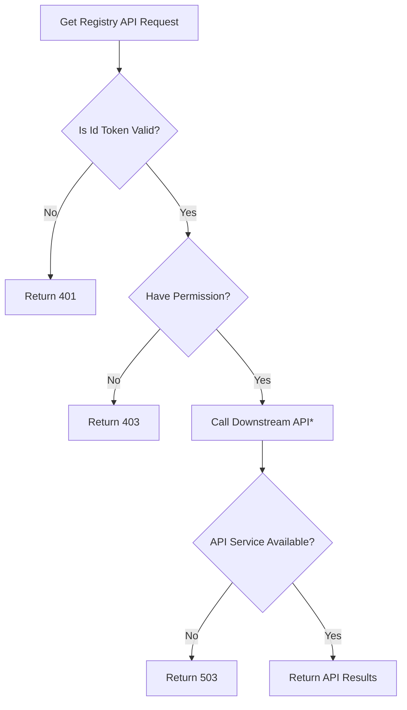

# Feathr Registry Access Control Gateway Specifications

## Registry API with Access Control Gateway

**Access Control Gateway** is an access control **Plugin** component of feature registry API. It can work with different type of backend registry. When user enables this component, registry requests will be validated in a gateway as below flow chart:



If Access control plugin is NOT enabled, the flow will directly **Call Downstream API\***.

## Access Control Registry API

- For all **get** requests, check **read** permission for certain project.
- For all **post** request, check **write** permission for certain project.
- For all **access control management** request, check **manage** permission for certain project.
- In case of feature level query, will verify the parent project access of the feature.
- Registry API calls and returns will be transparently transferred.

## Management Rules

### Initialize `userroles` table

Users needs to create a `userroles` table with [schema.sql](scripts/schema.sql) at the very first place. The process will be similar with SQL Registry `bacpac` initialization.

### Initialize `userroles` records

In current version, user needs to manually initialize `userroles` table in SQL database with [schema.sql](scripts/schema.sql) and insert global admin roles.
You can add `[your-email-account]` as global admin with the following SQL script in [Azure portal query editor](https://docs.microsoft.com/en-us/azure/azure-sql/database/connect-query-portal?view=azuresql)

```SQL
insert into userroles (project_name, user_name, role_name, create_by, create_reason, create_time) values ('global', '[your-email-account]','admin', '[your-email-account]', 'Initialize First Global Admin',  getutcdate())
```

When a feathr project is created though rbac protected registry API, default project admin role will be assigned to the creator.
Admin roles can add or delete roles in management UI page or through management API under certain scope.

### Environment Settings

`ENABLE_RBAC` needs to be set to deploy a registry backend with access control plugin.

| Variable            | Description                                                                      |
| ------------------- | -------------------------------------------------------------------------------- |
| RBAC_CONNECTION_STR | Connection String of the SQL database that host access control tables, required. |
| RBAC_API_BASE       | Aligned API base                                                                 |
| RBAC_REGISTRY_URL   | The downstream Registry API Endpoint                                             |
| RBAC_AAD_INSTANCE   | Instance like "https://login.microsoftonline.com"                                |
| RBAC_AAD_TENANT_ID  | Used get auth url together with `RBAC_AAD_INSTANCE`                              |
| RBAC_API_AUDIENCE   | Used as audience to decode jwt tokens                                            |

## Notes
Please notice that User Role records are **NOT** case sensitive. All records will be converted to lower case before saving to database.
Supported scenarios status are tracked below:

- General Foundations:
  - [x] Access Control Abstract Class
  - [x] API Spec Contents for Access Control Management APIs
  - [x] API Spec Contents for Registry API Access Control
  - [x] Separate Registry API and Access Control into different implementation
  - [x] A docker file to contain all required component for deployments
- SQL Implementation:
  - [x] `userroles` table CRUD through FastAPI
  - [x] `userroles` table schema & test data, could be used to make `.bacpac` file for SQL table initialize.
  - [x] Initialize default Project Admin role for project creator
  - [ ] Initialize default Global Admin Role for workspace creator
- UI Experience
  - [x] `management` page for project admin to make CUD requests to `userroles` table
  - [x] Use id token in Management API Request headers to identify requestor
- Future Enhancements:
  - [x] Support AAD Application token
  - [x] Support OAuth tokens with `email` attributes
  - [x] Functional in Feathr Client
  - [ ] Add Access Control Dev Guide (include deployment tips)
  - [ ] Add Access Control User Guide (UI & Client Experience)
  - [ ] Support AAD Groups
  - [ ] Support Other OAuth Providers

## Access Control Management APIs

### UserRole

| Field        | Comments                                     |
| ------------ | -------------------------------------------- |
| scope        | Project name or `global`                     |
| userName     | User email or APP ID                         |
| roleName     | Admin or Producer or Consumer                |
| createBy     | The admin user name who assigned this role   |
| createReason | The reason for this role assignment          |
| createTime   | Auto generated during record creation        |
| deleteBy     | For audit purpose, not used in API returns   |
| deleteReason | For audit purpose, not used in API returns   |
| deleteTime   | Auto generated when record marked as deleted |
| access       | A list of permissions of this role           |

### `GET /userroles`

Get `userrole` records of projects that requestor has `manage` access.

- Response Type: [`UserRole`](#userrole)

### `POST /users/{user}/userroles/add `

Create a new role assignment

- Request Params:
  - project: project name or `global`
  - user: user email or app id
  - role: admin or producer or consumer
  - reason: create reason

### `DELETE /users/{user}/userroles/delete`

Delete an existing role assignment

- Request Params:
  - project: project name or `global`
  - user: user email or app id
  - role: admin or producer or consumer
  - reason: delete reason
