# BUSINESS FOR BDP PLATFORM 业务系统

数据平台的业务系统：大数据应用层业务系统

1、美团Logan埋点

2、采集中心代码编写

3、维护kafka集群

4、日志消费系统

5、爬虫采集系统

6、ETL清洗入ES, HBase

7、电商分析

8、上线demo

9、开源大数据平台

```markdown
1、首页：

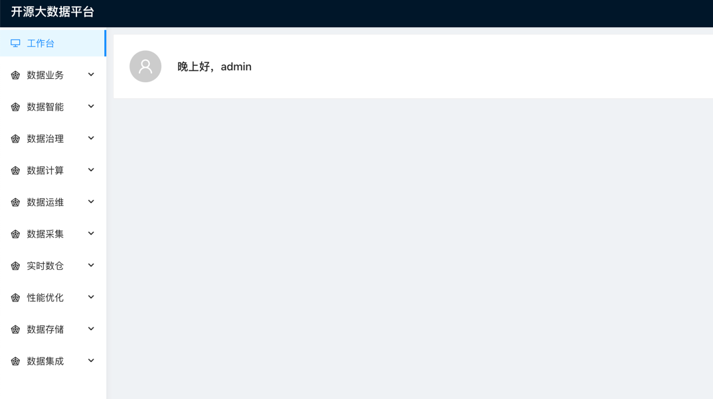

2、数据业务：

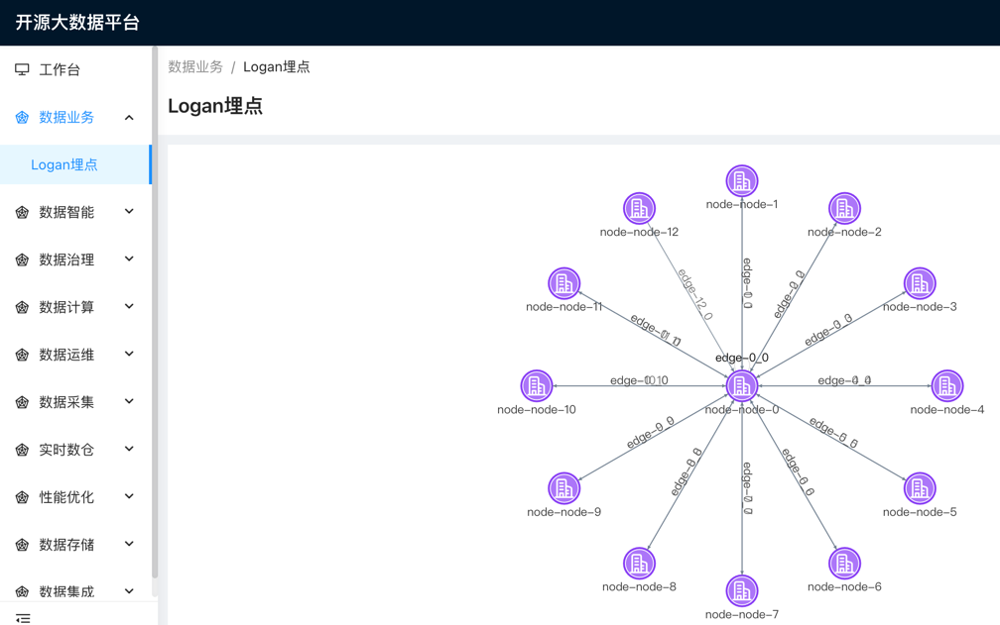

3、数据计算：

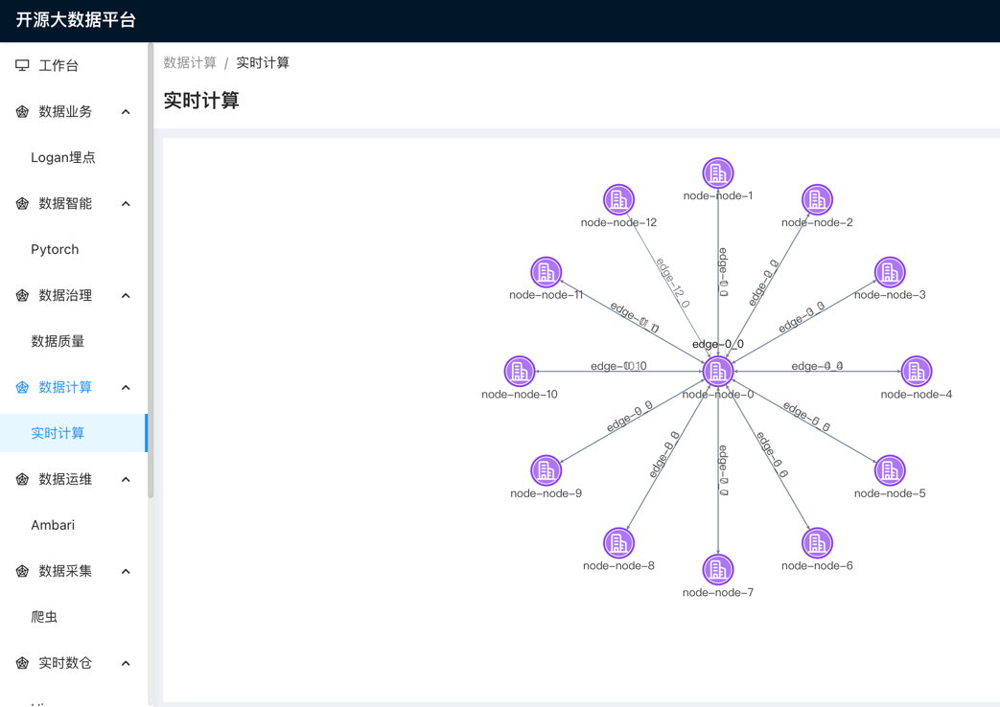

4、数据运维：

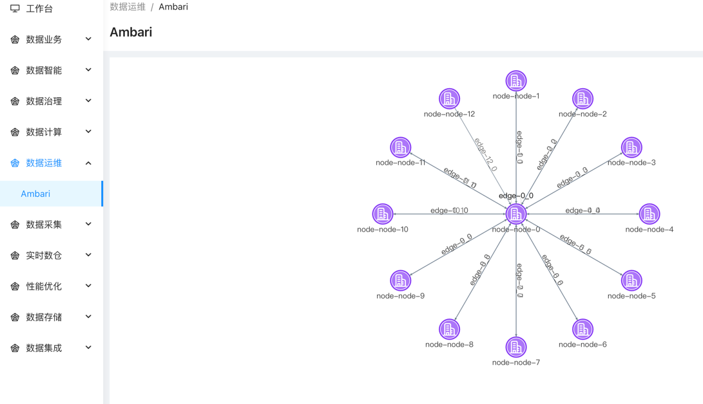

5、数据治理：

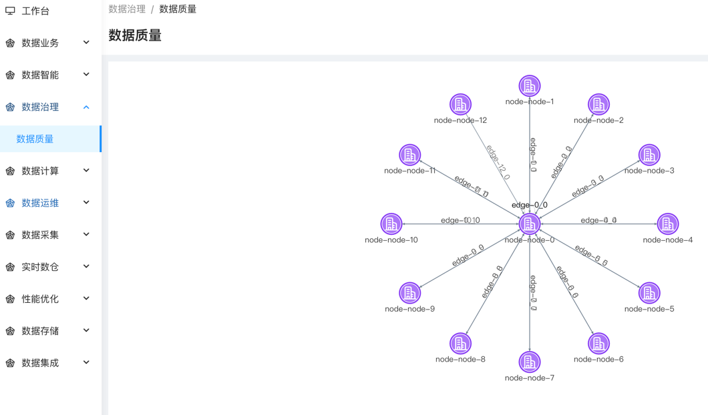

6、数据集成：

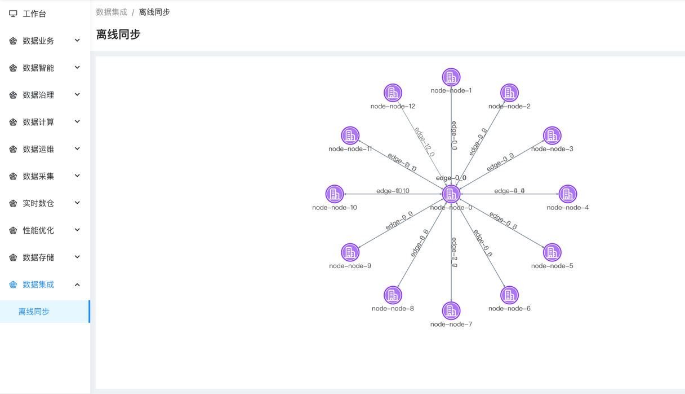

7、数据智能：

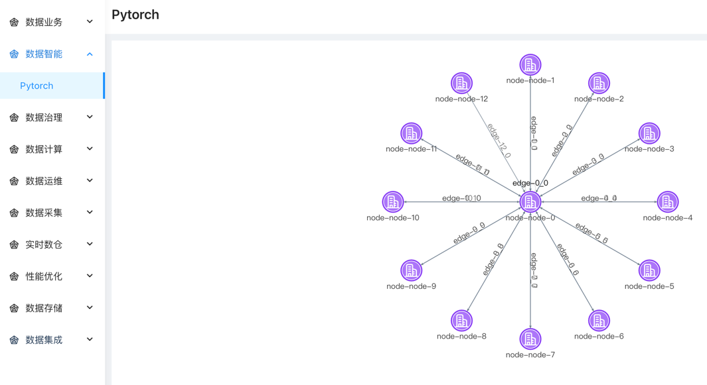

8、数据采集：

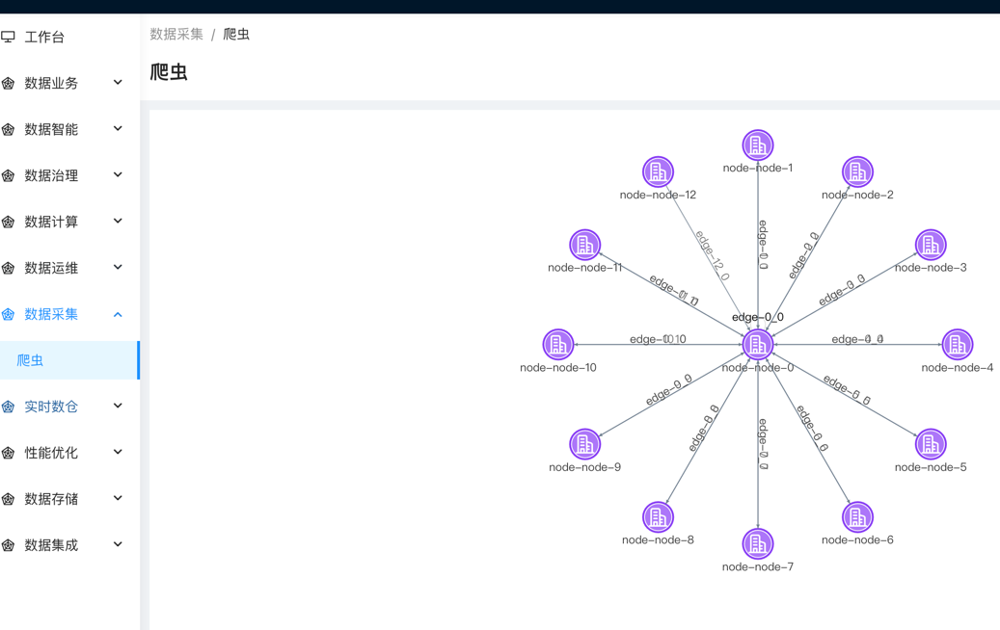

9、实时数仓：

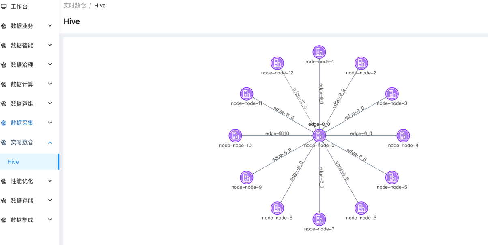

10、性能优化：

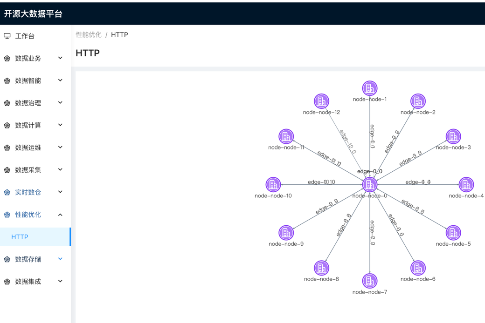

11、数据存储：

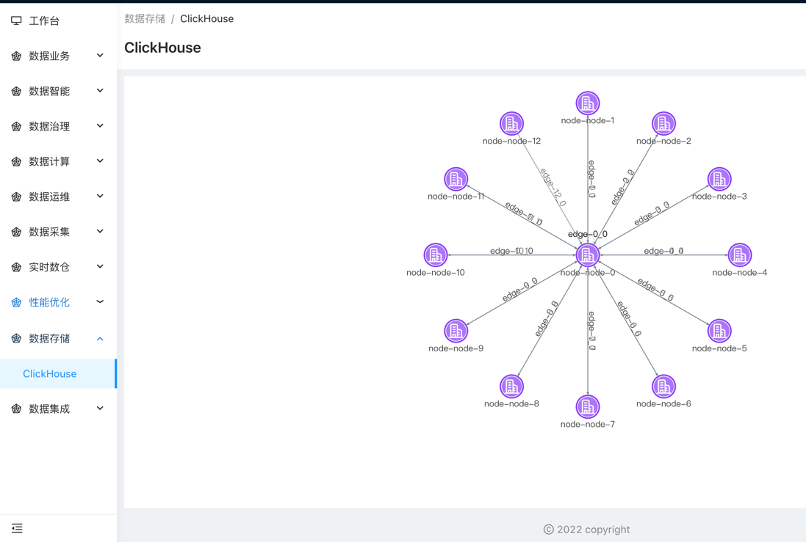

```