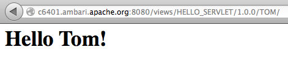

<!---
Licensed to the Apache Software Foundation (ASF) under one or more
contributor license agreements.  See the NOTICE file distributed with
this work for additional information regarding copyright ownership.
The ASF licenses this file to You under the Apache License, Version 2.0
(the "License"); you may not use this file except in compliance with
the License.  You may obtain a copy of the License at [http://www.apache.org/licenses/LICENSE-2.0](http://www.apache.org/licenses/LICENSE-2.0)

Unless required by applicable law or agreed to in writing, software
distributed under the License is distributed on an "AS IS" BASIS,
WITHOUT WARRANTIES OR CONDITIONS OF ANY KIND, either express or implied.
See the License for the specific language governing permissions and
limitations under the License.
-->

Hello Servlet View Example
========
Description
-----
The Hello Servlet view is a very simple view example.  Like the HelloWorld view example, it demonstrates the basics of how to write and deploy a view in Ambari but also include instance parameters and a servlet for a dynamic UI.  The Hello Servlet view displays a Hello world! message that is customized based on the properties of the view instance and the view context.

Package
-----

All views are packaged as a view archive.  The view archive contains the configuration file and various optional components of the view.

#####view.xml

The view.xml file is the only required file for a view archive.  The view.xml is the configuration that describes the view and view instances for Ambari.

      <view>
        <name>HELLO_SERVLET</name>
        <label>The Hello Servlet View!</label>
        <version>1.0.0</version>
        <parameter>
          <name>name</name>
          <description>The name for the greeting. Defaults to current user.</description>
          <required>false</required>
        </parameter>
        <instance>
          <name>USER</name>
        </instance>
        <instance>
          <name>TOM</name>
          <property>
            <key>name</key>
            <value>Tom</value>
          </property>
        </instance>
        <instance>
          <name>JERRY</name>
          <property>
            <key>name</key>
            <value>Jerry</value>
          </property>
        </instance>
      </view>

The configuration in this case defines a view named HELLO_SERVLET that has a multiple instances.  You can see that the view includes an optional parameter called name.  Each view instance may assign a property value to the name parameter.  In this case the view instances TOM and JERRY both assign a name value, while the instance USER does not.

#####WEB-INF/web.xml
The web.xml is the deployment descriptor used to deploy the view as a web app.  The Java EE standards apply for the descriptor.  We can see that for this example a single servlet is mapped to the root context path.

      <servlet>
        <servlet-name>HelloServlet</servlet-name>
        <servlet-class>org.apache.ambari.view.hello.HelloServlet</servlet-class>
      </servlet>
      <servlet-mapping>
        <servlet-name>HelloServlet</servlet-name>
        <url-pattern>/</url-pattern>
      </servlet-mapping>

#####HelloServlet.java

The servlet HelloServlet will be deployed as part of the view and mapped as described in the web.xml.

Notice that we can access the view context in the servlet by obtaining it as a servlet context attribute in the init() method.

      private ViewContext viewContext;

      @Override
      public void init(ServletConfig config) throws ServletException {
        super.init(config);

        ServletContext context = config.getServletContext();
        viewContext = (ViewContext) context.getAttribute(ViewContext.CONTEXT_ATTRIBUTE);
      }

If we take a look at the doGet() method of the servlet we see that the Hello message is customized to the name value specified as an instance property.  This means that each view instance may show a different greeting.  The default if no name property value is specified is the current user name.  The instance property values can be obtained from the view context.

      protected void doGet(HttpServletRequest request, HttpServletResponse response) throws IOException {
        response.setContentType("text/html");
        response.setStatus(HttpServletResponse.SC_OK);

        PrintWriter writer = response.getWriter();

        Map<String, String> properties = viewContext.getProperties();

        String name = properties.get("name");
        if (name == null) {
          name = viewContext.getUsername();
          if (name == null || name.length() == 0) {
            name = "world";
          }
        }
        writer.println("<h1>Hello " + name + "!</h1>");
      }

Build
-----

The view can be built as a maven project.

    cd ambari-views/examples/hello-servlet-view
    mvn clean package

The build will produce the view archive.

    ambari-views/examples/hello-servlet-view/target/hello-servlet-view-1.0.0.jar

Deploy
-----
To deploy a view we simply place the view archive in the views folder of the ambari-server machine.  By default the views folder is located at ...

    /var/lib/ambari-server/resources/views

To deploy the Hello Servlet view simply copy the hello-servlet-view jar to the ambari-server views folder and restart the ambari server.

Use
-----

After deploying a view you should see it as a view resource in the Ambari REST API.  If we request all views, we should see the HELLO_SERVLET view.

      http://<server>:8080/api/v1/views

      {
        "href" : "http://<server>:8080/api/v1/views",
        "items" : [
          {
            "href" : "http://<server>:8080/api/v1/views/HELLO_SERVLET",
            "ViewInfo" : {
              "view_name" : "HELLO_SERVLET"
            }
          },
          {
            "href" : "http://<server>:8080/api/v1/views/HELLO_WORLD",
            "ViewInfo" : {
              "view_name" : "HELLO_WORLD"
            }
          }
        ]
      }

If we want to see the details about a specific view, we can ask for it by name.  This shows us that the HELLO_SERVLET view defines a single 'name' parameter and has a three instances.

      http://<server>:8080/api/v1/views/HELLO_SERVLET/versions/1.0.0/

      {
      "href" : "http://<server>:8080/api/v1/views/HELLO_SERVLET/versions/1.0.0/",
      "ViewVersionInfo" : {
        "archive" : "/var/lib/ambari-server/resources/views/work/HELLO_SERVLET{1.0.0}",
        "label" : "The Hello Servlet View!",
        "parameters" : [
          {
            "name" : "name",
            "description" : "The name for the greeting. Defaults to current user.",
            "required" : false
          }
        ],
        "version" : "1.0.0",
        "view_name" : "HELLO_SERVLET"
      },
      "instances" : [
        {
          "href" : "http://<server>:8080/api/v1/views/HELLO_SERVLET/versions/1.0.0/instances/JERRY",
          "ViewInstanceInfo" : {
            "instance_name" : "JERRY",
            "version" : "1.0.0",
            "view_name" : "HELLO_SERVLET"
          }
        },
        {
          "href" : "http://<server>:8080/api/v1/views/HELLO_SERVLET/versions/1.0.0/instances/TOM",
          "ViewInstanceInfo" : {
            "instance_name" : "TOM",
            "version" : "1.0.0",
            "view_name" : "HELLO_SERVLET"
          }
        },
        {
          "href" : "http://<server>:8080/api/v1/views/HELLO_SERVLET/versions/1.0.0/instances/USER",
          "ViewInstanceInfo" : {
            "instance_name" : "USER",
            "version" : "1.0.0",
            "view_name" : "HELLO_SERVLET"
          }
        }
      ]
    }
    
To see a specific instance of a view, we can ask for it by name.  Here we can see the attributes of the view including its name and root context path.  We can also see that this view instance defines a value for the name property.

    http://<server>:8080/api/v1/views/HELLO_SERVLET/versions/1.0.0/instances/TOM

    {
      "href" : "http://<server>:8080/api/v1/views/HELLO_SERVLET/versions/1.0.0/instances/TOM",
      "ViewInstanceInfo" : {
        "context_path" : "/views/HELLO_SERVLET/1.0.0/TOM",
        "instance_name" : "TOM",
        "version" : "1.0.0",
        "view_name" : "HELLO_SERVLET",
        "instance_data" : { },
        "properties" : {
          "name" : "Tom"
        }
      },
      "resources" : [ ]
    }

If the view contains any web content, we can access it at the view's root context path.  In this case its the HelloServlet which displays a greeting customized to the view instance.
      
    http://<server>:8080/views/HELLO_SERVLET/1.0.0/JERRY/

    http://<server>:8080/views/HELLO_SERVLET/1.0.0/TOM

