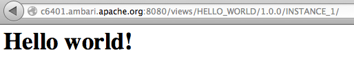

<!---
Licensed to the Apache Software Foundation (ASF) under one or more
contributor license agreements.  See the NOTICE file distributed with
this work for additional information regarding copyright ownership.
The ASF licenses this file to You under the Apache License, Version 2.0
(the "License"); you may not use this file except in compliance with
the License.  You may obtain a copy of the License at [http://www.apache.org/licenses/LICENSE-2.0](http://www.apache.org/licenses/LICENSE-2.0)

Unless required by applicable law or agreed to in writing, software
distributed under the License is distributed on an "AS IS" BASIS,
WITHOUT WARRANTIES OR CONDITIONS OF ANY KIND, either express or implied.
See the License for the specific language governing permissions and
limitations under the License.
-->

HelloWorld View Example
========
Description
-----
The HelloWorld view is a very simple view example.  It demonstrates the very basics of how to write and deploy a view in Ambari.  The HelloWorld view simply makes some static web content (a Hello world! message) available to view.

Package
-----

All views are packaged as a view archive.  The view archive contains the configuration file and various optional components of the view.

#####view.xml

The view.xml file is the only required file for a view archive.  The view.xml is the configuration that describes the view and view instances for Ambari.

      <view>
        <name>HELLO_WORLD</name>
        <label>The Hello World View!</label>
        <version>1.0.0</version>
        <instance>
          <name>INSTANCE_1</name>
        </instance>
      </view>

The configuration in this case defines a view named HELLO_WORLD that has a single instance named INSTANCE_1.

#####index.html

The index.html is the static web content being exposed by this view.

      <html>
        <head>
          <title>Hello world!</title>
        </head>
        <body>
          <h1>Hello world!</h1>
        </body>
      </html>

Build
-----

The view can be built as a maven project.

    cd ambari-views/examples/helloworld-view
    mvn clean package

The build will produce the view archive.
    
    ambari-views/examples/helloworld-view/target/helloworld-view-1.0.0.jar

Deploy
-----
To deploy a view we simply place the view archive in the views folder of the ambari-server machine.  By default the views folder is located at ...

    /var/lib/ambari-server/resources/views

To deploy the HelloWorld view simply copy the helloworld-view jar to the ambari-server views folder and restart the ambari server.

Use
-----

After deploying a view you should see it as a view resource in the Ambari REST API.  If we request all views, we should see the HELLO_WORLD view.  In this example it is shown as the only deployed view.

      http://<server>:8080/api/v1/views

      {
        "href" : "http://<server>:8080/api/v1/views",
        "items" : [
          {
            "href" : "http://<server>:8080/api/v1/views/HELLO_WORLD",
            "ViewInfo" : {
              "view_name" : "HELLO_WORLD"
            }
          }
        ]
      }

If we want to see the details about a specific view, we can ask for it by name.  This shows us that the HELLO_WORLD view does not define any parameters and has a single instance named INSTANCE_1.

    http://<server>:8080/api/v1/views/HELLO_WORLD/versions/1.0.0/

    {
      "href" : "http://<server>:8080/api/v1/views/HELLO_WORLD/versions/1.0.0/",
      "ViewVersionInfo" : {
        "archive" : "/var/lib/ambari-server/resources/views/work/HELLO_WORLD{1.0.0}",
        "label" : "The Hello World View!",
        "parameters" : [ ],
        "version" : "1.0.0",
        "view_name" : "HELLO_WORLD"
      },
      "instances" : [
        {
          "href" : "http://<server>:8080/api/v1/views/HELLO_WORLD/versions/1.0.0/instances/INSTANCE_1",
          "ViewInstanceInfo" : {
            "instance_name" : "INSTANCE_1",
            "version" : "1.0.0",
            "view_name" : "HELLO_WORLD"
          }
        }
      ]
    }

To see a specific instance of a view, we can ask for it by name.  Here we can see the attributes of the view including its name and root context path.  We can also see that this view instance does not define any properties or resources.

    http://<server>:8080/api/v1/views/HELLO_WORLD/versions/1.0.0/instances/INSTANCE_1

    {
      "href" : "http://<server>:8080/api/v1/views/HELLO_WORLD/versions/1.0.0/instances/INSTANCE_1",
      "ViewInstanceInfo" : {
        "context_path" : "/views/HELLO_WORLD/1.0.0/INSTANCE_1",
        "instance_name" : "INSTANCE_1",
        "version" : "1.0.0",
        "view_name" : "HELLO_WORLD",
        "instance_data" : { },
        "properties" : { }
      },
      "resources" : [ ]
    }

If the view contains any web content, we can access it at the view's root context path.  In this case its the index.html which displays Hello world!

    http://<server>:8080/views/HELLO_WORLD/1.0.0/INSTANCE_1/

