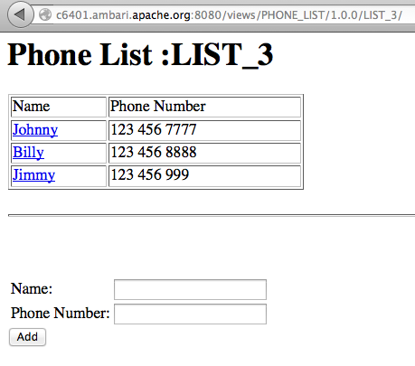

<!---
Licensed to the Apache Software Foundation (ASF) under one or more
contributor license agreements.  See the NOTICE file distributed with
this work for additional information regarding copyright ownership.
The ASF licenses this file to You under the Apache License, Version 2.0
(the "License"); you may not use this file except in compliance with
the License.  You may obtain a copy of the License at [http://www.apache.org/licenses/LICENSE-2.0](http://www.apache.org/licenses/LICENSE-2.0)

Unless required by applicable law or agreed to in writing, software
distributed under the License is distributed on an "AS IS" BASIS,
WITHOUT WARRANTIES OR CONDITIONS OF ANY KIND, either express or implied.
See the License for the specific language governing permissions and
limitations under the License.
-->

Phone List View Example
========
Description
-----
The Phone List view is a simple view example that demonstrates view persistence.  The view displays a list of names and phone numbers. The user may add, modify or delete numbers from the list through the view UI.  The names and phone numbers are stored in the Ambari database for the view instance and will get reloaded when the server is restarted.  This document also describes how to create a new view instance through the Ambari API.

Package
-----

All views are packaged as a view archive.  The view archive contains the configuration file and various optional components of the view.

#####view.xml

The view.xml file is the only required file for a view archive.  The view.xml is the configuration that describes the view and view instances for Ambari.

      <view>
        <name>PHONE_LIST</name>
        <label>The Phone List View</label>
        <version>1.0.0</version>
        <instance>
          <name>LIST_1</name>
        </instance>
        <instance>
          <name>LIST_2</name>
        </instance>
      </view>

The configuration in this case defines a view named PHONE_LIST that has a multiple instances.  Each view instance will have its own data persisted to the Ambari database.

#####WEB-INF/web.xml
The web.xml is the deployment descriptor used to deploy the view as a web app.  The Java EE standards apply for the descriptor.  We can see that for this example a single servlet is mapped to the root context path.

        <servlet>
          <servlet-name>PhoneListServlet</servlet-name>
          <servlet-class>org.apache.ambari.view.phonelist.PhoneListServlet</servlet-class>
        </servlet>
        <servlet-mapping>
          <servlet-name>PhoneListServlet</servlet-name>
          <url-pattern>/</url-pattern>
        </servlet-mapping>
        
#####PhoneListServlet.java

The servlet PhoneListServlet will be deployed as part of the view and mapped as described in the web.xml.

Notice that we can access the view context in the servlet by obtaining it as a servlet context attribute in the init() method.

      private ViewContext viewContext;

      @Override
      public void init(ServletConfig config) throws ServletException {
        super.init(config);

        ServletContext context = config.getServletContext();
        viewContext = (ViewContext) context.getAttribute(ViewContext.CONTEXT_ATTRIBUTE);
      }

The view context exposes the methods needed to save an application data map for a view instance.

    public interface ViewContext {
      …
      /**
       * Get the instance data value for the given key.
       *
       * @param key  the key
       *
       * @return the instance data value
       */
      public String getInstanceData(String key);

      /**
       * Get the instance data values.
       *
       * @return the view instance property values
       */
      public Map<String, String> getInstanceData();

      /**
       * Remove the instance data value for the given key.
       *
       * @param key  the key
       */
      public void removeInstanceData(String key);
    }

The servlet will make use of the context to persist the instance data (in this case the names and phone numbers).  For example ...

          @Override
          protected void doPost(HttpServletRequest request, HttpServletResponse response) 
              throws ServletException, IOException {
            String name = request.getParameter("name");
            String phone = request.getParameter("phone");
        
            if (name != null && name.length() > 0 && phone != null && phone.length() > 0) {
              if (request.getParameter("add") != null) {
                if (viewContext.getInstanceData(name) != null) {
                  throw new ServletException("A number for " + name + " already exists.");
                }
                viewContext.putInstanceData(name, phone);
              } else if (request.getParameter("update") != null) {
                viewContext.putInstanceData(name, phone);
              } else if (request.getParameter("delete") != null) {
                viewContext.removeInstanceData(name);
              }
            }
            listAll(request, response);
          }

Build
-----

The view can be built as a maven project.

    cd ambari-views/examples/phone-list-view
    mvn clean package

The build will produce the view archive.

    ambari-views/examples/phone-list-view/target/phone-list-view-1.0.0.jar

Deploy
-----
To deploy a view we simply place the view archive in the views folder of the ambari-server machine.  By default the views folder is located at ...

    /var/lib/ambari-server/resources/views

To deploy the Phone List view simply copy the phone-list-view jar to the ambari-server views folder and restart the ambari server.

Use
-----

After deploying a view you should see it as a view resource in the Ambari REST API.  If we request all views, we should see the PHONE_LIST view.

      http://<server>:8080/api/v1/views

      {
        "href" : "http://<server>:8080/api/v1/views",
        "items" : [
          {
            "href" : "http://<server>:8080/api/v1/views/HELLO_SERVLET",
            "ViewInfo" : {
              "view_name" : "HELLO_SERVLET"
            }
          },
          {
            "href" : "http://<server>:8080/api/v1/views/HELLO_WORLD",
            "ViewInfo" : {
              "view_name" : "HELLO_WORLD"
            }
          },
          {
            "href" : "http://<server>:8080/api/v1/views/PHONE_LIST",
            "ViewInfo" : {
            "view_name" : "PHONE_LIST"
          }
        }
        ]
      }

If we want to see the details about a specific view, we can ask for it by name.  This shows us that the PHONE_LIST view has a two instances.

      http://<server>:8080/api/v1/views/PHONE_LIST/versions/1.0.0/
      
      {
      "href" : "http://<server>:8080/api/v1/views/PHONE_LIST/versions/1.0.0/",
      "ViewVersionInfo" : {
        "archive" : "/var/lib/ambari-server/resources/views/work/PHONE_LIST{1.0.0}",
        "label" : "The Phone List View",
        "parameters" : [ ],
        "version" : "1.0.0",
        "view_name" : "PHONE_LIST"
      },
      "instances" : [
        {
          "href" : "http://<server>:8080/api/v1/views/PHONE_LIST/versions/1.0.0/instances/LIST_1",
          "ViewInstanceInfo" : {
            "instance_name" : "LIST_1",
            "version" : "1.0.0",
            "view_name" : "PHONE_LIST"
          }
        },
        {
          "href" : "http://<server>:8080/api/v1/views/PHONE_LIST/versions/1.0.0/instances/LIST_2",
          "ViewInstanceInfo" : {
            "instance_name" : "LIST_2",
            "version" : "1.0.0",
            "view_name" : "PHONE_LIST"
          }
        }
      ]
    }

To see a specific instance of a view, we can ask for it by name.  Here we can see the attributes of the view including its name and root context path.  We can also see that this view instance defines a value for the name property.

    http://<server>:8080/api/v1/views/PHONE_LIST/versions/1.0.0/instances/LIST_1

    {
      "href" : "http://<server>:8080/api/v1/views/PHONE_LIST/versions/1.0.0/instances/LIST_1",
      "ViewInstanceInfo" : {
        "context_path" : "/views/PHONE_LIST/1.0.0/LIST_1",
        "instance_name" : "LIST_1",
        "version" : "1.0.0",
        "view_name" : "PHONE_LIST",
        "instance_data" : { },
        "properties" : { }
      },
      "resources" : [ ]
    }

If the view contains any web content, we can access it at the view's root context path.  In this case its the PhoneListServlet which displays a list of phone number entries for the view instance.
      
    http://<server>:8080/views/PHONE_LIST/1.0.0/LIST_1/

Use the view API to add new numbers to the phone list.  Click on any name in the list to edit or delete a number

#####Different Instance
Each instance of the Phone List view has its own data so you can maintain separate lists.  Access the UI for a different view instance and you will see a different phone list…

    http://<server>:8080/views/PHONE_LIST/LIST_2/

We can look at the Ambari database and see that the view instance data is being persisted …

#####New Instance
Notice that the two instances above were defined in the view.xml for the Phone List view.  We can also create new instances through the API.  For example, if you POST the following…

    POST http://<server>:8080/api/v1/views/PHONE_LIST/versions/1.0.0/instances/LIST_3
    
You should then see a new instance named LIST_3 for the Phone List view …

    {
      "href" : "http://<server>:8080/api/v1/views/PHONE_LIST/versions/1.0.0/instances/",
      "items" : [
        {
          "href" : "http://<server>:8080/api/v1/views/PHONE_LIST/versions/1.0.0/instances/LIST_1",
          "ViewInstanceInfo" : {
            "instance_name" : "LIST_1",
            "version" : "1.0.0",
            "view_name" : "PHONE_LIST"
          }
        },
        {
          "href" : "http://<server>:8080/api/v1/views/PHONE_LIST/versions/1.0.0/instances/LIST_2",
          "ViewInstanceInfo" : {
            "instance_name" : "LIST_2",
            "version" : "1.0.0",
            "view_name" : "PHONE_LIST"
          }
        },
        {
          "href" : "http://<server>:8080/api/v1/views/PHONE_LIST/versions/1.0.0/instances/LIST_3",
          "ViewInstanceInfo" : {
            "instance_name" : "LIST_3",
            "version" : "1.0.0",
            "view_name" : "PHONE_LIST"
          }
        }
      ]
    }
          
 You can then access the new instance UI to add, edit and delete numbers for the new list …
 
 
 
