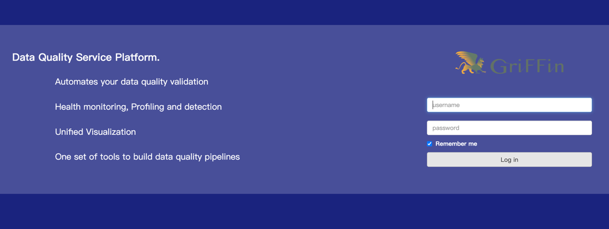
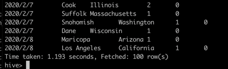
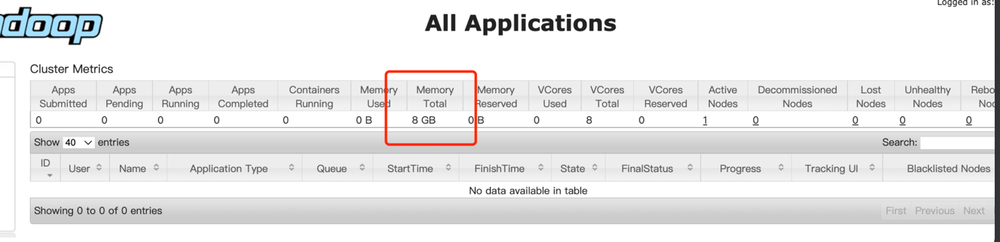
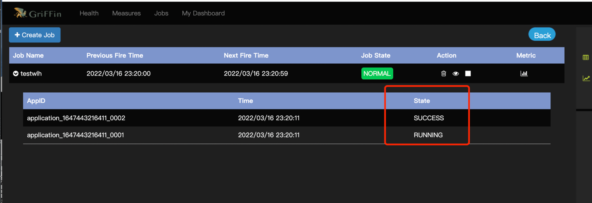
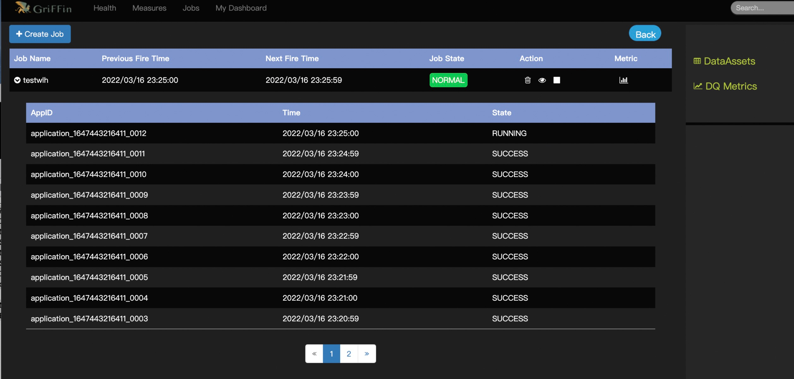

# DATA QUALITY QUICK START


1、centos安装docker docker-compose

2、docker部署griffin-spark2以及es容器
cd griffin-compose-batch.yml所在路径
docker-compose -f griffin-compose-batch.yml up

```markdown
请尽量少用 docker-compose down
```
docker-compose -f griffin-compose-batch.yml down

docker-compose -f griffin-compose-batch.yml start

docker-compose -f griffin-compose-batch.yml stop

griffin登陆时默认没有账号密码，直接login登陆即可

http://remoteIp:38080/


3、运行数据质量demo

```markdown
1、 新建measure http://remoteIp:38080/#/measures
1.1 选表选择demo_src与demo_target

1.2 docker容器内部

进入hive docker exec -it griffin hive

进入griffin: docker exec -it griffin /bin/bash

1.3 创建表，导入表

本地数据文件拷贝到docker: docker cp counties.csv griffin:/root

1.3.1 griffin容器里面hive客户端执行以下语句:

CREATE EXTERNAL TABLE counties(
`date` string, county string, state string,
cases int, deaths int
)
ROW FORMAT DELIMITED FIELDS TERMINATED BY ','
STORED AS TEXTFILE;

1.3.2 hive继续执行load:

load data local inpath '/root/counties.csv' overwrite into table counties;

导入数据如图：



2、job 配置cron表达式

Yarn资源监控：http://remoteIp:38088/cluster



job成功运行，以及下一次fire的时间：



job列表：



3、es查看结果

3.1 浏览器打开

http://remoteIp:39200/griffin/_search?size=100&pretty

3.2 curl

curl -XGET http://remoteIp:39200/griffin/_search?size=100&pretty

json结果：查看result.json结构

{
    "_index": "griffin",
    "_type": "accuracy",
    "_id": "AX-TUbjN6xwiw4NaE4p1",
    "_score": 1.0,
    "_source": {
        "name": "testwlh",
        "tmst": 1647357659000,
        "value": {
        "county_distcount": 9,
        "county_count": 100
        }
    }
}

```

