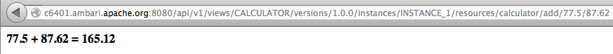

<!---
Licensed to the Apache Software Foundation (ASF) under one or more
contributor license agreements.  See the NOTICE file distributed with
this work for additional information regarding copyright ownership.
The ASF licenses this file to You under the Apache License, Version 2.0
(the "License"); you may not use this file except in compliance with
the License.  You may obtain a copy of the License at [http://www.apache.org/licenses/LICENSE-2.0](http://www.apache.org/licenses/LICENSE-2.0)

Unless required by applicable law or agreed to in writing, software
distributed under the License is distributed on an "AS IS" BASIS,
WITHOUT WARRANTIES OR CONDITIONS OF ANY KIND, either express or implied.
See the License for the specific language governing permissions and
limitations under the License.
-->

Calculator View Example
========
Description
-----
The Calculator view is another simple view example.  Like the HelloWorld view example, it demonstrates the basics of how to write and deploy a view in Ambari but also includes a simple resource.  The Calculator resource uses JAX-RS annotations to define the actions that can be performed on the resource.

Package
-----

All views are packaged as a view archive.  The view archive contains the configuration file and various optional components of the view.

#####view.xml

The view.xml file is the only required file for a view archive.  The view.xml is the configuration that describes the view and view instances for Ambari.

      <view>
        <name>CALCULATOR</name>
        <label>The Calculator View</label>
        <version>1.0.0</version>
        <resource>
          <name>calculator</name>
          <service-class>org.apache.ambari.view.proxy.CalculatorResource</service-class>
        </resource>
        <instance>
          <name>INSTANCE_1</name>
        </instance>
      </view>

The configuration in this case defines a view named CALCULATOR that has a single instance.  The view also defines a resource named 'calculator'.

#####CalculatorResource.java

The CalculatorResource class defines the calculator resource for the view.  It uses JAX-RS annotations to define the actions that can be performed on the resource.

      @GET
      @Path("/add/{a}/{b}")
      @Produces({"text/html"})
      public Response add(@PathParam("a") double a, @PathParam("b") double b) {
        String result = a + " + " + b + " = " + (a + b);
        return Response.ok("<b>" + result + "</b>").type("text/html").build();
      }

The add method will service requests to **'calculator/add/{a}/{b}'** for INSTANCE_1 of the CALCULATOR view.  

For example ...

     http://<server>:8080/api/v1/views/CALCULATOR/instances/INSTANCE_1/resources/calculator/add/77.5/87.62

Build
-----

The view can be built as a maven project.

    cd ambari-views/examples/calculator-view
    mvn clean package

The build will produce the view archive.

    ambari-views/examples/calculator-view/target/calculator-view-1.0.0.jar

Deploy
-----
To deploy a view we simply place the view archive in the views folder of the ambari-server machine.  By default the views folder is located at ...

    /var/lib/ambari-server/resources/views

To deploy the Calculator view simply copy the calculator-view jar to the ambari-server views folder and restart the ambari server.

Use
-----

After deploying a view you should see it as a view resource in the Ambari REST API.  If we request all views, we should see the CALCULATOR view.

      {
        "href" : "http://<server>:8080/api/v1/views",
        "items" : [
          {
            "href" : "http://<server>:8080/api/v1/views/CALCULATOR",
            "ViewInfo" : {
              "view_name" : "CALCULATOR"
            }
          },
          {
            "href" : "http://<server>:8080/api/v1/views/HELLO_SERVLET",
            "ViewInfo" : {
              "view_name" : "HELLO_SERVLET"
            }
          },
          {
            "href" : "http://<server>:8080/api/v1/views/HELLO_WORLD",
            "ViewInfo" : {
              "view_name" : "HELLO_WORLD"
            }
          }
        ]
      }

If we want to see the details about a specific view, we can ask for it by name.  This shows us that the CALCULATOR view has a single instance named INSTANCE_1.

      http://<server>:8080/api/v1/views/CALCULATOR/versions/1.0.0

      {
      "href" : "http://<server>:8080/api/v1/views/CALCULATOR/versions/1.0.0",
      "ViewVersionInfo" : {
        "archive" : "/var/lib/ambari-server/resources/views/work/CALCULATOR{1.0.0}",
        "label" : "The Calculator View",
        "parameters" : [ ],
        "version" : "1.0.0",
        "view_name" : "CALCULATOR"
      },
      "instances" : [
        {
          "href" : "http://<server>:8080/api/v1/views/CALCULATOR/versions/1.0.0/instances/INSTANCE_1",
          "ViewInstanceInfo" : {
            "instance_name" : "INSTANCE_1",
            "version" : "1.0.0",
            "view_name" : "CALCULATOR"
          }
        }
      ]
    }

To see a specific instance of a view, we can ask for it by name.  Here we can see the attributes of the view instance.  We can also see that this view has a resource name 'calculator'.

    http://<server>:8080/api/v1/views/CALCULATOR/versions/1.0.0/instances/INSTANCE_1

    {
      "href" : "http://<server>:8080/api/v1/views/CALCULATOR/versions/1.0.0/instances/INSTANCE_1",
      "ViewInstanceInfo" : {
        "context_path" : "/views/CALCULATOR/1.0.0/INSTANCE_1",
        "instance_name" : "INSTANCE_1",
        "version" : "1.0.0",
        "view_name" : "CALCULATOR",
        "instance_data" : { },
        "properties" : { }
      },
      "resources" : [
        {
          "href" : "http://<server>:8080/api/v1/views/CALCULATOR/versions/1.0.0/instances/INSTANCE_1/resources/calculator",
          "instance_name" : "INSTANCE_1",
          "name" : "calculator",
          "version" : "1.0.0",
          "view_name" : "CALCULATOR"
        }
      ]
    }
    
We can access the view's resource through the resource's href.

    http://<server>:8080/api/v1/views/CALCULATOR/versions/1.0.0/instances/INSTANCE_1/resources/calculator/

We can access the add method of the resource with the following …

     http://<server>:8080/api/v1/views/CALCULATOR/versions/1.0.0/instances/INSTANCE_1/resources/calculator/add/77.5/87.62

