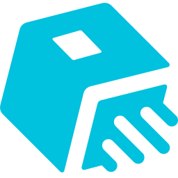
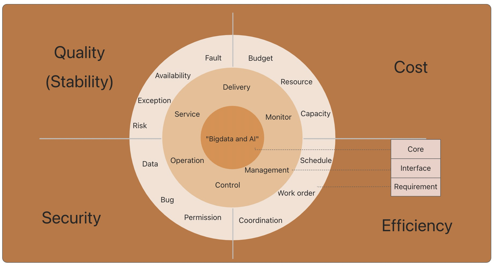

  

<h1 align="center"> SREWorks </h1>

<b> Cloud Native DataOps & AIOps Platform </b>

  
  

   <a href="https://www.yuque.com/sreworks-doc/docs" target="_blank">Documentation</a> 

---

   English | <a href="README-CN.md">中文<a/>

## Introduction

SREWorks: Alibaba Cloud Big Data SRE team's cloud-native operation and maintenance (O&M) platform was born out of nearly a decade of business precipitation, using the thinking of "Big Data and AI" for O&M work（we call it DataOps and AIOps）, to help more practitioners use DataOps and AIOps to do a efficient O&M work.

Google suggested a job title of SRE (Site Reliability Engineer) in 2003. It consists of a team of software engineers and system administrators who place a premium on O & M personnel's development skills, forcing them to devote less than half of their time to daily tasks and the other half to the creation of automation technologies to decrease labor needs.

SREWorks focuses on the application-centric one-stop "cloud native" and "DataOps and AIOps" O & M SaaS management suite as an engineering practice for the Alibaba Cloud Big Data SRE team's SRE concept. It enables companies to achieve the delivery and maintenance of cloud-native apps and resources via two primary capabilities: enterprise application and resource management and O & M development.

Alibaba Cloud Big Data SRE team has been working hard to practice the "DataOps and AIOps" concept, the industry's DataOps (data operation and maintenance) first proposed by the team, is naturally close to big data and AI, is very familiar with Big Data & AI technology, and has the big data and AI computing power resources on demand, has been working hard to practice the "DataOps and AIOps" concept, the industry's DataOps Standard O & M warehouses, data O & M platforms, and operation centers are among the end-to-end DataOps closed-loop engineering methods in the SREWorks.

There are many excellent open-source O & M platforms that reflect cloud-native scenarios in the traditional IT O&M field. There are currently no systematic O & M solutions available. With the rise of the cloud-native era, the Alibaba Cloud Big Data SRE team will open-source its O & M platform, SREWorks, in the hopes of providing O & M engineers with an out-of-the-box experience.

## Getting Started

- [Quick Install](/paas/sw-frontend/docs/documents/rr5g10.md)
- [Installation from source code](/paas/sw-frontend/docs/documents/mzz07m.md)
- [Document](https://www.yuque.com/sreworks-doc/docs/)
- [Online Demo](https://wj.qq.com/s2/10565748/53da/)

## Roadmap

[ROADMAP](ROADMAP.md)

## Contributing

We'd love to accept your patches and contributions to SREWorks. Please refer to [CONTRIBUTING](CONTRIBUTING.md) for a few small guidelines you need to follow.

## Community

- Wechat Chat Group (*Chinese*): Broker wechat to add you into the user group.

- Dingtalk Chat Group (*Chinese*): 35853026

## Code of Conduct

Contributions to the SREWorks are expected to adhere to our [Code of Conduct](CODE_OF_CONDUCT.md).
