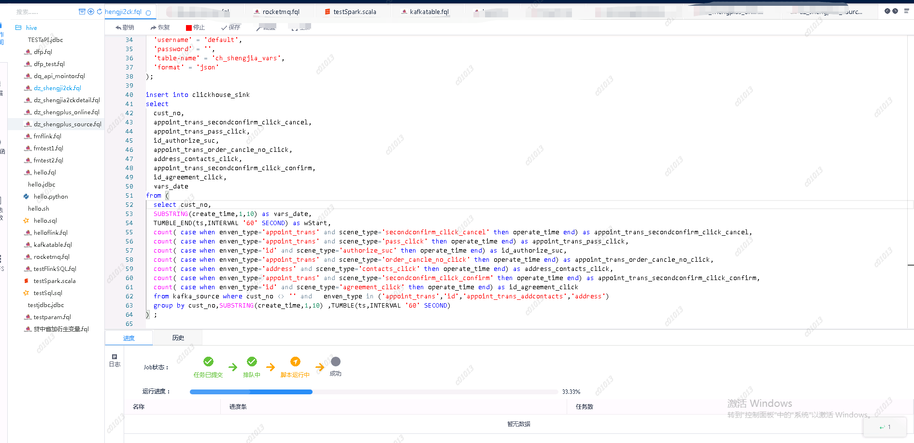
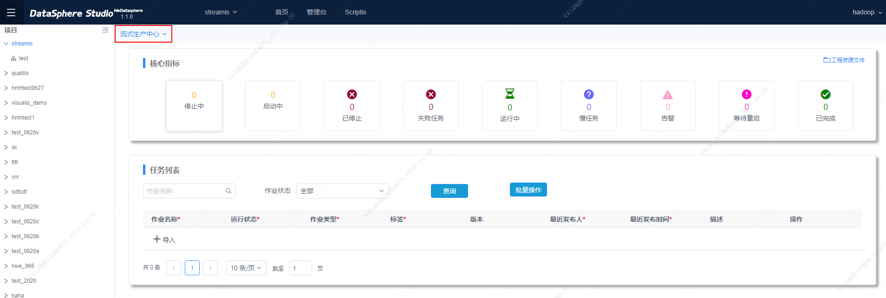
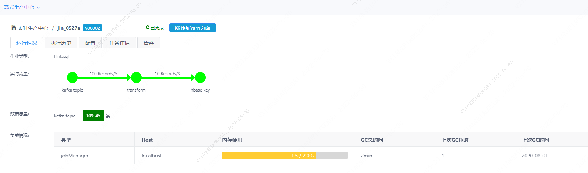
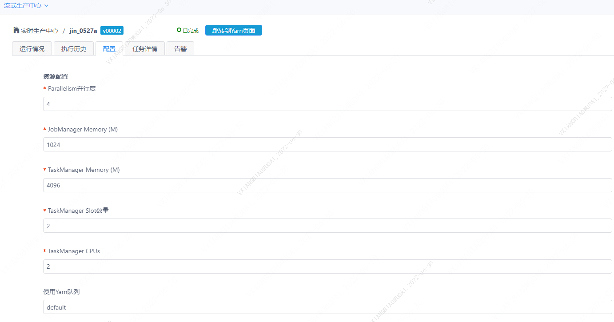
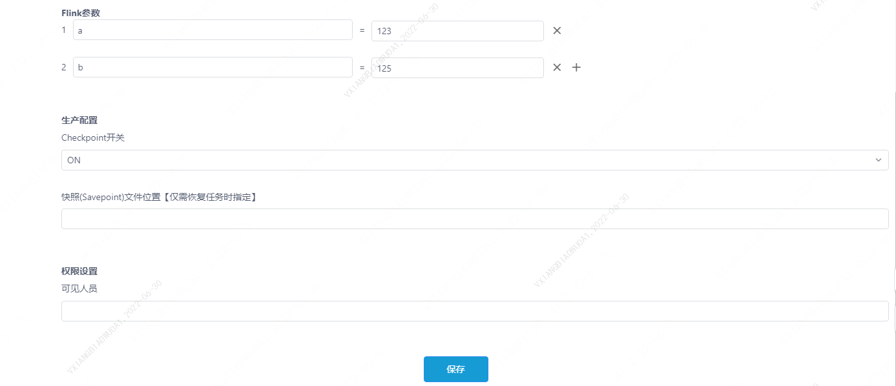
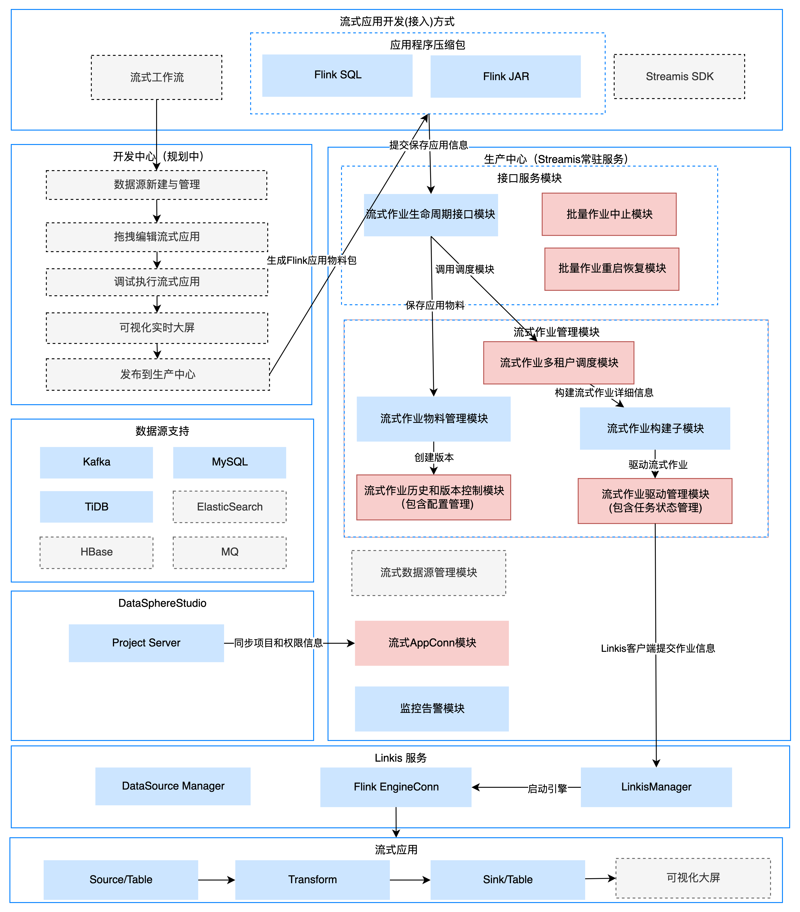

# Streamis

[English](README.md) | 中文

## 引言

 &nbsp; &nbsp; &nbsp; &nbsp;Streamis 是 **微众银行** 联合 **天翼云**、**仙翁科技** 和 **萨摩耶云** 联合共建的流式应用开发管理系统。

 &nbsp; &nbsp; &nbsp; &nbsp;基于 [DataSphere Studio](https://github.com/WeBankFinTech/DataSphereStudio) 的框架化能力，以及底层对接 [Linkis](https://github.com/apache/incubator-linkis) 的 **Flink 引擎**，让用户低成本完成流式应用的开发、调试、发布和生产管理。
 
 &nbsp; &nbsp; &nbsp; &nbsp;未来还规划将以工作流式的图形化拖拽开发体验，将流式应用以Source节点、
Dimension节点、Transform节点、Sink节点 和 [Visualis](https://github.com/WeBankFinTech/Visualis) 节点串连成一条流式工作流，让用户以更低的学习成本完成流式应用的开发、调试和发布。

----

## 核心特点

#### 1. 基于 DSS 和 Linkis，打造领先的流式应用开发管理系统。

&nbsp; &nbsp; &nbsp; &nbsp;以 Flink 为底层计算引擎，基于开发中心和生产中心隔离的架构设计模式，完全隔离开发权限与发布权限，隔离开发环境与生产环境，保证业务应用的高稳定性和高安全性。

&nbsp; &nbsp; &nbsp; &nbsp;应用开发层与 DSS 的数据应用开发流程有机整合，提供极简的用户使用体验。

&nbsp; &nbsp; &nbsp; &nbsp;应用执行层集成 Linkis 计算中间件，打造金融级具备高并发、高可用、多租户隔离和资源管控等能力的流式应用管理能力。

#### 2. 强大的流式应用开发调试能力。

&nbsp; &nbsp; &nbsp; &nbsp;基于 DSS-Scriptis 提供流式应用的开发和调试功能，支持对 FlinkSQL 进行实时调试和结果集展示。

#### 3. 强大的流式应用生产中心能力。

&nbsp; &nbsp; &nbsp; &nbsp;支持流式作业的多版本管理、全生命周期管理、监控告警、checkpoint 和 savepoint 管理能力。

&nbsp; &nbsp; &nbsp; &nbsp;流式应用运行情况：

&nbsp; &nbsp; &nbsp; &nbsp;流式应用参数配置：

&nbsp; &nbsp; &nbsp; &nbsp;更多功能，请参考：[Streamis 用户手册](docs/zh_CN/0.2.0/使用文档/Streamis用户手册.md)。

----

## 依赖的生态组件

| 依赖的应用工具    | 描述                                                         | Streamis 兼容版本 |
|--------------|---------------------------------------------------------------|--------------|
| [DataSphereStudio](https://github.com/WeBankFinTech/DataSphereStudio) | 数据应用开发管理集成框架。以工作流式的图形化拖拽开发体验，将满足从数据交换、脱敏清洗、分析挖掘、质量检测、可视化展现、定时调度到数据输出应用等，数据应用开发全流程场景需求。 | &gt;= DSS1.1.0（已发布）|
| [Linkis](https://github.com/apache/incubator-linkis) | 计算中间件 Apache Linkis，通过提供 REST/WebSocket/JDBC/SDK 等标准接口，上层应用可以方便地连接访问 MySQL/Spark/Hive/Presto/Flink 等底层引擎。 | &gt;= Linkis1.1.1（已发布），部分功能需要Linkis 1.1.2支持 |

----

## Demo试用环境

&nbsp; &nbsp; &nbsp; &nbsp;正在部署中，敬请期待！

----

## 下载

&nbsp; &nbsp; &nbsp; &nbsp;请前往 [Streamis releases](https://github.com/WeBankFinTech/Streamis/releases) 页面下载 Streamis 的已编译版本或源码包。

----

## 编译和安装部署

&nbsp; &nbsp; &nbsp; &nbsp;请参考 [Streamis 安装部署文档](docs/zh_CN/0.2.0/Streamis安装文档.md) ，用于安装部署 Streamis 及其依赖环境。

----

## 示例和使用指引

&nbsp; &nbsp; &nbsp; &nbsp;请到 [用户使用文档](docs/zh_CN/0.2.0/使用文档/Streamis用户手册.md) ，了解如何快速使用 Streamis。

----

## Streamis 功能介绍
 
| 功能模组 | 描述 | Streamis | 
 | :----: | :----: |-------|
 | 安装部署 | 部署难易程度和第三方依赖 | 一键部署，依赖Linkis Flink引擎 |
 | 开发中心| FlinkSQL 流式应用实时开发、调试 | 支持，需集成DSS | 
 | 生产中心 | 流式应用管理运维能力 | 支持 |
 |       | 复用 Linkis 计算治理能力 | 支持 |
 |       | 支持 FlinkSQL 和 FlinkJar 包等方式发布 | 支持 |
 |       | 流式应用的多版本管理能力 | 支持 |
 |       | 流式应用的参数配置和告警能力 | 支持 |
 | 服务高可用 | 应用高可用，服务多点，状态快照实现容错处理，故障不影响使用 | 支持 | 
 | 系统管理 | 节点、资源管理 | 支持 |
 |权限管理  |任务的操作权限控制 |支持 |
 
----

## 架构

----

## 贡献

&nbsp; &nbsp; &nbsp; &nbsp;我们非常欢迎和期待更多的贡献者参与共建 Streamis, 不论是代码、文档，或是其他能够帮助到社区的贡献形式。

## 联系我们

&nbsp; &nbsp; &nbsp; &nbsp;对 Streamis 的任何问题和建议，敬请提交 [issue](https://github.com/WeBankFinTech/Streamis/issues)，以便跟踪处理和经验沉淀共享。

&nbsp; &nbsp; &nbsp; &nbsp;您也可以扫描下面的二维码，加入我们的 微信/QQ群，以获得更快速的响应。

----

## License

 &nbsp; &nbsp; &nbsp; &nbsp;DSS is under the Apache 2.0 license. See the [License](LICENSE) file for details.

