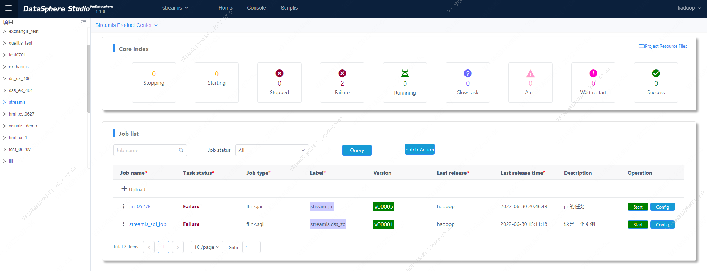
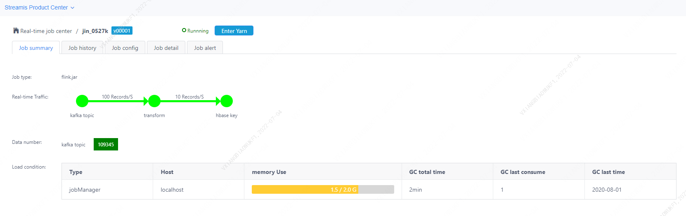
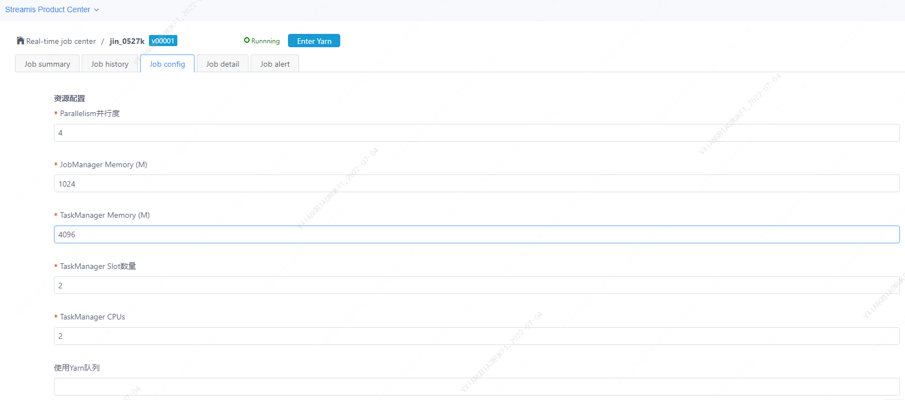
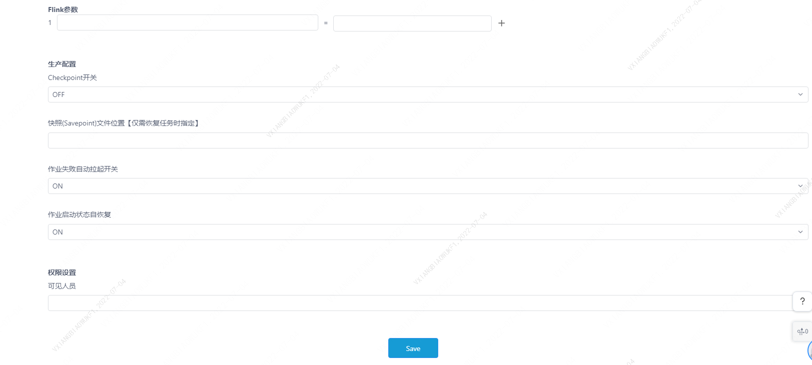
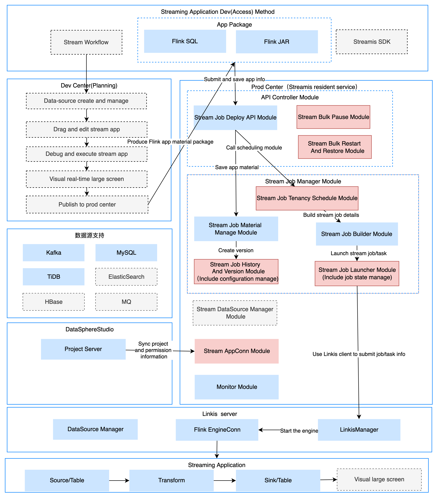

# Streamis

English | [中文](README-ZH.md)

## Introduction

&nbsp; &nbsp; &nbsp; &nbsp;Streamis is an jointed development project for Streaming application development and management established by WeBank, CtYun, Samoyed Financial Cloud and XianWeng Technology.

&nbsp; &nbsp; &nbsp; &nbsp;Based on the framework capabilities of [DataSphere Studio](https://github.com/WeBankFinTech/DataSphereStudio) and the underlying docking [Linkis](https://github.com/apache/incubator-linkis/blob/master/README.md) 's **Flink engine** allows users to complete the development, debugging, release and production management of streaming applications at low cost.

&nbsp; &nbsp; &nbsp; &nbsp;In the future, it is also planned to use a workflow-style graphical drag-and-drop development experience, and the streaming application will be based on the Source node,
The Dimension node, Transform node, Sink node and [Visualis](https://github.com/WeBankFinTech/Visualis) nodes are connected in series to form a streaming workflow, allowing users to complete the development of streaming applications at a lower learning cost. Debug and release.

----

## Core features

#### 1. Based on DSS and DSS-Scriptis, to create a leading streaming application development management system.

&nbsp; &nbsp; &nbsp; &nbsp;With Flink as the underlying computation engine, based on the architectural design pattern of the isolation between the development center and the production center, it completely isolates development permissions and publishing permissions, and isolates the development environment and production environment to ensure high stability and high security of streaming applications.

&nbsp; &nbsp; &nbsp; &nbsp;The application development layer is organically integrated with the data application development process of DSS, providing simplier user experience.

&nbsp; &nbsp; &nbsp; &nbsp;The application execution layer integrates Linkis to provide financial-level streaming application management capabilities with high concurrency, high availability, multi-tenant isolation, and resource management.

#### 2. Powerful streaming application development and debugging capabilities.

&nbsp; &nbsp; &nbsp; &nbsp;Based on DSS-Scriptis, provides streaming application development and debugging functions, and supports real-time debugging and result set display of FlinkSQL.

#### 3. Powerful streaming application production center capabilities. 

&nbsp; &nbsp; &nbsp; &nbsp;Supports multi-version management, full life cycle management, monitoring alarm, checkpoint and savepoint management capabilities of streaming jobs.

&nbsp; &nbsp; &nbsp; &nbsp;Running information page:

&nbsp; &nbsp; &nbsp; &nbsp;Configurations page：

&nbsp; &nbsp; &nbsp; &nbsp;For more features, please refer to: [User Manual](docs/en_US/userManual/StreamisUserManual.md).

----

## Depended ecosystems

| Depended Component | Description | Streamis compatibility |
| -------------- | -------------------------------------------------------------- | --------------|
| [DataSphereStudio](https://github.com/WeBankFinTech/DataSphereStudio) | Data application development management framework. With a unified UI, the workflow-like graphical drag-and-drop development experience meets the entire lifecycle of data application development from data import, desensitization cleaning, data analysis, data mining, quality inspection, visualization, scheduling to data output applications, etc. | &gt;= DSS1.1.0 (Released) |
| [Linkis](https://github.com/apache/incubator-linkis) | Apache Linkis, builds a layer of computation middleware, by using standard interfaces such as REST/WS/JDBC provided by Linkis, the upper applications can easily access the underlying engines such as MySQL/Spark/Hive/Presto/Flink, etc. | &gt;= Linkis1.1.1 (Released),some functions need to be supported by linkis 1.1.2 |

## Demo Trial environment

&nbsp; &nbsp; &nbsp; &nbsp;In progress, stay tuned!

----

## Download

&nbsp; &nbsp; &nbsp; &nbsp;Please go to the [Streamis Releases](https://github.com/WeBankFinTech/Streamis/releases) Page to download a compiled version or a source code package of Streamis.

----

## Compile and install deployment

please refer to [Streamis Installation and Deployment Document](docs/en_US/0.2.0/StreamisDeployment.md) for installing and deploying Streamis.

----

## Examples and usage guidelines

&nbsp; &nbsp; &nbsp; &nbsp;Please visit to [User documentation](docs/en_US/userManual/StreamisUserManual.md), learn how to use Streamis quickly.

----

## Features

| Function Module | Description | Streamis |
 | :----: | :----: |-------|
| UI | Integrated and convenient management interface and monitoring window | Integrated |
| Installation and deployment | Deployment difficulty and third-party dependencies | One-click deployment, relying on Linkis Flink engine |
| Development Center | FlinkSQL streaming application real-time development and debugging | Support, need to integrate DSS |
|Production Center | Streaming Application Management Operation and Maintenance Capability | Support |
| | Reuse Linkis computing governance capabilities | Support |
| | Support FlinkSQL and FlinkJar package release | Support |
| | Multi-version management capabilities | Support |
| | Configuration and alert management capabilities | Support |
| Service high availability | Multiple services,State snapshot for fault tolerance, failure does not affect the use | Application high availability |
| System Management | Node and Resource Management | Support |
| Permission management | Task operation permission control | Support |

----

## Architecture

----

## Contributing

&nbsp; &nbsp; &nbsp; &nbsp;Contributions are always welcomed, we need more contributors to build Streamis together. either code, or doc, or other supports that could help the community.

----

## Communication contribution

&nbsp; &nbsp; &nbsp; &nbsp;For any questions or suggestions, please kindly submit an [issue](https://github.com/WeBankFinTech/Streamis/issues).

&nbsp; &nbsp; &nbsp; &nbsp;You can scan the QR code below to join our WeChat and QQ group to get more immediate response.

----

## License

&nbsp; &nbsp; &nbsp; &nbsp;DSS is under the Apache 2.0 license. See the [License](LICENSE) file for details.

