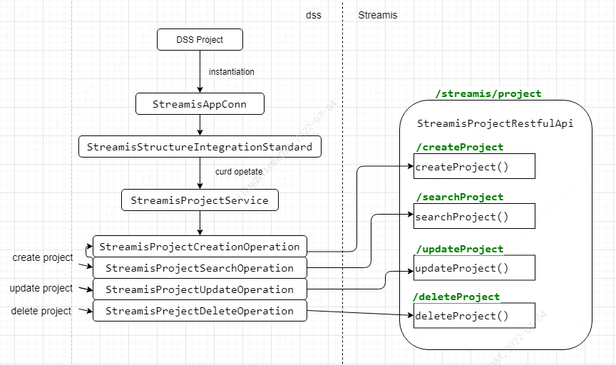

# Streamis access AppConn

## Overall flow chart


## DSS project APPCONN plug-in streamis-appconn

### The configuration table
Configure the following four tables:dss_workspace_dictionary、dss_appconn、dss_workspace_menu_appconn、dss_appconn_instance，appconn_name for realTimeJobCenter is appconn accessed by the graphical interface，appconn_name for streamis is appconn accessed by the API，The StreamisAppConn object is instantiated based on the configuration information in the table when DSS is started.Appconn in the following SQL_ INSTALL_ IP and appconn_ INSTALL_ When executing DSS installation script for automatic installation, port will enter through interactive commands.  
```roomsql
delete from  `dss_workspace_dictionary` WHERE `appconn_name` = 'streamis';

INSERT INTO `dss_workspace_dictionary` ( `workspace_id`, `parent_key`, `dic_name`, `dic_name_en`, `dic_key`, `dic_value`, `dic_value_en`, `title`, `title_en`, `url`, `url_type`,`icon`, `order_num`, `remark`, `create_user`, `create_time`, `update_user`, `update_time`, appconn_name)
VALUES ('0','p_develop_process','流式生产中心','Streamis Product Center','pdp_streamis_product_center','streamis_prod',NULL,NULL,NULL,
'http://APPCONN_INSTALL_IP:APPCONN_INSTALL_PORT/#/realtimeJobCenter?projectName=${projectName}&workspaceName=${workspaceName}','0','kaifa-icon','1','工程开发流程-流式生产中心','SYSTEM','2020-12-28 17:32:35',NULL,'2022-06-30 17:49:02','streamis');

select @old_dss_appconn_id:=id from `dss_appconn` where `appconn_name` = 'streamis';

delete from  `dss_workspace_menu_appconn` WHERE `appconn_id` = @old_dss_appconn_id;
delete from `dss_appconn_instance` where `appconn_id` = @old_dss_appconn_id;
delete from  `dss_appconn` where `appconn_name`='streamis';

select @old_jobcenter_dss_appconn_id:=id from `dss_appconn` where `appconn_name` = 'realTimeJobCenter';

delete from  `dss_workspace_menu_appconn` WHERE `appconn_id` = @old_jobcenter_dss_appconn_id;
delete from `dss_appconn_instance` where `appconn_id` = @old_jobcenter_dss_appconn_id;
delete from  `dss_appconn` where `appconn_name`='realTimeJobCenter';

INSERT INTO dss_appconn
(appconn_name, is_user_need_init, `level`, if_iframe, is_external, reference, class_name, appconn_class_path, resource)
VALUES('streamis', 0, 1, 1, 1, NULL, 'com.webank.wedatasphere.streamis.dss.appconn.StreamisAppConn', NULL, NULL);
INSERT INTO dss_appconn
(appconn_name, is_user_need_init, `level`, if_iframe, is_external, reference, class_name, appconn_class_path, resource)
VALUES('realTimeJobCenter', 0, 1, 1, 1, 'sso', '', NULL, NULL);

select @dss_appconn_id:=id from `dss_appconn` where `appconn_name` = 'streamis';
select @jobcenter_dss_appconn_id:=id from `dss_appconn` where `appconn_name` = 'realTimeJobCenter';

INSERT INTO dss_workspace_menu_appconn
(appconn_id, menu_id, title_en, title_cn, desc_en, desc_cn, labels_en, labels_cn, is_active, access_button_en, access_button_cn, manual_button_en, manual_button_cn, manual_button_url, icon, `order`, create_by, create_time, last_update_time, last_update_user, image)
VALUES(@jobcenter_dss_appconn_id, 1, 'StreamSQL development', 'StreamSQL开发', 'Real-time application development is a streaming solution jointly built by WeDataSphere, Boss big data team and China Telecom ctcloud Big data team.', '实时应用开发是微众银行微数域(WeDataSphere)、Boss直聘大数据团队 和 中国电信天翼云大数据团队 社区联合共建的流式解决方案，以 Linkis 做为内核，基于 Flink Engine 构建的批流统一的 Flink SQL，助力实时化转型。',
'streaming, realtime', '流式,实时', 0, 'under union construction', '联合共建中', 'related information', '相关资讯', 'http://127.0.0.1:8088/wiki/scriptis/manual/workspace_cn.html', 'shujukaifa-logo', NULL, NULL, NULL, NULL, NULL, 'shujukaifa-icon');

INSERT INTO dss_appconn_instance
(appconn_id, label, url, enhance_json, homepage_uri)
VALUES(@dss_appconn_id, 'DEV', 'http://APPCONN_INSTALL_IP:APPCONN_INSTALL_PORT/', '', 'http://APPCONN_INSTALL_IP:APPCONN_INSTALL_PORT/#/realTimeJobCenter');

INSERT INTO dss_appconn_instance
(appconn_id, label, url, enhance_json, homepage_uri)
VALUES(@jobcenter_dss_appconn_id, 'DEV', 'http://APPCONN_INSTALL_IP:APPCONN_INSTALL_PORT/#/realTimeJobCenter', NULL, NULL);
```

### Concrete implementation description
StreamisAppConn extends AbstractOnlySSOAppConn implements SecondlyAppConn，Override method to create StreamisStructureIntegrationStandard.StreamisAppConn currently only implements section-free login and organizational structure specification capabilities。

To create a StreamisProjectService by rewriting the methods in StreamisStructureIntegrationStandard, four methods need to be rewritten internally, and four operation classes will be created: StreamisProjectSearchOperation, StreamisProjectCreationOperation, StreamisProjectUpdateOperation, and StreamisPrejectDeleteOperation. The operation class calls the streamis application through HTTP to query, create, modify and delete project respectively, and synchronize the DSS project information to Streamis.

- When DSS creates a project, it will first call the query operation to query whether the same project name already exists in streamis. If it does, a prompt will pop up. If it does not exist, it will continue to call the create operation to create a new project in streamis;
- When DSS modifies a project, it will call the modify operation to update the project information in streamis;
- When DSS deletes an item, it will call the delete operation to delete the item information in streamis and change the deletion mark.

## API
1 API name: query project
- API path：GET /streamis/project/searchProject
- Request parameters

|Parameter name	  |Whether it is necessary	|Example	|remarks     |
|-------------|---------|-------|--------|
|projectName  |yes	|  |  |

- Return data

|name         |type     |Whether it is necessary  |Default    |remarks  |
|-------------|--------|---------|---------|--------|
|method       |string  |no   |
|status       |number  |yes   |
|message      |string  |no   |
|data         |object  |yes   |
|- projectId  |number  |yes   |

2 API name：create project
- API path：POST /streamis/project/createProject
- Request parameters

|Parameter name	  |Whether it is necessary	|Example	|remarks     |
|-------------|---------|-------|--------|
|projectName  |yes	|  |  |
|workspaceId  |no	|  |  |
|releaseUsers  |no	|  |  |
|editUsers    |no	|  |  |
|accessUsers  |no	|  |  |

- Return data

|name      |type     |Whether it is necessary  |Default    |remarks  |
|----------|--------|---------|---------|--------|
|method    |string  |no   |
|status    |number  |yes   |
|message   |string  |no   |
|data      |object  |yes   |
|- projectId   |number  |yes   |
|- projectName  |string  |no   |

3 API name：update project
- API path：PUT /streamis/project/updateProject
- Request parameters

|Parameter name	  |Whether it is necessary	|Example	|remarks     |
|-------------|---------|-------|--------|
|projectId	  |yes	|  |  |
|projectName  |yes	|  |  |
|workspaceId  |no	|  |  |
|releaseUsers  |no	|  |  |
|editUsers    |no	|  |  |
|accessUsers  |no	|  |  |

- Return data

|name      |type     |Whether it is necessary  |Default    |remarks  |
|----------|--------|---------|---------|--------|
|method    |string  |no   |
|status    |number  |yes   |
|message   |string  |no   |
|data      |object  |no   |

4 API name：delete project
- API path：DELETE /streamis/project/deleteProject
- Request parameters

|Parameter name	  |Whether it is necessary	|Example	|remarks     |
|-------------|---------|-------|--------|
|projectId	  |yes	|  |  |
|projectName  |no	|  |  |

- Return data

|name      |type     |Whether it is necessary  |Default    |remarks  |
|----------|--------|---------|---------|--------|
|method    |string  |no   |
|status    |number  |yes   |
|message   |string  |no   |
|data      |object  |no   |

## Streamis project streamis-project-server

### Related table operation
There are 2 tables involved in streamis, including linkis_ stream_ Project and linkis_ stream_ project_ privilege.
```roomsql
--table already exists
CREATE TABLE `linkis_stream_project` (
  `id` bigint(20) NOT NULL AUTO_INCREMENT,
  `workspace_id` bigint(20) DEFAULT NULL,
  `name` varchar(100) DEFAULT NULL,
  `create_by` varchar(50) DEFAULT NULL,
  PRIMARY KEY (`id`) USING BTREE
) ENGINE=InnoDB AUTO_INCREMENT=1 DEFAULT CHARSET=utf8 ROW_FORMAT=COMPACT COMMENT='project table';

--newly added table
CREATE TABLE `linkis_stream_project_privilege` (
  `id` bigint(20) NOT NULL AUTO_INCREMENT,
  `project_id` bigint(20) NOT NULL,
  `user_name` varchar(100) NOT NULL,
  `privilege` tinyint(1) DEFAULT '0' NOT NULL COMMENT '1:RELEASE ，2:EDIT ，3:ACCESS',
  PRIMARY KEY (`id`) USING BTREE
) ENGINE=InnoDB AUTO_INCREMENT=1 DEFAULT CHARSET=utf8 COMMENT='project privilege table';

--newly added field
ALTER TABLE `linkis_stream_project` ADD create_time datetime DEFAULT NULL;
ALTER TABLE `linkis_stream_project` ADD last_update_by varchar(50) DEFAULT NULL;
ALTER TABLE `linkis_stream_project` ADD last_update_time datetime DEFAULT NULL;
ALTER TABLE `linkis_stream_project` ADD is_deleted tinyint unsigned DEFAULT 0;
```

### Concrete implementation description
- The query operation will obtain the request parameter projectName in the table links_ stream_project Query the corresponding ID. If the query operation is successful, the returned status is 0, and the projectid is the queried ID. if the query result is empty, the projectid is null;
- The creation operation will insert the project information (projectName、workspaceId) in the request parameters into the project table linkis_stream_project and auto increment the generated ID, associate the user in the permission information data (releaseUsers、editUsers、accessUsers) in the request parameters with the generated ID of the project table, and insert the table linkis_stream_project_privilege, the status value returned from the successful creation operation is 0, and the project table generation ID will be returned as the value of projectId;
- The modification operation will update the request information data to the table linkis_stream_project and linkis_stream_project_privilege, the status value returned successfully is 0;
- In the delete operation, the is_deleted field of the table linkis_stream_project will be marked as 1 according to the projectId. The relevant data in the table linkis_stream_project_privilege will be deleted, the status value returned successfully is 0.
