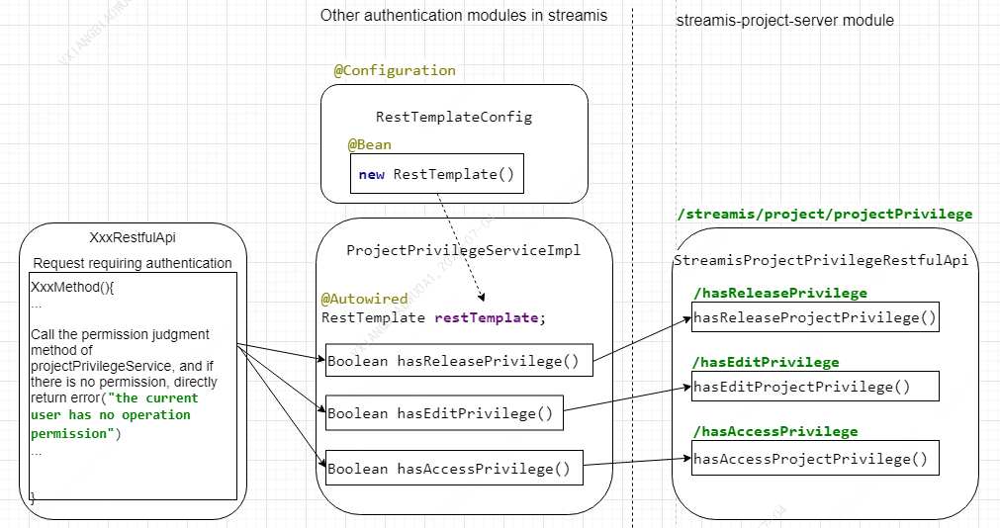

# Authentication

## Authentication flow chart
In Streamis, the module that needs authentication does not rely on the Streamis project server module. The rest interface is called to handle authentication.

## Specific implementation instructions
Get the set of all permissions according to the current user name and item id/ name. If the permission set contains RELEASE permission, you have the permission to publish / edit / view; if the permission set contains EDIT permission, you have the permission to edit / view; if the permission set contains ACCESS permission, you have the permission to view;  
Permission inclusion relationship: RELEASE permission includes EDIT permission and ACCESS permission; edit permission includes ACCESS permission.

### edit privilege API：

|RequestMethod  |API path                                          |name             |
|------|----------------------------------------------------------|-----------------|
|POST  |/streamis/streamProjectManager/project/files/upload       |Project resource file - Import   |
|GET   |/streamis/streamProjectManager/project/files/delete       |Delete all versions of the file under the project  |
|GET   |/streamis/streamProjectManager/project/files/version/delete |Delete version file  |
|GET   |/streamis/streamProjectManager/project/files/download     |Task details - Download  |
|POST  |streamis/streamJobManager/job/createOrUpdate              |create or Update streamis-job|
|POST  |/streamis/streamJobManager/job/upload                     |Upload file  |
|POST  |/streamis/streamJobManager/job/execute                  |start-up  |
|GET   |/streamis/streamJobManager/job/stop                     |stop  |
|PUT   |/streamis/streamJobManager/job//snapshot/{jobId:\w+}    |Snapshot generation  |
|GET   |/streamis/streamJobManager/config/json/{jobId:\w+}    |Configuration - save  |
|POST  |/streamis/streamJobManager/job/bulk/execution         |Batch start  |
|POST  |/streamis/streamJobManager/job/bulk/pause             |Batch stop  |

### access privilege API：

|RequestMethod  |API path                                          |name          |
|------|----------------------------------------------------------|-------------|
|GET   |streamis/streamJobManager/job/list                        |Query the jobs that the current user can view  |
|GET   |/streamis/streamProjectManager/project/files/list         |prokect resource document  |
|GET   |/streamis/streamProjectManager/project/files/version/list  |Obtain all versions of the file under the project  |
|GET   |/streamis/streamJobManager/job/version                    |Query job version  |
|GET   |/streamis/streamJobManager/job/execute/history            |Job execution history  |
|GET   |/streamis/streamJobManager/job/progress                |Get the latest task status of the current version of the job  |
|GET   |/streamis/streamJobManager/job/jobContent             |Task details  |
|GET   |/streamis/streamJobManager/job/logs                   |Get log  |
|POST  |/streamis/streamJobManager/config/json/{jobId:\w+}    |Get task configuration  |
|GET   |/streamis/streamJobManager/config/view                |Query the current job configuration information  |