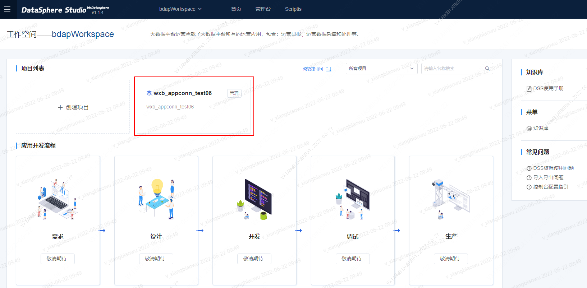

Streamisappconn installation document this article mainly introduces the deployment, configuration and installation of streamisappconn in DSS (datasphere studio) 1.1.0

# 1. Preparation for deploying streamisappconn
Before deploying streamisappconn, please complete the installation of streamis0.2.0 and other related components, and ensure that the basic functions of the project are available.

# 2. Download and compilation of streamisappconn plug-in
1) Download binary package

We provide the material package of streamisappconn, which you can download directly. [Click to jump to the release interface](https://github.com/WeBankFinTech/Streamis/releases)

2） Compile package

If you want to develop and compile streamisappconn yourself, the specific compilation steps are as follows: 1 Code for clone streams; 2 Find the streamis appconn module and compile streamis appconn separately
```shell script
cd {STREAMIS_CODE_HOME}/streamis-appconn
mvn clean install
```
Streamis will be found under this path Zip installation package
```shell script
{STREAMIS_CODE_HOME}\streamis-appconn\target\streamis.zip
```

# 3. Overall steps for deployment and configuration of streamisappconn plug-in
1. get the packed streamis Zip material package

2. place it in the following directory and unzip it

Note: after extracting streamis appconn for the first time, make sure that there is no index in the current folder_ v0000XX. Index file, which will be generated later
```shell script
cd {DSS_Install_HOME}/dss/dss-appconns
unzip streamis.zip
```
The extracted directory structure is:
```shell script
conf
db
lib
```
3. execute scripts for automatic installation
 ```shell script
cd {DSS_INSTALL_HOME}/dss/bin
sh ./appconn-install.sh
# Script is an interactive installation scheme. You need to enter the string streamis and the IP and port of streamis service to complete the installation
# The streamis port here refers to the front-end port, which is configured in nginx. Instead of the back-end service port
```

## 4. After the installation of streamis appconn, you need to restart the DSS service to finally complete the plug-in update
###4.1) make the deployed appconn effective
Use the DSS start / stop script to make appconn effective. Enter the directory {DSS_INSTALL_HOME}/dss/sbin where the script is located, and execute the script using the following commands in sequence:
```shell script
sh ./dss-stop-all.sh
sh ./dss-start-all.sh
```
###4.2) verify whether streamis appconn is effective
After installing and deploying streamis appconn, you can preliminarily verify whether the streamis appconn is successfully installed through the following steps.

Create a new project in the DSS workspace


Check whether the project is created synchronously in the streamis database. Query the records indicating that appconn is successfully installed
```roomsql
SELECT * FROM linkis_stream_project WHERE name = ' input project_name ';
```

# 5. Installation principle of streamis appconn
The relevant configuration information of streamis will be inserted into the following table. The use configuration of streamis can be completed by configuring the following table. (Note: if you only need to quickly install appconn, you don't need to pay too much attention to the following fields. Most of the init.sql provided are configured by default. Focus on the above operations.)

|table name	            |table function	                      |remarks    |
|-------------------|-----------------------------------------|------|
|dss_workspace_dictionary  |Configuring a streaming production center                  	|must|
|dss_appconn	           |Basic information of appconn, used to load appconn         	|must|
|dss_workspace_menu_appconn  |Appconn menu, front-end connection to streamis	        |must|
|dss_appconn_instance	  |The instance information of appconn, including its own URL information	|must|
