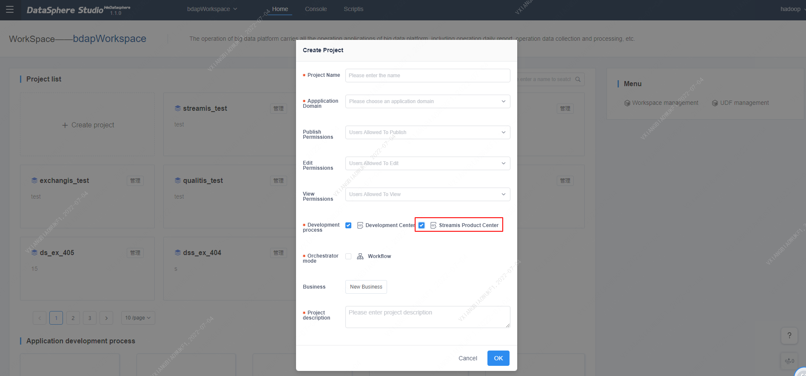
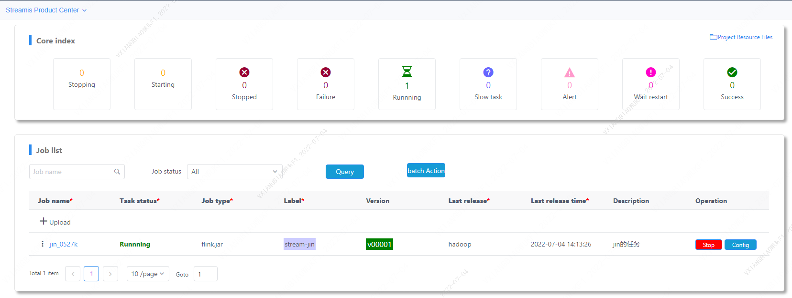
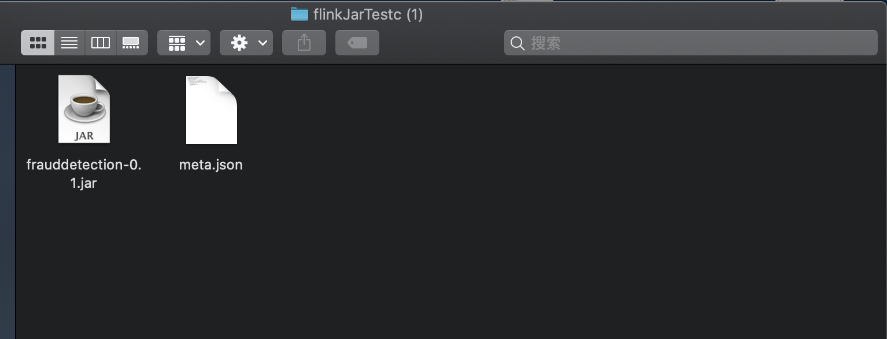
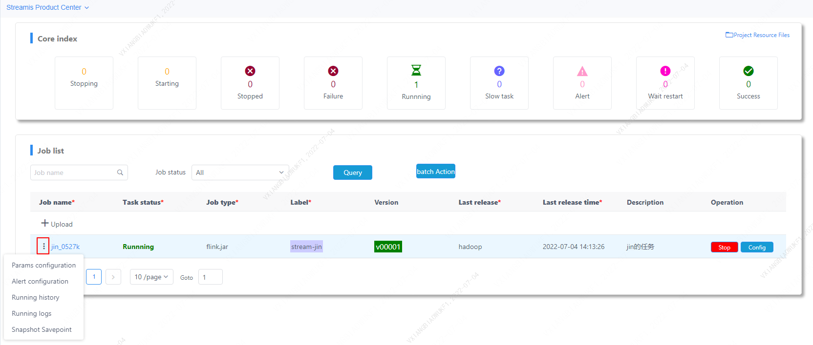
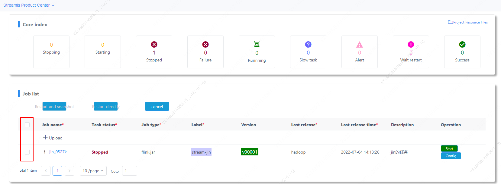
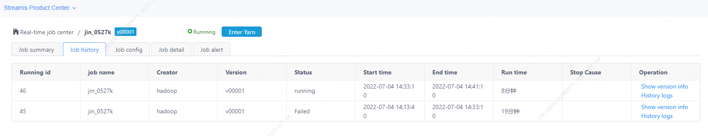
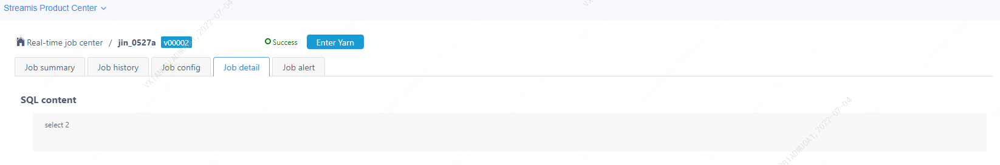
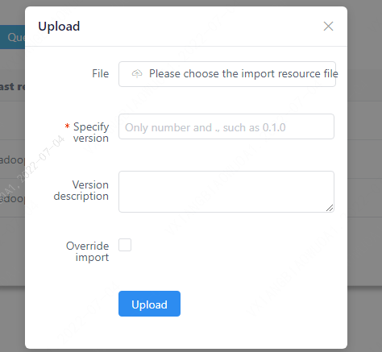

# Streamis quick start

## 1. Preface

&nbsp;&nbsp;&nbsp;&nbsp;&nbsp;&nbsp;&nbsp;&nbsp;&nbsp;This article is a quick start document for Streamis 0.2.0, which covers the basic usage process of Stremis. More details on operation and usage will be provided in the user documentation.
  

## 2. Streamis entrance
&nbsp;&nbsp;&nbsp;&nbsp;&nbsp;&nbsp;&nbsp;&nbsp;&nbsp;For the convenience of users,**the Streamis system is embedded in the DSS system in the form of DSS components**

The entry path is **Home-DSS component application-Enter Streamis**


<center>Picture 2.1 Streamis entrance]</center>

## 3. Core indicators

&nbsp;&nbsp;&nbsp;&nbsp;&nbsp;&nbsp;&nbsp;&nbsp;&nbsp;Entering the homepage, the top half shows the core indicators.

&nbsp;&nbsp;&nbsp;&nbsp;&nbsp;&nbsp;&nbsp;&nbsp;&nbsp;The core indicator shows the status summary of the Flink tasks uploaded to the project for execution. There are temporarily 7 states, showing the state name and the number of tasks in that state. The specific content is as shown in the figure below.


<center>Picture 3.1 Core indicators</center>

# 4. Job management

&nbsp;&nbsp;&nbsp;&nbsp;&nbsp;&nbsp;&nbsp;&nbsp;&nbspSupport the release of Flink Jar and Flink SQL, and provide the development and debugging and production management capabilities of streaming applications, such as: start and stop, status monitoring, checkpoint, etc.

## 4.1. Upload job

&nbsp;&nbsp;&nbsp;&nbsp;&nbsp;&nbsp;&nbsp;&nbsp;&nbsp;Click **"Upload"** and select the zip file to upload. The file is divided into two job types, Flink Jar and Flink SQL, and the format is as follows:

### 4.1.1. The contents of the Flink Jar ZIP file are as follows: 


<center>Picture 4.1 Flink Jar ZIP</center> 

<br/>

#### Flink Jar meta.json：

```json
{
    "projectName": "flinkJarTest3",
    "jobName": "flinkJarTestc",
    "jobType": "flink.jar",
    "tags": "e,t,y,h,g",
    "description": "test of FlinkJar Job3",
    "jobContent": {
        "main.class.jar": "frauddetection-0.1.jar",
        "main.class": "spendreport.FraudDetectionJob",
        "args": ["aa","bb"],
        "hdfs.jars": [],
        "dependency.jars": [],
        "resources": []
    }
}
```

### 4.1.2. Flink SQL ZIP

&nbsp;&nbsp;&nbsp;&nbsp;&nbsp;&nbsp;&nbsp;&nbsp;&nbsp;The SQL type file is just a ZIP compressed package of the meta.json file, and its content is as follows:

#### Flink SQL meta.json：

```json
{
  "projectName": "flinkSqlTestD",
  "jobName": "flinkSqlTesta",
  "jobType": "flink.sql",
  "tags": "a,b,c",
  "description": "test FlinkSql JobD",
  "jobContent": {
    "type": "sql",
    "sql": "select 1",
    "file": "",
    "resourceId": "",
    "version": ""
  }
}

```

<br/>

&nbsp;&nbsp;&nbsp;&nbsp;&nbsp;&nbsp;&nbsp;&nbsp;&nbsp;After the ZIP file is uploaded successfully, the task is displayed in the task list in Figure 3.1, and operations such as start, stop, configuration and checkpoint are provided according to the task status;

&nbsp;&nbsp;&nbsp;&nbsp;&nbsp;&nbsp;&nbsp;&nbsp;&nbsp;The task list provides the function of **"query"**, where **job name** provides the function of fuzzy query.


## 4.3. Management jobs

<br/>

&nbsp;&nbsp;&nbsp;&nbsp;&nbsp;&nbsp;&nbsp;&nbsp;&nbsp;Click **"job name"** of a task in the task list to provide the function of managing the task, or click **"three dots"** to the left of the name to call up the specific function configuration entry, as shown below:


<center>Picture4.3 Configuration job</center> 

<br/>

&nbsp;&nbsp; The configuration task provides four functions, namely:

- Parameter configuration 
- alarm configuration 
- operation history 
- operation log
- snapshot[savepoint]

<br/>

Click batch operation, and multiple job tasks can be restarted. Restart and snapshot  will generate a snapshot and then restart. Restart directly will not generate a snapshot.



### 4.3.1. Job summary:


<center> Picture 4.4 Job summary</center> 

<br/>

&nbsp;&nbsp;The running status summarizes the real-time traffic, total amount of data, and load status of the task.

<br/>

### 4.3.2. Job history:


<center>Picture 4.5 Job history</center> 

<br/>

&nbsp;&nbsp;The running history records the record of each run of the task.

<br/>


### 4.3.3. Job config:


<center>Picture 4.6 Job config</center> 

<br/>

&nbsp;&nbsp;The configuration page is used to configure various parameters of the running task, and provides the following types of configuration:

- Resource configuration
- Production configuration
- Flink parameters
- Permission settings

<br/>

### 4.3.4. Job details：

<br/>

&nbsp;&nbsp;The job details are divided into two display interfaces according to the task type Flink Jar and Flink SQL.

<br/>

**Flink Jar Job details**


<center>Picture 4.7 Flink Jar Job details</center> 

<br/>

&nbsp;&nbsp;Flink Jar task details show the contents and parameters of the task Jar package, and provide the function of downloading the Jar package.

<br/>


**Flink SQL job details**


<center>Picture 4.8 Flink SQL job details</center> 

<br/>

&nbsp;&nbsp;The Flink SQL job details show the SQL statement of the task.

<br/>


## 5. Project resource file

<br/>

&nbsp;&nbsp;&nbsp;&nbsp;&nbsp;&nbsp;&nbsp;&nbsp;&nbsp; **Page entry:** On the top right of the homepage-core indicators **"Project Resource File"**.

&nbsp;&nbsp;&nbsp;&nbsp;&nbsp;&nbsp;&nbsp;&nbsp;&nbsp;The project resource file provides the function of uploading and managing the resource files required by the project, as shown in the figure below:

<br/>


<center>Picture 5.1 Engineering Documents Home Page</center>

<br/>


<center>Picture 5.2 Upload project file</center>
