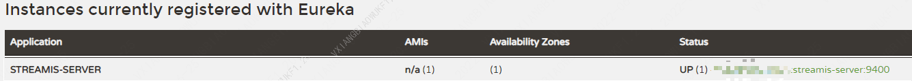

# Streamis安装部署文档

## 1.组件介绍

Streamis0.2.0 提供了 Streamis-JobManager 流式生产中心，其作用主要有：

1. 上传/更新流式应用
2. 配置流式应用参数，如 Flink 的 Slot 数量、checkpoint相关参数等 
3. 管理流式应用，如启停、savepoint等 
4. 流式应用监控告警


## 2.代码编译
 
**Streamis 无需手动编译，可以直接下载安装包进行部署，请 [点我下载安装包](https://github.com/WeBankFinTech/Streamis/releases)。**

如果您想自己编译 Streamis，可参考如下步骤进行。

- 后台编译方式如下：

```shell script
cd ${STREAMIS_CODE_HOME}
mvn -N install
mvn clean install
```
编译成功后将会在项目的 `assembly/target` 目录下生成安装包 `wedatasphere-streamis-${streamis-version}-dist.tar.gz`

- 前端编译方式如下：

前置依赖：nodejs、python 2.0

```shell script
cd ${STREAMIS_CODE_HOME}/web
npm i
npm run build
```
编译成功后，在 `${STREAMIS_CODE_HOME}/web` 目录下生成 `streamis-${streamis-version}-dist.zip`

## 3.安装准备

#### 3.1 基础环境安装

&nbsp;&nbsp;&nbsp;&nbsp;&nbsp;&nbsp;&nbsp;&nbsp;下面的软件必须安装：

- MySQL (5.5+)，[如何安装MySQL](https://www.runoob.com/mysql/mysql-install.html)
- JDK (1.8.0_141以上)，[如何安装JDK](https://www.runoob.com/java/java-environment-setup.html)

### 3.2 Linkis 和 DSS 环境

- Linkis (>=1.1.1)，Streamis 的执行依赖于 Linkis 的 Flink 引擎，并且依赖 **Linkis-1.1.1** 及以上版本，部分功能需要Linkis-1.1.2支持。
- DataSphere Studio (>=1.1.0)，Streamis 流式作业的开发和调试，依赖于 DSS-Scriptis，Streamis 流式生产中心则需嵌入到 DSS 工程框架体系之中，所以依赖于 **DSS-1.1.0** 及以上版本。

在正式安装 Streamis 之前，请先安装 Linkis1.1.1 和 DSS1.1.0 及以上版本，并且保证 Linkis Flink 引擎 和 DSS 可以正常使用，DSS 和 Linkis 安装，可参照 [DSS & Linkis 一键安装部署文档](https://github.com/WeBankFinTech/DataSphereStudio-Doc/blob/main/zh_CN/%E5%AE%89%E8%A3%85%E9%83%A8%E7%BD%B2/DSS%E5%8D%95%E6%9C%BA%E9%83%A8%E7%BD%B2%E6%96%87%E6%A1%A3.md)。

如何验证 DSS 和 Linkis 已基本可用？您可以在 DSS-Scriptis 上新建一个 flinksql 脚本并执行，如果 flinksql 能正确执行并返回结果集，表示 DSS 和 linkis 环境是可用的。


## 4.安装和启动

### 后台安装

1.安装包准备

将安装包上传到 Linux 服务器（目前只支持 Linux 环境部署）的安装目录，如 /appcom/Install/streamis，然后进行解压：

```shell script
cd /appcom/Install/streamis
tar -xvf wedatasphere-streamis-${streamis-version}-dist.tar.gz
```

2.修改数据库配置

```shell script
vi conf/db.sh
#配置基础的数据库信息

```

3.修改基础配置文件

```shell script
    vi conf/config.sh
```

```shell script
### deploy user
deployUser=hadoop

### ssh port
SSH_PORT=22

##The Port of Streamis
STREAMIS_PORT=9400

### The install home path of STREAMIS，Must provided
STREAMIS_INSTALL_HOME=/appcom/Install/streamis

###  Linkis EUREKA  information.  # Microservices Service Registration Discovery Center
EUREKA_INSTALL_IP=127.0.0.1
EUREKA_PORT=20303

### Linkis Gateway  information
GATEWAY_INSTALL_IP=127.0.0.1
GATEWAY_PORT=9001

```

4.执行安装脚本

```shell script
sh bin/install.sh
```

- install.sh脚本会询问您是否需要初始化数据库并导入元数据。

&nbsp;&nbsp;&nbsp;&nbsp;&nbsp;因为担心用户重复执行install.sh脚本，把数据库中的用户数据清空，所以在install.sh执行时，会询问用户是否需要初始化数据库并导入元数据。

&nbsp;&nbsp;&nbsp;&nbsp;&nbsp;**第一次安装**必须选是。


5.启动

```shell script
sh bin/start.sh
```

- 启动验证

验证方式，因为 Streamis 与 Linkis 同用一套 Eureka，所以您需要检查 Linkis 的 Eureka 页面是否已经包含了 Streamis 的服务，如图：




### 前端部署

1.安装nginx
 
```bash
sudo yum install -y nginx
```

2.部署前端包

```
mkdir ${STREAMIS_FRONT_PATH}
cd ${STREAMIS_FRONT_PATH}
#放置前端包
unzip streamis-${streamis-version}.zip
```

3.修改nginx配置文件<br>

```bash
cd /etc/nginx/conf.d
vi streamis.conf
# 复制下面的模板并根据实际情况进行修改
```

```
server {
    listen       9088;# 访问端口
    server_name  localhost;
    location / {
        root   ${STREAMIS_FRONT_PATH}/dist; # 请修改成Streamis前端的静态文件目录
        index  index.html index.html;
    }
    location /api {
    proxy_pass http://${Linkis_GATEWAY_IP}:${LINKIS_GATEWY_PORT}; #后端Linkis的地址,请修改成Linkis网关的ip和端口
    proxy_set_header Host $host;
    proxy_set_header X-Real-IP $remote_addr;
    proxy_set_header x_real_ipP $remote_addr;
    proxy_set_header remote_addr $remote_addr;
    proxy_set_header X-Forwarded-For $proxy_add_x_forwarded_for;
    proxy_http_version 1.1;
    proxy_connect_timeout 4s;
    proxy_read_timeout 600s;
    proxy_send_timeout 12s;
    proxy_set_header Upgrade $http_upgrade;
    proxy_set_header Connection upgrade;
    }

    #error_page  404              /404.html;
    # redirect server error pages to the static page /50x.html
    #
    error_page   500 502 503 504  /50x.html;
    location = /50x.html {
    root   /usr/share/nginx/html;
    }
}
```

4.加载nginx配置

```bash
sudo nginx -s reload
```

## 5. 接入DSS

如您想正常使用 Streamis0.2.0 前端，还需安装 DSS StreamisAppConn 插件，请参考: [StreamisAppConn 插件安装文档](development/StreamisAppConn安装文档.md)

## 6.Linkis Flink引擎编译安装
如您想正常执行 Streamis0.2.0，还需安装 Linkis Flink 引擎，请参考: [Linkis Flink 引擎安装文档](https://linkis.apache.org/zh-CN/docs/1.1.2/engine_usage/flink/)

## 7.Streamis组件升级文档/脚本
如您想从Streamis较低版本升级到 Streamis0.2.0 ，请参考：[Streamis升级文档](development/Streamis升级文档.md)