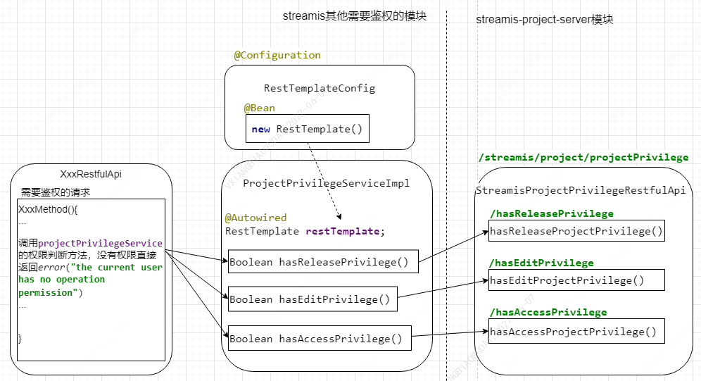

# 鉴权

## 鉴权流程图
streamis存在需要鉴权的模块没有依赖streamis-project-server模块的情况，使用rest接口调用来处理鉴权。

## 具体实现说明
根据当前用户名和项目ID/名称获取到所有权限的集合，如果权限集合中包含RELEASE权限，则拥有发布/编辑/查看的权限，如果权限集合中包含EDIT权限，则拥有编辑/查看的权限，如果权限集合中包含ACCESS权限，则拥有查看的权限；  
权限包含关系：RELEASE权限包含EDIT权限、ACCESS权限；EDIT权限包含ACCESS权限。

## 接口
### edit权限接口：

|RequestMethod  |接口路径                                          |名称             |
|------|----------------------------------------------------------|-----------------|
|POST  |/streamis/streamProjectManager/project/files/upload       |工程资源文件-导入   |
|GET   |/streamis/streamProjectManager/project/files/delete       |删除项目下该文件所有版本  |
|GET   |/streamis/streamProjectManager/project/files/version/delete |删除版本文件  |
|GET   |/streamis/streamProjectManager/project/files/download     |任务详情-下载  |
|POST  |streamis/streamJobManager/job/createOrUpdate              |创建或更新streamis-job|
|POST  |/streamis/streamJobManager/job/upload                     |上传文件  |
|POST  |/streamis/streamJobManager/job/execute                  |启动  |
|GET   |/streamis/streamJobManager/job/stop                     |停止  |
|PUT   |/streamis/streamJobManager/job//snapshot/{jobId:\w+}    |快照生成  |
|GET   |/streamis/streamJobManager/config/json/{jobId:\w+}    |配置-保存  |
|POST  |/streamis/streamJobManager/job/bulk/execution         |批量启动  |
|POST  |/streamis/streamJobManager/job/bulk/pause             |批量停止  |

### access权限接口：

|RequestMethod  |接口路径                                          |名称          |
|------|----------------------------------------------------------|-------------|
|GET   |streamis/streamJobManager/job/list                        |查询当前用户可查看job  |
|GET   |/streamis/streamProjectManager/project/files/list         |工程资源文件  |
|GET   |/streamis/streamProjectManager/project/files/version/list  |获取工程下该文件所有版本  |
|GET   |/streamis/streamJobManager/job/version                    |查询job版本  |
|GET   |/streamis/streamJobManager/job/execute/history            |job执行历史  |
|GET   |/streamis/streamJobManager/job/progress                |获取job当前版本最新task状态  |
|GET   |/streamis/streamJobManager/job/jobContent             |任务详情  |
|GET   |/streamis/streamJobManager/job/logs                   |获取日志  |
|POST  |/streamis/streamJobManager/config/json/{jobId:\w+}    |获得任务配置  |
|GET   |/streamis/streamJobManager/config/view                |查询当前job配置信息  |