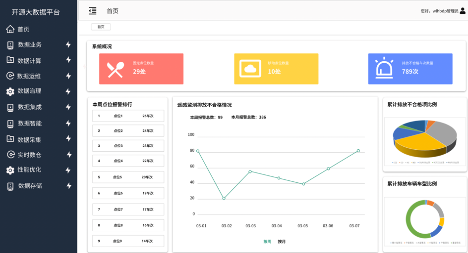

# 开源大数据平台原型图

```markdown
墨刀原型图链接：

https://modao.cc/app/HhitGZQTr954c7Ug8XBvAY#screen=sl11y8j8s27vbea

总体架构图：


1、首页：



2、数据业务：


3、数据计算：


4、数据运维：


5、数据治理：


6、数据集成：


7、数据智能：


8、数据采集：


9、实时数仓：


10、性能优化：


11、数据存储：


```