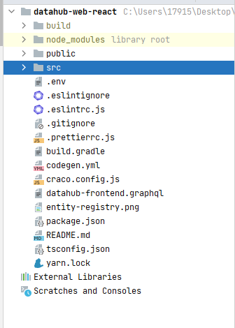
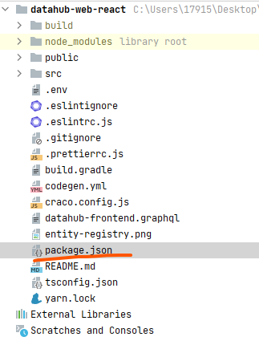
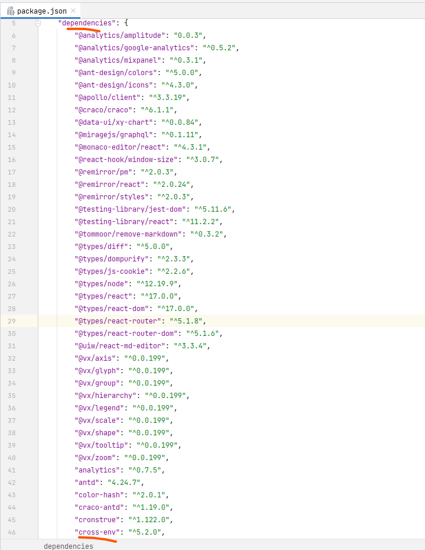
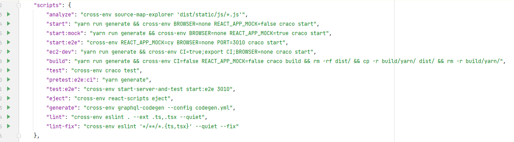
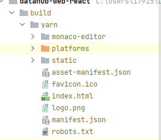

## dataHub 本地启动前端开发 datahub-web-react

## 1. 克隆官方源码

> 这里以ssh方式为例 下载最新master源码
``` shell
git clone git@github.com:datahub-project/datahub.git
```
## 2. 导入源码目录下的datahub-web-react


## 3. 本地化启动操作

> 打开 package.json



> dependencies 下添加 cross-env 



> 添加完成后修改scripts 按照下图添加 cross-env



> 修改src目录下 setupProxy.js
> 该文件找不到可以搜一下

``` js
const logInFilter = function (pathname, req) {
  return pathname.match('^/logIn') && req.method === 'POST';
};

if (process.env.REACT_APP_MOCK === 'true' || process.env.REACT_APP_MOCK === 'cy') {
    // no proxy needed, MirageJS will intercept all http requests
    module.exports = function () {};
} else {
    // create a proxy to the graphql server running in docker container
    const { createProxyMiddleware } = require('http-proxy-middleware');

    module.exports = function (app) {
        app.use(
            '/logIn',
            createProxyMiddleware(logInFilter, {
                target: 'http://IP:9002',
                changeOrigin: true,
            }),
        );
        app.use(
            '/authenticate',
            createProxyMiddleware({
                target: 'http://IP:9002',
                changeOrigin: true,
            }),
        );
        app.use(
            '/api/v2/graphql',
            createProxyMiddleware({
                target: 'http://IP:9002',
                changeOrigin: true,
            }),
        );
    };
}

```

> 9002 端口是它的后台端口 本地化启动之前需要先源码部署一套datahub 官方默认的方式是docker方式 也就是需要先部署一套环境再单独启动前端。
如何部署见 [部署文档](README.md)


> 以上操作完成直接可按需执行以下命令

- 注： 执行速度有点慢需要点耐心

``` shell
# 需要已经有nodejs环境 版本号 1.14 1.16 都可以 我这里是1.14
yarn install
# 如果下依赖慢可以使用 taobao的源
yarn config set registry https://registry.npm.taobao.org/
#打包项目
yarn build
#启动项目
yarn run start
```
- 前端端口 IP:3000 


## dataHub 修改后提交到docker容器中

> 如需详细见视频 [datahub源代码替换](docs/datahub替换源代码视频.mp4) 视频中有启动&编译等待可以手动跳过

> 在进行该操作之前需要先完成以下工作

- 1. 已经修改好的源码，如何本地化部署启动参照上面内容
-
    2. 已经部署好的datahub docker环境
- 因为需要datahub 后台服务

### 1. 先导出docker 中 datahub的前端项目

> 执行如下命令

``` shell
docker cp datahub-frontend-react:/datahub-frontend/lib/datahub-web-react-datahub-web-react-assets.jar ./
```

> 导出后下载到本地用解压工具打开删除里面public文件夹中的内容 如不明白可以看视频


> 打包工程执行 yarn build 然后把打包 目录 build > yarn 下的内容全部拷贝到public中



> 把jar上传到服务器 并执行以下命令 并重启 datahub-frontend-react 容器

``` shell
docker cp datahub-web-react-datahub-web-react-assets.jar datahub-frontend-react:/datahub-frontend/lib/
```


 


