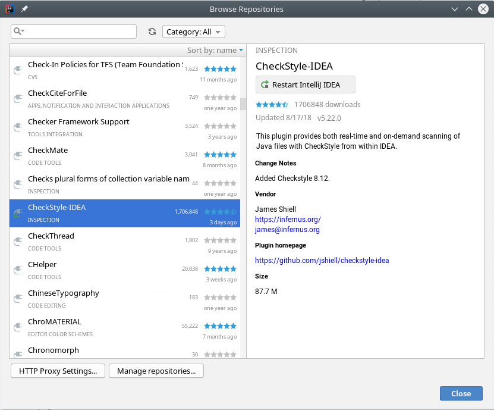
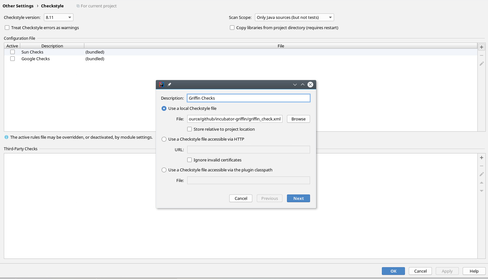
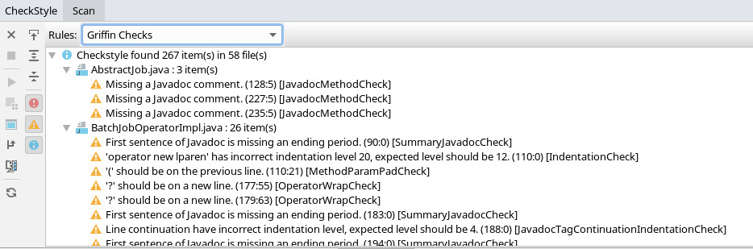
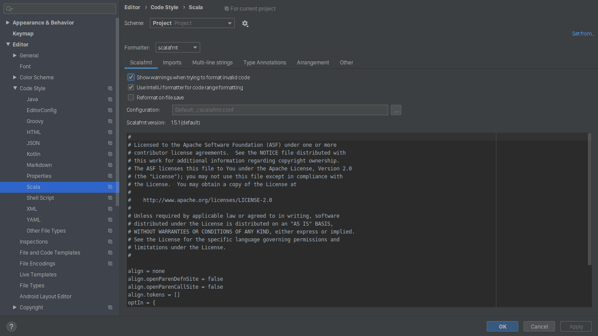
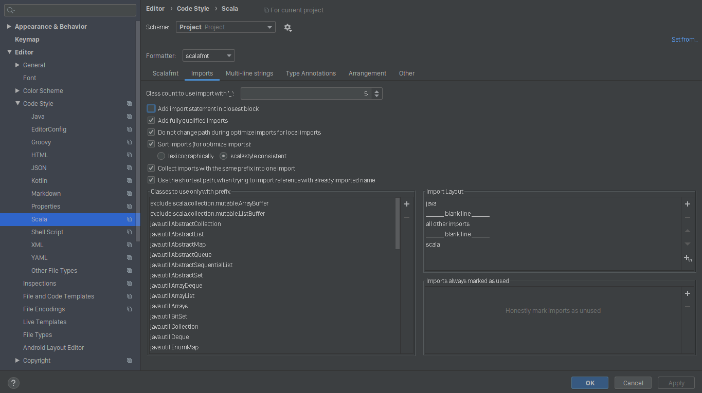
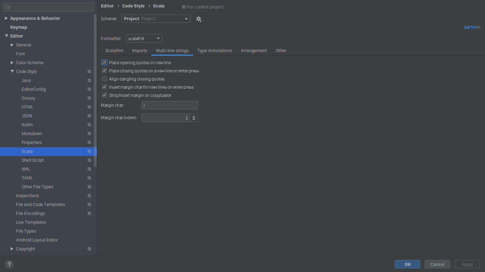
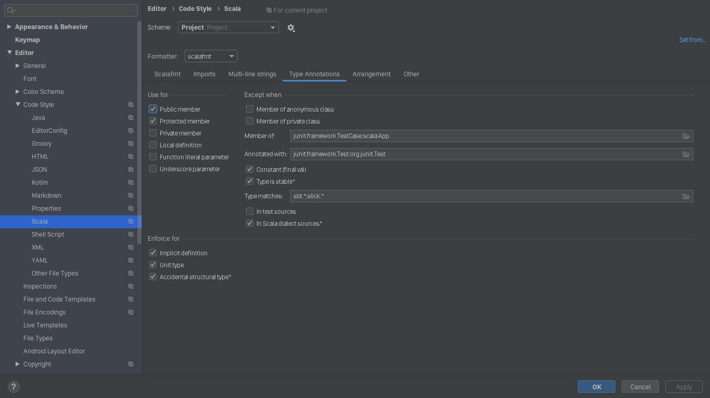
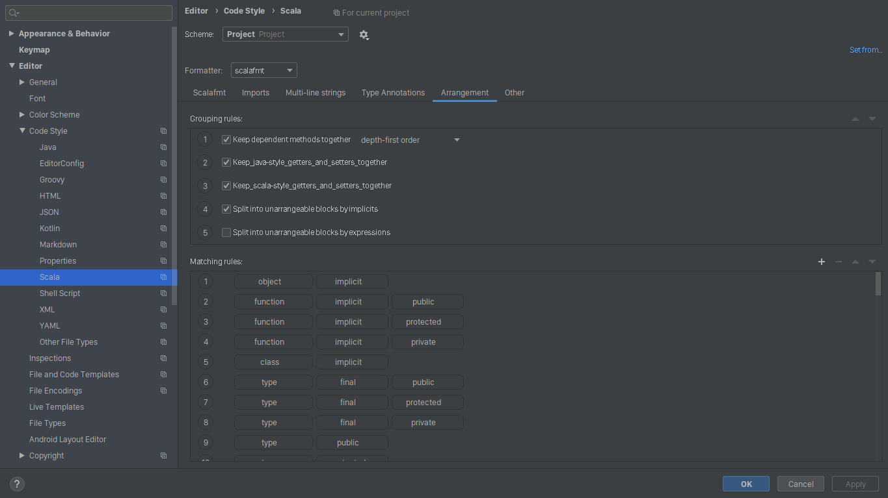
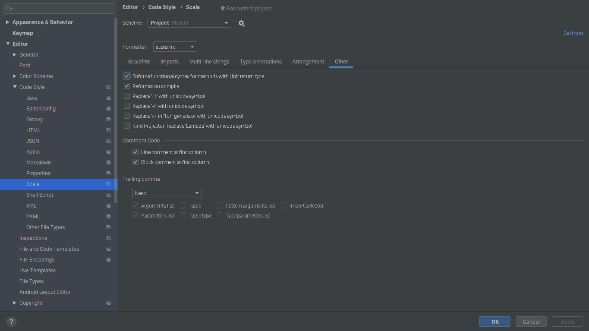

<!--
Licensed to the Apache Software Foundation (ASF) under one
or more contributor license agreements.  See the NOTICE file
distributed with this work for additional information
regarding copyright ownership.  The ASF licenses this file
to you under the Apache License, Version 2.0 (the
"License"); you may not use this file except in compliance
with the License.  You may obtain a copy of the License at

  http://www.apache.org/licenses/LICENSE-2.0

Unless required by applicable law or agreed to in writing,
software distributed under the License is distributed on an
"AS IS" BASIS, WITHOUT WARRANTIES OR CONDITIONS OF ANY
KIND, either express or implied.  See the License for the
specific language governing permissions and limitations
under the License.
-->

# Apache Griffin Development Code Style Config Guide
Apache Griffin consists of three main modules - Measure, Services and UI. These are developed using Scala, Java and Angular 2 respectively.

Quoting the Databricks-Apache Spark Code Style Guide at [link](https://github.com/databricks/scala-style-guide) :
> Code is written once by its author, but read and modified multiple times by lots of other engineers. As most bugs actually come from future modification of the code, we need to optimize our codebase for long-term, global readability and maintainability. The best way to achieve this is to write simple code.

So it's necessary to define a bunch of code style rules, which are to be followed by all contributors and committers so as ot keep the code base consistent.


## Config Java Code Style
We suggest developers use automatic tools to check code violation like [CheckStyle](https://github.com/checkstyle/checkstyle).<br>
+ Firstly, you need to apply Apache Griffin's Java Code Style Rules. Copy configuration and save as griffin_check.xml
```xml
<?xml version="1.0"?>
<!DOCTYPE module PUBLIC
        "-//Checkstyle//DTD Checkstyle Configuration 1.3//EN"
        "https://checkstyle.org/dtds/configuration_1_3.dtd">

<!--
    Checkstyle configuration that checks the Griffin coding conventions extending Google Java Style
    that can be found at https://google.github.io/styleguide/javaguide.html.

    Checkstyle is very configurable. Be sure to read the documentation at
    http://checkstyle.sf.net (or in your downloaded distribution).

    To completely disable a check, just comment it out or delete it from the file.

    Authors: Max Vetrenko, Ruslan Diachenko, Roman Ivanov.
 -->

<module name = "Checker">
    <property name="charset" value="UTF-8"/>

    <property name="severity" value="warning"/>

    <property name="fileExtensions" value="java, properties, xml"/>
    <!-- Checks for whitespace                               -->
    <!-- See http://checkstyle.sf.net/config_whitespace.html -->
    <module name="FileTabCharacter">
        <property name="eachLine" value="true"/>
    </module>

    <module name="TreeWalker">
        <module name="OuterTypeFilename"/>
        <module name="IllegalTokenText">
            <property name="tokens" value="STRING_LITERAL, CHAR_LITERAL"/>
            <property name="format"
                      value="\\u00(09|0(a|A)|0(c|C)|0(d|D)|22|27|5(C|c))|\\(0(10|11|12|14|15|42|47)|134)"/>
            <property name="message"
                      value="Consider using special escape sequence instead of octal value or Unicode escaped value."/>
        </module>
        <module name="AvoidEscapedUnicodeCharacters">
            <property name="allowEscapesForControlCharacters" value="true"/>
            <property name="allowByTailComment" value="true"/>
            <property name="allowNonPrintableEscapes" value="true"/>
        </module>
        <module name="LineLength">
            <property name="max" value="100"/>
            <property name="ignorePattern" value="^package.*|^import.*|a href|href|http://|https://|ftp://"/>
        </module>
        <module name="AvoidStarImport"/>
        <module name="OneTopLevelClass"/>
        <module name="NoLineWrap"/>
        <module name="EmptyBlock">
            <property name="option" value="TEXT"/>
            <property name="tokens"
                      value="LITERAL_TRY, LITERAL_FINALLY, LITERAL_IF, LITERAL_ELSE, LITERAL_SWITCH"/>
        </module>
        <module name="NeedBraces"/>
        <module name="LeftCurly"/>
        <module name="RightCurly">
            <property name="id" value="RightCurlySame"/>
            <property name="tokens"
                      value="LITERAL_TRY, LITERAL_CATCH, LITERAL_FINALLY, LITERAL_IF, LITERAL_ELSE,
                    LITERAL_DO"/>
        </module>
        <module name="RightCurly">
            <property name="id" value="RightCurlyAlone"/>
            <property name="option" value="alone"/>
            <property name="tokens"
                      value="CLASS_DEF, METHOD_DEF, CTOR_DEF, LITERAL_FOR, LITERAL_WHILE, STATIC_INIT,
                    INSTANCE_INIT"/>
        </module>
        <module name="WhitespaceAround">
            <property name="allowEmptyConstructors" value="true"/>
            <property name="allowEmptyMethods" value="true"/>
            <property name="allowEmptyTypes" value="true"/>
            <property name="allowEmptyLoops" value="true"/>
            <message key="ws.notFollowed"
                     value="WhitespaceAround: ''{0}'' is not followed by whitespace. Empty blocks may only be represented as '{}' when not part of a multi-block statement (4.1.3)"/>
            <message key="ws.notPreceded"
                     value="WhitespaceAround: ''{0}'' is not preceded with whitespace."/>
        </module>
        <module name="OneStatementPerLine"/>
        <module name="MultipleVariableDeclarations"/>
        <module name="ArrayTypeStyle"/>
        <module name="MissingSwitchDefault"/>
        <module name="FallThrough"/>
        <module name="UpperEll"/>
        <module name="ModifierOrder"/>
        <module name="EmptyLineSeparator">
            <property name="allowNoEmptyLineBetweenFields" value="true"/>
        </module>
        <module name="SeparatorWrap">
            <property name="id" value="SeparatorWrapDot"/>
            <property name="tokens" value="DOT"/>
            <property name="option" value="nl"/>
        </module>
        <module name="SeparatorWrap">
            <property name="id" value="SeparatorWrapComma"/>
            <property name="tokens" value="COMMA"/>
            <property name="option" value="EOL"/>
        </module>
        <module name="SeparatorWrap">
            <!-- ELLIPSIS is EOL until https://github.com/google/styleguide/issues/258 -->
            <property name="id" value="SeparatorWrapEllipsis"/>
            <property name="tokens" value="ELLIPSIS"/>
            <property name="option" value="EOL"/>
        </module>
        <module name="SeparatorWrap">
            <!-- ARRAY_DECLARATOR is EOL until https://github.com/google/styleguide/issues/259 -->
            <property name="id" value="SeparatorWrapArrayDeclarator"/>
            <property name="tokens" value="ARRAY_DECLARATOR"/>
            <property name="option" value="EOL"/>
        </module>
        <module name="SeparatorWrap">
            <property name="id" value="SeparatorWrapMethodRef"/>
            <property name="tokens" value="METHOD_REF"/>
            <property name="option" value="nl"/>
        </module>
        <module name="PackageName">
            <property name="format" value="^[a-z]+(\.[a-z][a-z0-9]*)*$"/>
            <message key="name.invalidPattern"
                     value="Package name ''{0}'' must match pattern ''{1}''."/>
        </module>
        <module name="TypeName">
            <message key="name.invalidPattern"
                     value="Type name ''{0}'' must match pattern ''{1}''."/>
        </module>
        <module name="LambdaParameterName">
            <property name="format" value="^[a-z]([a-z0-9][a-zA-Z0-9]*)?$"/>
            <message key="name.invalidPattern"
                     value="Lambda parameter name ''{0}'' must match pattern ''{1}''."/>
        </module>
        <module name="CatchParameterName">
            <property name="format" value="^[a-z]([a-z0-9][a-zA-Z0-9]*)?$"/>
            <message key="name.invalidPattern"
                     value="Catch parameter name ''{0}'' must match pattern ''{1}''."/>
        </module>
        <module name="ClassTypeParameterName">
            <property name="format" value="(^[A-Z][0-9]?)$|([A-Z][a-zA-Z0-9]*[T]$)"/>
            <message key="name.invalidPattern"
                     value="Class type name ''{0}'' must match pattern ''{1}''."/>
        </module>
        <module name="MethodTypeParameterName">
            <property name="format" value="(^[A-Z][0-9]?)$|([A-Z][a-zA-Z0-9]*[T]$)"/>
            <message key="name.invalidPattern"
                     value="Method type name ''{0}'' must match pattern ''{1}''."/>
        </module>
        <module name="InterfaceTypeParameterName">
            <property name="format" value="(^[A-Z][0-9]?)$|([A-Z][a-zA-Z0-9]*[T]$)"/>
            <message key="name.invalidPattern"
                     value="Interface type name ''{0}'' must match pattern ''{1}''."/>
        </module>
        <module name="NoFinalizer"/>
        <module name="GenericWhitespace">
            <message key="ws.followed"
                     value="GenericWhitespace ''{0}'' is followed by whitespace."/>
            <message key="ws.preceded"
                     value="GenericWhitespace ''{0}'' is preceded with whitespace."/>
            <message key="ws.illegalFollow"
                     value="GenericWhitespace ''{0}'' should followed by whitespace."/>
            <message key="ws.notPreceded"
                     value="GenericWhitespace ''{0}'' is not preceded with whitespace."/>
        </module>
        <module name="Indentation">
            <property name="basicOffset" value="4"/>
            <property name="braceAdjustment" value="0"/>
            <property name="caseIndent" value="4"/>
            <property name="throwsIndent" value="4"/>
            <property name="lineWrappingIndentation" value="4"/>
            <property name="arrayInitIndent" value="2"/>
        </module>
        <module name="AbbreviationAsWordInName">
            <property name="ignoreFinal" value="false"/>
            <property name="allowedAbbreviationLength" value="1"/>
        </module>
        <module name="OverloadMethodsDeclarationOrder"/>
        <module name="VariableDeclarationUsageDistance"/>
        <module name="CustomImportOrder">
            <property name="sortImportsInGroupAlphabetically" value="true"/>
            <property name="separateLineBetweenGroups" value="true"/>
            <property name="customImportOrderRules" value="STATIC###THIRD_PARTY_PACKAGE"/>
        </module>
        <module name="MethodParamPad"/>
        <module name="NoWhitespaceBefore">
            <property name="tokens"
                      value="COMMA, SEMI, POST_INC, POST_DEC, DOT, ELLIPSIS, METHOD_REF"/>
            <property name="allowLineBreaks" value="true"/>
        </module>
        <module name="ParenPad"/>
        <module name="OperatorWrap">
            <property name="option" value="NL"/>
            <property name="tokens"
                      value="BAND, BOR, BSR, BXOR, DIV, EQUAL, GE, GT, LAND, LE, LITERAL_INSTANCEOF, LOR,
                    LT, MINUS, MOD, NOT_EQUAL, PLUS, QUESTION, SL, SR, STAR, METHOD_REF "/>
        </module>
        <module name="AnnotationLocation">
            <property name="id" value="AnnotationLocationMostCases"/>
            <property name="tokens"
                      value="CLASS_DEF, INTERFACE_DEF, ENUM_DEF, METHOD_DEF, CTOR_DEF"/>
        </module>
        <module name="AnnotationLocation">
            <property name="id" value="AnnotationLocationVariables"/>
            <property name="tokens" value="VARIABLE_DEF"/>
            <property name="allowSamelineMultipleAnnotations" value="true"/>
        </module>
        <module name="NonEmptyAtclauseDescription"/>
        <module name="JavadocTagContinuationIndentation"/>
        <module name="SummaryJavadoc">
            <property name="forbiddenSummaryFragments"
                      value="^@return the *|^This method returns |^A [{]@code [a-zA-Z0-9]+[}]( is a )"/>
        </module>
        <module name="JavadocParagraph"/>
        <module name="AtclauseOrder">
            <property name="tagOrder" value="@param, @return, @throws, @deprecated"/>
            <property name="target"
                      value="CLASS_DEF, INTERFACE_DEF, ENUM_DEF, METHOD_DEF, CTOR_DEF, VARIABLE_DEF"/>
        </module>
        <module name="JavadocMethod">
            <property name="scope" value="public"/>
            <property name="allowMissingParamTags" value="true"/>
            <property name="allowMissingThrowsTags" value="true"/>
            <property name="allowMissingReturnTag" value="true"/>
            <property name="minLineCount" value="2"/>
            <property name="allowedAnnotations" value="Override, Test"/>
            <property name="allowThrowsTagsForSubclasses" value="true"/>
        </module>
        <module name="MethodName">
            <property name="format" value="^[a-z][a-z0-9][a-zA-Z0-9_]*$"/>
            <message key="name.invalidPattern"
                     value="Method name ''{0}'' must match pattern ''{1}''."/>
        </module>
        <module name="SingleLineJavadoc">
            <property name="ignoreInlineTags" value="false"/>
        </module>
        <module name="EmptyCatchBlock">
            <property name="exceptionVariableName" value="expected"/>
        </module>
        <module name="CommentsIndentation"/>
    </module>
</module>
```
+ Secondly, you should enable rule check during code building
    + Enable In Maven
    ```xml
    <plugin>
    	<groupId>org.apache.maven.plugins</groupId>
    	<artifactId>maven-checkstyle-plugin</artifactId>
    	<version>3.0.0</version>
    	<dependencies>
    		<dependency>
    			<groupId>com.puppycrawl.tools</groupId>
    			<artifactId>checkstyle</artifactId>
    			<version>8.11</version>
    		</dependency>
    	</dependencies>
    	<executions>
    		<execution>
    			<id>verify-style</id>
    			<phase>process-classes</phase>
    			<goals>
    				<goal>check</goal>
    			</goals>
    		</execution>
    	</executions>
    	<configuration>
    		<configLocation>griffin_check.xml</configLocation>
    		<enableFilesSummary>false</enableFilesSummary>
    	</configuration>
    </plugin>
    ```
    + Enable In IntelliJ IDE
        + Download CheckStyle-IDEA Plugin

        

        + Add Apache Griffin Checks In IDEA Setting

        

        + Check Codes Convention

        


## Scala Code Style Guide

Since only Measure module is written in Scala, this guide applies to only the measure module. 
For Scala code, Apache Griffin follows the official [Scala style guide](https://docs.scala-lang.org/style/) 
and [Apache Spark Scala guide](https://github.com/databricks/scala-style-guide).

#### Guide Update History
| Version | Date       | Changes |
|:-------:|:-----------|:--------|
| 1       | 2019-12-24 | Initial version: Added Scala Code Style Guide |

#### Configuration
For code style checks Apache Griffin uses [Scalastyle](http://www.scalastyle.org/) and formatting is handled 
by [Scalafmt](https://scalameta.org/scalafmt/).

Configurations for both Scalastyle and Scalafmt are present in the root of Apache Griffin repository.
 - Scalastyle Config: `scalastyle-config.xml`
 - Scalafmt Config: `.scalafmt.conf`
 
####  Formatting and Style Check
 
Although automatic formatting and checks are built into the build steps of Apache Griffin, 
to manually format Scala code and check for possible style violations, run the following commands.

```
## assuming current working directory is griffin root

cd measure
mvn clean verify -DskipTests
```

####  IntelliJ IDEA Setup

Navigate to _Settings > Editor > Code Style > Scala_ and follow the screenshots below to ensure coding standards
 in the IntelliJ IDEA.








#### Important Notes
1. [Guide Update History](#guide-update-history) section must be updated each time any section of 
Scala Code Style Guide is edited.
2. Formatting and code style checks must be ensured each time before submitting or updating a pull request as 
violations will cause build failures.
3. If you’re not sure about the right style for something, try to follow the style of the existing codebase. 
Look at whether there are other examples in the code that use your feature. 

In case of any queries or dilemmas feel free to reach out to the other contributors and committers 
on the [dev@griffin.apache.org](mailto:dev@griffin.apache.org) list.

## Config Angular 2 Code Style
to do
