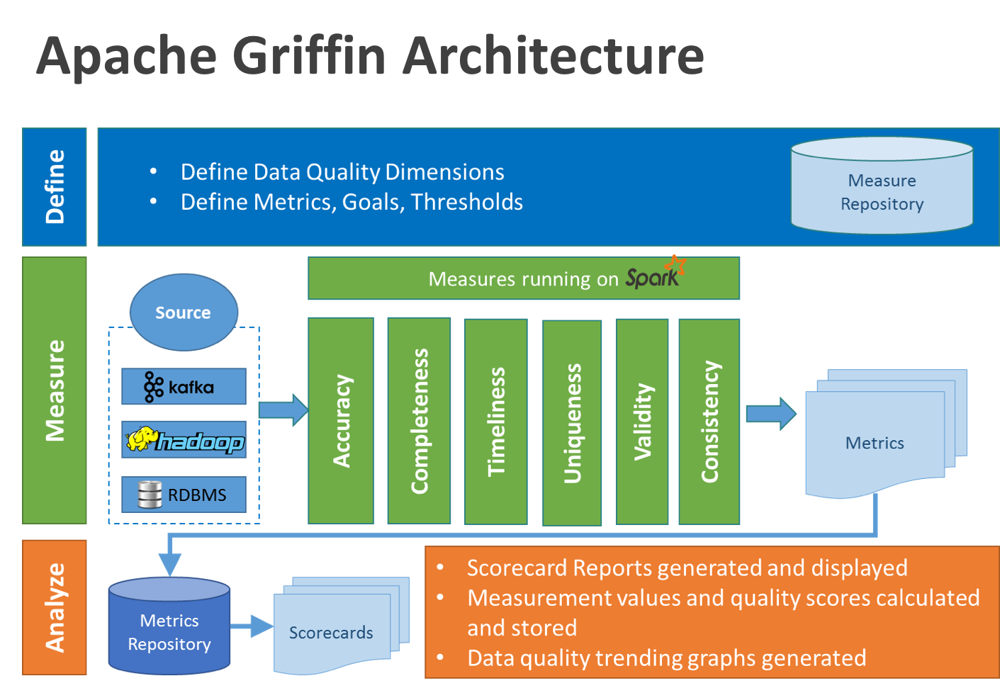

<!--
Licensed to the Apache Software Foundation (ASF) under one
or more contributor license agreements.  See the NOTICE file
distributed with this work for additional information
regarding copyright ownership.  The ASF licenses this file
to you under the Apache License, Version 2.0 (the
"License"); you may not use this file except in compliance
with the License.  You may obtain a copy of the License at

  http://www.apache.org/licenses/LICENSE-2.0

Unless required by applicable law or agreed to in writing,
software distributed under the License is distributed on an
"AS IS" BASIS, WITHOUT WARRANTIES OR CONDITIONS OF ANY
KIND, either express or implied.  See the License for the
specific language governing permissions and limitations
under the License.
-->
## Abstract
Apache Griffin is a Data Quality Service Platform(**DQSP**) built on top of Apache Hadoop and Apache Spark. It provides a comprehensive framework that processes different tasks like defining data quality model, executing data quality measurement, automating data profiling and validation, as well as an unified data quality visualization across multiple data systems.  It aims to address challenges from data quality domain in big data applications.

## Overview of Apache Griffin  
When people dances with big data (Hadoop or other streaming systems), they will hit a big challenge, measurement of data quality. Different teams have built customized tools to detect and analyze data quality issues within their own domains. However, it's extremely possible to take a platform approach as commonly occurring patterns, which is what we think. As such, we are building a platform to provide shared Infrastructure and generic features to solve common pain points of data quality. This would help us to build trusted data assets.

Currently it is very difficult and costly to validate data quality when we have large volumes of related data flowing across multi-platforms (streaming and batch). Taking eBay's Real-time Personalization Platform as a sample, everyday we have to validate data quality about ~600M records. Data quality often becomes one big challenge in this complex and massive scale environment.

We hit the following problems in eBay:

1. Lack of an end-to-end, unified view of data quality from multiple data sources to target applications that take into account the lineage of the data. This poses a long time to identify and fix data quality issues.
2. Lack of an unified system to measure data quality in streaming mode through self-service. The system should be like a suitable composition where datasets can be registered, data quality models can be defined, data quality can be visualized and monitored using a simple tool and teams alerted when an issue is detected.
3. Lack of a shared platform and exposed API services. Every team should not reinvent the wheel by its own and have not to apply and manage own hardware and software infrastructure to solve this common problem.

Considering these problems, we decided to build Apache Griffin - A data quality service that aims to solve the above shortcomings.

Apache Griffin includes:

**Data Quality Model Engine**: Apache Griffin is a model driven solution, users can choose various data quality dimension to execute their data quality validation based on selected target data-set or source data-set ( as the golden reference data). It has corresponding library supporting in back-end for the following measurement:

 - Accuracy - reflects the real-world objects or a verifiable source into data
 - Completeness - keeps all necessary data present
 - Validity -  corrects all data values within the data domains specified by the business
 - Timeliness - keeps the data available at the time needed
 - Anomaly detection -  pre-built algorithm functions for the identification of items, events or observations which do not conform to an expected pattern or other items in a dataset
 - Data Profiling - applies statistical analysis and assessment of data values within a dataset for consistency, uniqueness and logic.

**Data Collection Layer**:

We support two kinds of data sources, batch data and real time data.

For batch mode, we can collect data source from  our Hadoop platform by various data connectors.

For real time mode, we can connect with messaging system like Kafka to near real time analysis.

**Data Process and Storage Layer**:

For batch analysis, our data quality model will compute data quality metrics in our spark cluster based on data source in hadoop.

For near real time analysis, we consume data from messaging system, then our data quality model will compute our real time data quality metrics in our spark cluster. for data storage, we use elastic search in our back end to fulfill front end request.

**Apache Griffin Service**:

We have restful services to accomplish all the functions of Apache Griffin, such as exploring data-sets, create data quality measures, publish metrics, retrieve metrics, add subscription, etc. So, the developers can develop their own user interface based on these web services.

## Main architecture diagram

