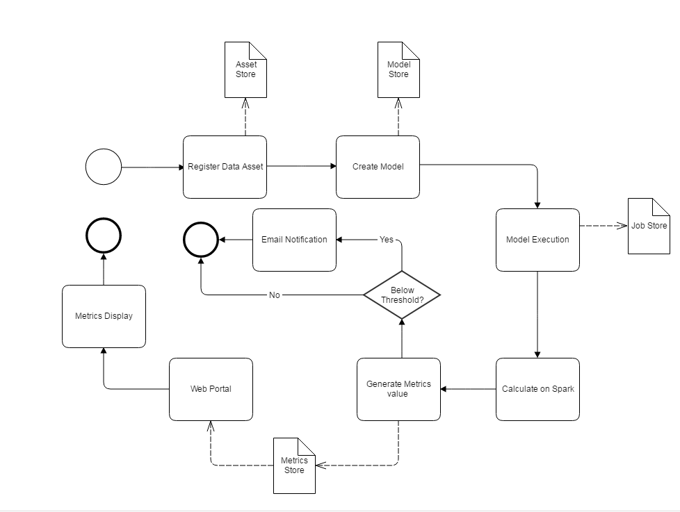
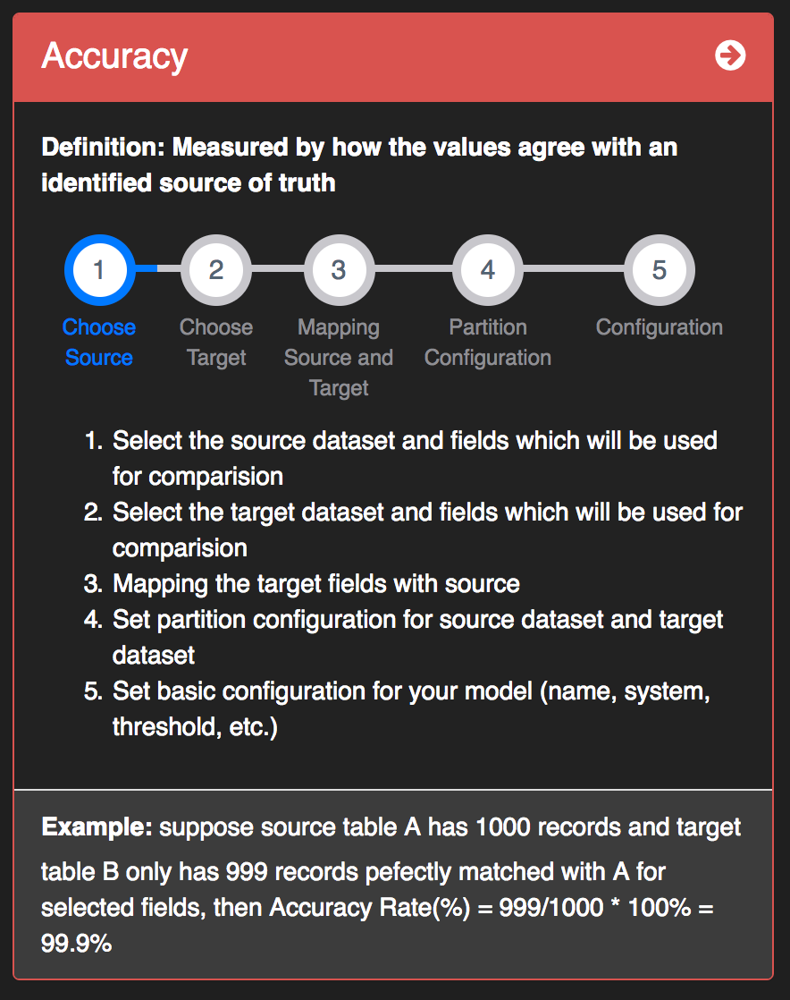
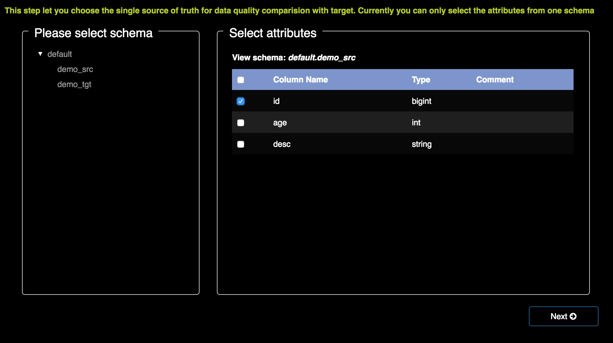
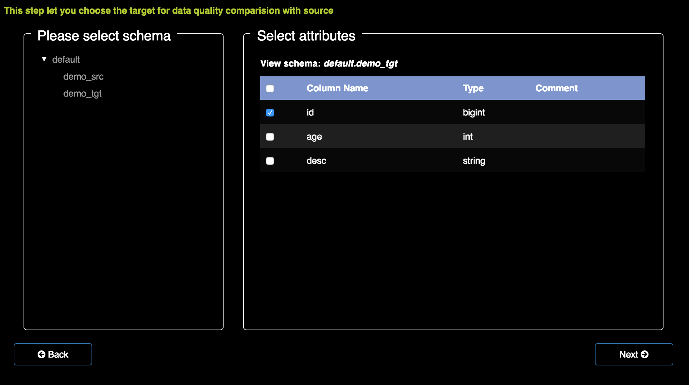
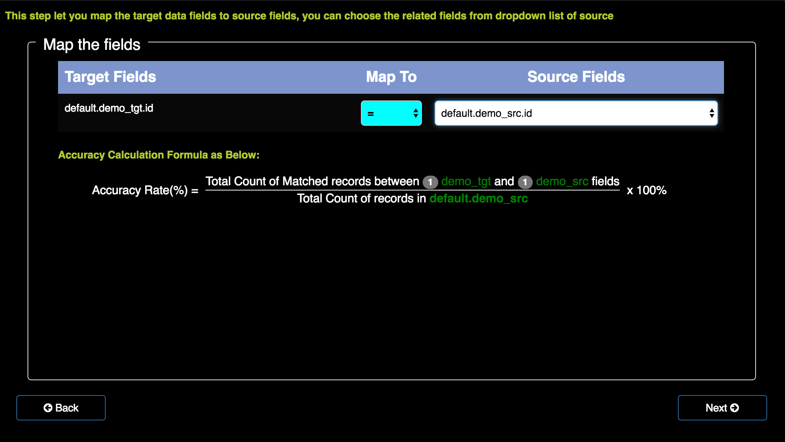
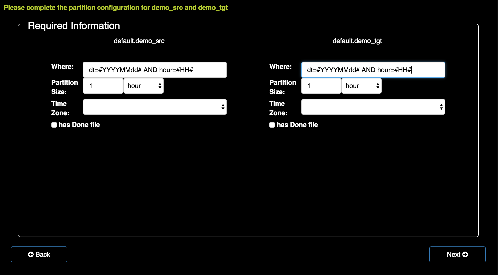
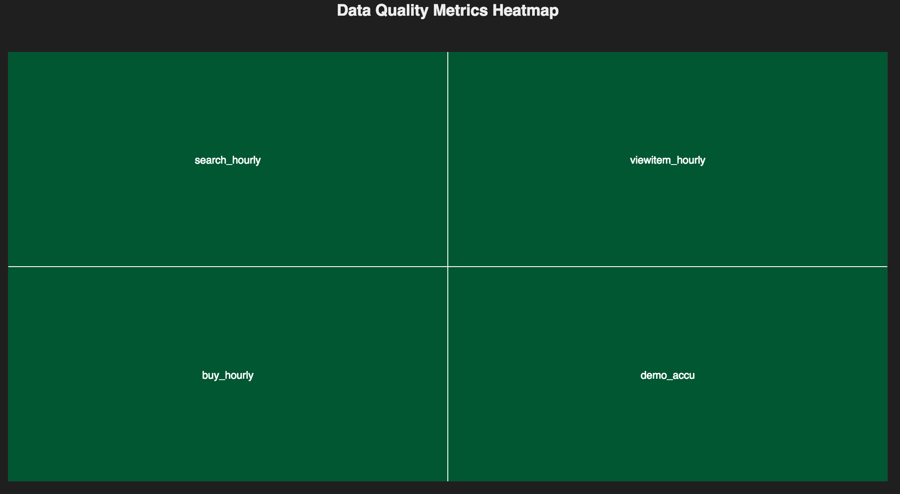

<!--
Licensed to the Apache Software Foundation (ASF) under one
or more contributor license agreements.  See the NOTICE file
distributed with this work for additional information
regarding copyright ownership.  The ASF licenses this file
to you under the Apache License, Version 2.0 (the
"License"); you may not use this file except in compliance
with the License.  You may obtain a copy of the License at

  http://www.apache.org/licenses/LICENSE-2.0

Unless required by applicable law or agreed to in writing,
software distributed under the License is distributed on an
"AS IS" BASIS, WITHOUT WARRANTIES OR CONDITIONS OF ANY
KIND, either express or implied.  See the License for the
specific language governing permissions and limitations
under the License.
-->
# Apache Griffin User Guide

## 1 Introduction & Access

- Apache Griffin is an open source Data Quality solution for distributed data systems at any scale in both streaming or batch data context.
- Users will primarily access this application from a PC.

## 2 Procedures

After you log into the system, you may follow the steps:

1. First, create a new measure.
2. Then, create a job to process the measure periodically.
3. Finally, the heatmap and dashboard will show the data diagram of the measures.

### 2.1 Data Asset

You can check the data assets by clicking "DataAssets" on the top right corner.

Then you can see all the data assets listed here.

### 2.2 Create measure

By clicking "Measures", and then choose "Create Measure". You can use the measure to process data and get the result you want.

There are mainly four kinds of measures for you to choose, which are:

1. if you want to measure the match rate between source and target, choose accuracy.
2. if you want to check the specific value of the data(such as: null column count), choose profiling.

At current we only support accuracy measure creation from UI.

#### **2.2.1 Accuracy** [[1]](#accuracy)

**Definition:**

Measured by how the values agree with an identified source of truth.

**Steps:**

1) Choose source

Select the source dataset and fields which will be used for comparision.

For example, we choose 3 columns here.

2) Choose target:

Select the target dataset and fields which will be used for comparision.

3) Mapping source and target

- Step1: "Map To": Select which rule to match the source and the target. Here are 6 options to choose:
  1. = : data of the two columns should be exactly matched.
  2. != : data of the two columns should be different.
  3. \> : the target column data should be bigger than the source one.
  4. \>= : the target column data should be bigger than or equal to the source one.
  5. < : the target column data should be smaller than the source one.
  6. <= : the target column data should be smaller than or equal to the source one.
- Step2: "Source fields": choose the source column that you want to compare with the target column.

4) Partition Configuration

Set partition configuration for source dataset and target dataset.  
The partition size  means hive database minimum data unit,used to split data you want to calculate

Done file path means format of done file path

5) Configuration

Set up the measure required information.  
The organization means the group of your measure, you can manage your measurement dashboard by group later.

6) Measure information

After you create a new accuracy measure, you can check the measure you've created by selecting it in the listed measurements' page.

**Example:**

Suppose the source table A has 1000 records and the target table B only has 999 records which can perfectly match with A in selected fields, then the accuracy rate=999/1000*100%=99.9%.

### 2.3 Create Job

By clicking "Jobs", and then choose "Create Job". You can submit a job to execute your measure periodically.

At current we only support simple periodically scheduling job for measures.

Fill out the block of job configuration.

- Job Name: you can set a name for your job.
- Measure Name: name of the measure you want to schedule. you need to choose it from the list of measures you've created before.
- Cron Expression: cron expression of scheduler. For example: 0 0/4 * * *.
- Begin: data segment start time comparing with trigger time
- End: data segment end time comparing with trigger time.

After submit the job, Apache Griffin will schedule the job in background, and after calculation, you can monitor the dashboard to view the result on UI.

## 3 Metrics dashboard

After the processing work has done, here are 3 ways to show the data diagram.   

1. Click on "Health", it shows the heatmap of metrics data. 

   

2. Click on "DQ Metrics".

     

   You can see the diagrams of metrics.

   

   By clicking on the diagram, you can get the zoom-in picture of it, and know the metrics at the selected time window.  

   

3. The metrics is shown on the right side of the page. By clicking on the measure, you can get the diagram and details about the measure result.   

   

## References
###Six core data quality dimensions

*Content adapted from [THE SIX PRIMARY DIMENSIONS FOR DATA QUALITY ASSESSMENT](http://www.damauk.org/RWFilePub.php?&cat=403&dx=1&ob=3&rpn=catviewleafpublic403&id=106193), DAMA, UK*

| Title                                    | Accuracy                                 |
| ---------------------------------------- | ---------------------------------------- |
| Definition                               | The degree to which data correctly describes the "real world" object or event being described. |
| Reference                                | Ideally the "real world" truth is established through primary research. However, as this is often not practical, it is common to use 3rd party reference data from sources which are deemed trustworthy and of the same chronology. |
| Measure                                  | The degree to which the data mirrors the characteristics of the real world object or objects it represents. |
| Scope                                    | Any "real world" object or objects that may be characterized or described by data, held as data item, record, data set or database. |
| Unit of Measure                          | The percentage of data entries that pass the data accuracy rules. |
| Type of Measure:  <ul><li>Assessment</li><li>Continuous</li><li>Discrete</li></ul> | Assessment, e.g. primary research or reference against trusted data. Continuous Measurement, e.g. age of students derived from the relationship between the students’ dates of birth and the current date. Discrete Measurement, e.g. date of birth recorded. |
| Related Dimension                        | Validity is a related dimension because, in order to be accurate, values must be valid, the right value and in the correct representation. |
| Optionality                              | Mandatory because - when inaccurate - data may not be fit for use. |
| Applicability                            |                                          |
| Example(s)                               | A European school is receiving applications for its annual September intake and requires students to be aged 5 before the 31st August of the intake year.    In this scenario, the parent, a US Citizen, applying to a European school completes the Date of Birth (D.O.B) on the application form in the US date format, MM/dd/yyyy rather than the European dd/MM/yyyy format, causing the representation of days and months to be reversed.     As a result, 09/08/yyyy really meant 08/09/yyyy causing the student to be accepted as the age of 5 on the 31st August in yyyy.     The representation of the student’s D.O.B.–whilst valid in its US context–means that in Europe the age was not derived correctly and the value recorded was consequently not accurate |
| Pseudo code                              | ((Count of accurate objects)/ (Count of accurate objects + Counts of inaccurate objects)) x 100   Example: (Count of children who applied aged 5 before August/yyyy)/ (Count of children who applied aged 5 before August 31st yyyy+ Count of children who applied aged 5 after August /yyyy and before December 31st/yyyy) x 100 |

| Title                                    | Profiling                                |
| ---------------------------------------- | ---------------------------------------- |
| Definition                               | Data are valid if it conforms to the syntax (format, type, range) of its definition. |
| Reference                                | Database, metadata or documentation rules as to the allowable types (string, integer, floating point etc.), the format (length, number of digits etc.) and range (minimum, maximum or contained within a set of allowable values). |
| Measure                                  | Comparison between the data and the metadata or documentation for the data item. |
| Scope                                    | All data can typically be measured for Validity. Validity applies at the data item level and record level (for combinations of valid values). |
| Unit of Measure                          | Percentage of data items deemed Valid to Invalid. |
| Type of Measure:  <ul><li>Assessment</li><li>Continuous</li><li>Discrete</li></ul> | Assessment, Continuous and Discrete      |
| Related dimension                        | Accuracy, Completeness, Consistency and Uniqueness |
| Optionality                              | Mandatory                                |
| Applicability                            |                                          |
| Example(s)                               | Each class in a UK secondary school is allocated a class identifier; this consists of the 3 initials of the teacher plus a two digit year group number of the class. It is declared as AAA99 (3 Alpha characters and two numeric characters).  Scenario 1: A new year 9 teacher, Sally Hearn (without a middle name) is appointed therefore there are only two initials. A decision must be made as to how to represent two initials or the rule will fail and the database will reject the class identifier of “SH09”. It is decided that an additional character “Z” will be added to pad the letters to 3: “SZH09”, however this could break the accuracy rule. A better solution would be to amend the database to accept 2 or 3 initials and 1 or 2 numbers.   Scenario 2: The age at entry to a UK primary & junior school is captured on the form for school applications. This is entered into a database and checked that it is between 4 and 11. If it were captured on the form as 14 or N/A it would be rejected as invalid. |
| Pseudo code                              | Scenario 1: Evaluate that the Class Identifier is 2 or 3 letters a-z followed by 1 or 2 numbers 7 – 11.  Scenario 2: Evaluate that the age is numeric and that it is greater than or equal to 4 and less than or equal to 11. |
