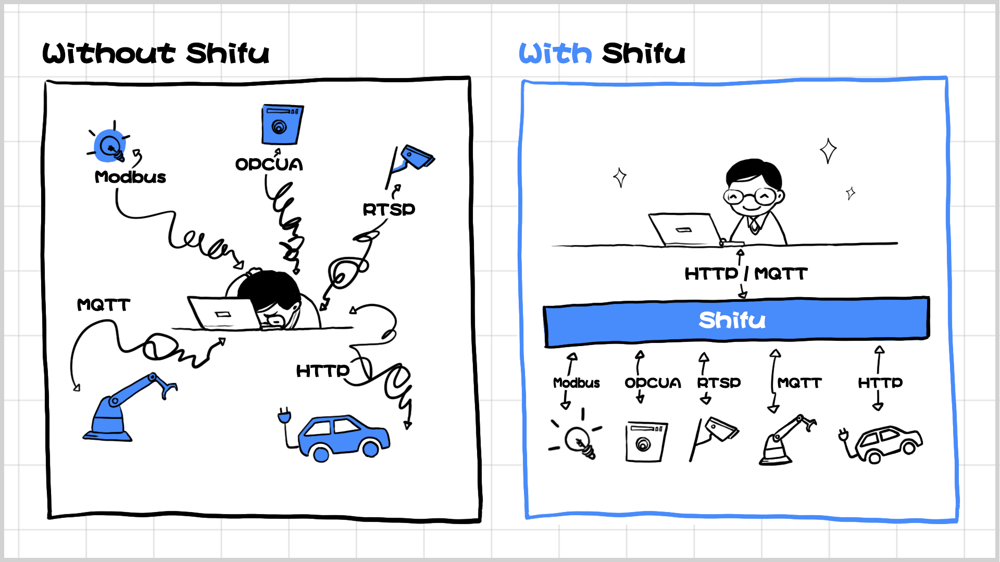
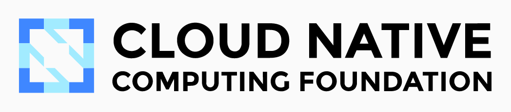
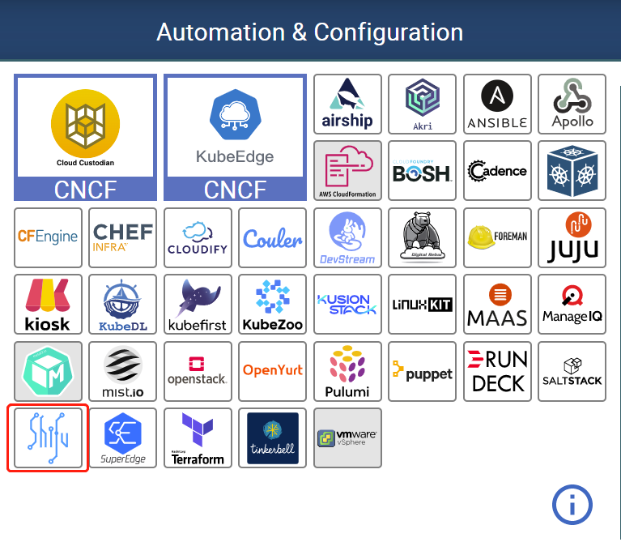

[中文](README-zh.md) | English

 

</img>

<h1 style="border-bottom: none">
 
    Open Source Industrial Edge
     
</h1>
Shifu is a Kubernetes native, production-grade, protocol & vendor agnostic IoT development framework.

    
    &nbsp;
    
    &nbsp;
    
     &nbsp;
    

## Features
**Kubernetes native** — developing your application while managing your devices, spare the need for maintaining an additional O&M infrastructure.

**Open Platform** — No vendor lock-in. You can easily deploy Shifu on the edge(from RaspberryPi to edge clusters) or on the cloud(public, private and hybrid cloud are all supported).

**Protocol agnostic** — HTTP, MQTT, RTSP, Siemens S7, TCP socket, OPC UA...The microservice architecture of Shifu enables it to quickly adapt to new protocols.

</img>

## How to connect a proprietary-protocol camera with five lines of code

</img>

</img>

## Community

Welcome to the Shifu community to share your thoughts and ideas! Any suggestion will be deeply valued.
We couldn't be more excited to have you.

## Get Started

Welcome to check 🗒️[Shifu Documentation](https://shifu.dev/) for detailed information on:
- 🔧[Install](https://shifu.dev/docs/guides/install/install-shifu-dev)
- 🔌[Connect devices](https://shifu.dev/docs/guides/cases/)
- 👨‍💻[Application Development](https://shifu.dev/docs/guides/application/)

## Contributing

Feel free to [create an issue](https://github.com/Edgenesis/shifu/issues/new/choose) or [submit a pull request](https://github.com/Edgenesis/shifu/pulls)!

We will forever be grateful to all the [contributors](https://github.com/Edgenesis/shifu/graphs/contributors).

## Shifu is officially a [CNCF landscape project](https://landscape.cncf.io/)

</img>

</img>

## Stargazers over time

## License
This project is distributed under Apache 2.0 License.
