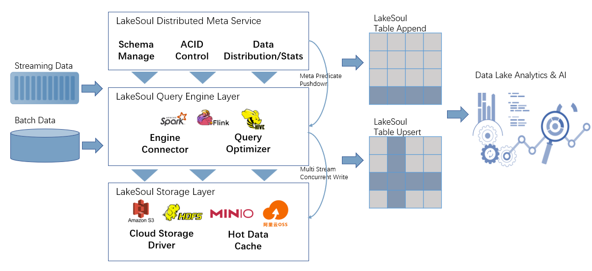

[中文介绍](README-CN.md)

# LakeSoul
LakeSoul is a cloud-native Lakehouse framework developed by [DMetaSoul](https://www.dmetasoul.com) team, and supports scalable metadata management, ACID transactions, efficient and flexible upsert operation, schema evolution, and unified streaming & batch processing.

LakeSoul implements incremental upserts for both row and column and allows concurrent updates. LakeSoul uses LSM-Tree like structure to support updates on hash partitioning table with primary key, and achieve very high write throughput (30MB/s/core) on cloud object store like S3 while providing optimized merge on read performance. LakeSoul scales metadata management and achieves ACID control by using PostgreSQL. LakeSoul provides tools to ingest CDC and log streams automatically in a zero-ETL style.

More detailed features please refer to our doc page: [Documentations](https://www.dmetasoul.com/en/docs/lakesoul/intro/)

# Quick Start
Follow the [Quick Start](https://www.dmetasoul.com/en/docs/lakesoul/Getting%20Started/setup-local-env/) to quickly set up a test env.

# Tutorials
Please find tutorials in doc site:
[Tutorials](https://www.dmetasoul.com/en/docs/lakesoul/Tutorials/consume-cdc-via-spark-streaming/)

* Checkout [LakeSoul Flink CDC Whole Database Synchronization Tutorial](https://www.dmetasoul.com/en/docs/lakesoul/Tutorials/flink-cdc-sink/) on how to sync an entire MySQL database into LakeSoul in realtime, with auto table creation, auto DDL sync and exactly once guarantee.
* Checkout [Multi Stream Merge and Build Wide Table Tutorial](https://www.dmetasoul.com/en/docs/lakesoul/Tutorials/mutil-stream-merge/) on how to merge multiple stream with same primary key (and different other columns) concurrently without join.
* Checkout [Upsert Data and Merge UDF Tutorial](https://www.dmetasoul.com/en/docs/lakesoul/Tutorials/upsert-and-merge-udf/) on how to upsert data and Merge UDF to customize merge logic.
* Checkout [Snapshot API Usage](https://www.dmetasoul.com/en/docs/lakesoul/Tutorials/snapshot-manage/) on how to do snapshot read (time travel), snapshot rollback and cleanup.

# Usage Documentations
Please find usage documentations in doc site:
[Usage Doc](https://www.dmetasoul.com/en/docs/lakesoul/Usage%20Doc/setup-meta-env/)

[快速开始](https://www.dmetasoul.com/docs/lakesoul/Getting%20Started/setup-local-env/)

[教程](https://www.dmetasoul.com/docs/lakesoul/Tutorials/consume-cdc-via-spark-streaming/)

[使用文档](https://www.dmetasoul.com/docs/lakesoul/Usage%20Doc/setup-meta-env/)

# Feature Roadmap
* Meta Management ([#23](https://github.com/meta-soul/LakeSoul/issues/23))
  - [x] Multiple Level Partitioning: Multiple range partition and at most one hash partition
  - [x] Concurrent write with auto conflict resolution
  - [x] MVCC with read isolation
  - [x] Write transaction (two-stage commit) through Postgres Transaction
  - [x] Schema Evolution: Column add/delete supported
* Table operations 
  - [x] LSM-Tree style upsert for hash partitioned table
  - [x] Merge on read for hash partition with upsert delta file
  - [x] Copy on write update for non hash partitioned table
  - [x] Compaction
* Data Warehousing
  - [x] CDC stream ingestion with auto ddl sync
  - [x] Incremental and Snapshot Query
    - [x] Snapshot Query ([#103](https://github.com/meta-soul/LakeSoul/issues/103))
    - [x] Incremental Query ([#103](https://github.com/meta-soul/LakeSoul/issues/103))
    - [x] Incremental Streaming Source ([#130](https://github.com/meta-soul/LakeSoul/issues/130))
  - [ ] Materialized View
    - [ ] Incremental MV Build
    - [ ] Auto query rewrite
* Spark Integration
  - [x] Table/Dataframe API
  - [x] SQL support with catalog except upsert
  - [x] Query optimization
    - [x] Shuffle/Join elimination for operations on primary key
  - [x] Merge UDF (Merge operator)
  - [ ] Merge Into SQL support
    - [x] Merge Into SQL with match on Primary Key (Merge on read)
    - [ ] Merge Into SQL with match on non-pk
    - [ ] Merge Into SQL with match condition and complex expression (Merge on read when match on PK) (depends on [#66](https://github.com/meta-soul/LakeSoul/issues/66))
  - [x] Multiple Spark Versions Support
    - [x] Support Spark 3.3, 3.2 and 3.1
* Flink Integration and CDC Ingestion ([#57](https://github.com/meta-soul/LakeSoul/issues/57))
  - [x] Table API
  - [x] Flink CDC
    - [x] Exactly Once Sink
    - [x] Auto Schema Change (DDL) Sync
    - [x] Auto Table Creation (depends on #78)
    - [x] Support multiple source tables with different schemas ([#84](https://github.com/meta-soul/LakeSoul/issues/84))
* Hive Integration
  - [x] Export to Hive partition after compaction
  - [x] Apache Kyuubi (Hive JDBC) Integration
* Realtime Data Warehousing
  - [x] CDC ingestion
  - [x] Time Travel (Snapshot read)
  - [x] Snapshot rollback
  - [ ] MPP Engine Integration (depends on [#66](https://github.com/meta-soul/LakeSoul/issues/66))
    - [ ] Presto
    - [ ] Apache Doris
* Cloud and Native IO ([#66](https://github.com/meta-soul/LakeSoul/issues/66))
  - [x] Object storage IO optimization
  - [ ] Native merge on read
  - [ ] Multi-layer storage classes support with data tiering
  

# Opensource License
LakeSoul is opensourced under Apache License v2.0.

## 官方项目地址
https://github.com/meta-soul/LakeSoul