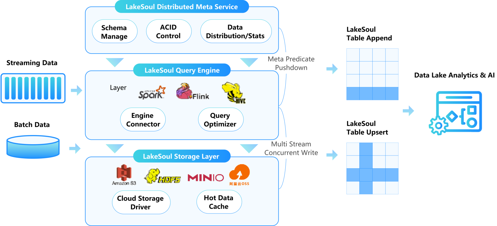

[中文介绍](README-CN.md)

LakeSoul is a cloud-native Lakehouse framework that supports scalable metadata management, ACID transactions, efficient and flexible upsert operation, schema evolution, and unified streaming & batch processing.

LakeSoul was originally created by DMetaSoul company and was donated to Linux Foundation AI & Data as a sandbox project since May 2023.

LakeSoul implements incremental upserts for both row and column and allows concurrent updates.

LakeSoul uses LSM-Tree like structure to support updates on hash partitioning table with primary key, and achieves very high write throughput while providing optimized merge on read performance (refer to [Performance Benchmarks](https://lakesoul-io.github.io/blog/2023/04/21/lakesoul-2.2.0-release)). LakeSoul scales metadata management and achieves ACID control by using PostgreSQL.

LakeSoul supports concurrent batch or streaming read and write. Both read and write supports CDC semantics, and together with auto schema evolution and exacly-once guarantee, constructing realtime data warehouses is made easy.

More detailed features please refer to our doc page: [Documentations](https://lakesoul-io.github.io/docs/intro)

# Quick Start
Follow the [Quick Start](https://lakesoul-io.github.io/docs/Getting%20Started/setup-local-env) to quickly set up a test env.

# Tutorials
Please find tutorials in doc site:

* Checkout [LakeSoul Flink CDC Whole Database Synchronization Tutorial](https://lakesoul-io.github.io/docs/Tutorials/flink-cdc-sink) on how to sync an entire MySQL database into LakeSoul in realtime, with auto table creation, auto DDL sync and exactly once guarantee.
* Checkout [Flink SQL Usage](https://lakesoul-io.github.io/docs/Usage%20Docs/flink-lakesoul-connector) on using Flink SQL to read or write LakeSoul in both batch and streaming mode, with the supports of Flink Changelog Stream semantics and row-level upsert and delete.
* Checkout [Multi Stream Merge and Build Wide Table Tutorial](https://lakesoul-io.github.io/docs/Tutorials/mutil-stream-merge) on how to merge multiple stream with same primary key (and different other columns) concurrently without join.
* Checkout [Upsert Data and Merge UDF Tutorial](https://lakesoul-io.github.io/docs/Tutorials/upsert-and-merge-udf) on how to upsert data and Merge UDF to customize merge logic.
* Checkout [Snapshot API Usage](https://lakesoul-io.github.io/docs/Tutorials/snapshot-manage) on how to do snapshot read (time travel), snapshot rollback and cleanup.
* Checkout [Incremental Query Tutorial](https://lakesoul-io.github.io/docs/Tutorials/incremental-query) on how to do incremental query in Spark in batch or stream mode.

# Usage Documentations
Please find usage documentations in doc site:
[Usage Doc](https://lakesoul-io.github.io/docs/Usage%20Docs/setup-meta-env)

[快速开始](https://lakesoul-io.github.io/zh-Hans/docs/Getting%20Started/setup-local-env)

[教程](https://lakesoul-io.github.io/zh-Hans/docs/Tutorials/flink-cdc-sink)

[使用文档](https://lakesoul-io.github.io/zh-Hans/docs/Usage%20Docs/setup-meta-env)

# Feature Roadmap
* Meta Management ([#23](https://github.com/lakesoul-io/LakeSoul/issues/23))
  - [x] Multiple Level Partitioning: Multiple range partition and at most one hash partition
  - [x] Concurrent write with auto conflict resolution
  - [x] MVCC with read isolation
  - [x] Write transaction (two-stage commit) through Postgres Transaction
  - [x] Schema Evolution: Column add/delete supported
* Table operations 
  - [x] LSM-Tree style upsert for hash partitioned table
  - [x] Merge on read for hash partition with upsert delta file
  - [x] Copy on write update for non hash partitioned table
  - [x] Compaction
* Data Warehousing
  - [x] CDC stream ingestion with auto ddl sync
  - [x] Incremental and Snapshot Query
    - [x] Snapshot Query ([#103](https://github.com/lakesoul-io/LakeSoul/issues/103))
    - [x] Incremental Query ([#103](https://github.com/lakesoul-io/LakeSoul/issues/103))
    - [x] Incremental Streaming Source ([#130](https://github.com/lakesoul-io/LakeSoul/issues/130))
    - [x] Flink Stream/Batch Source
  - [ ] Materialized View
    - [ ] Incremental MV Build
    - [ ] Auto query rewrite
* Data Science
  -[ ] Native Python Reader (without PySpark)
* Spark Integration
  - [x] Table/Dataframe API
  - [x] SQL support with catalog except upsert
  - [x] Query optimization
    - [x] Shuffle/Join elimination for operations on primary key
  - [x] Merge UDF (Merge operator)
  - [ ] Merge Into SQL support
    - [x] Merge Into SQL with match on Primary Key (Merge on read)
    - [ ] Merge Into SQL with match on non-pk
    - [ ] Merge Into SQL with match condition and complex expression (Merge on read when match on PK) (depends on [#66](https://github.com/lakesoul-io/LakeSoul/issues/66))
* Flink Integration and CDC Ingestion ([#57](https://github.com/lakesoul-io/LakeSoul/issues/57))
  - [x] Table API
    - [x] Batch/Stream Sink
    - [x] Batch/Stream source
    - [x] Stream Source/Sink for ChangeLog Stream Semantics
    - [x] Exactly Once Source and Sink
  - [x] Flink CDC
    - [x] Auto Schema Change (DDL) Sync
    - [x] Auto Table Creation (depends on #78)
    - [x] Support sink multiple source tables with different schemas ([#84](https://github.com/lakesoul-io/LakeSoul/issues/84))
* Hive Integration
  - [x] Export to Hive partition after compaction
  - [x] Apache Kyuubi (Hive JDBC) Integration
* Realtime Data Warehousing
  - [x] CDC ingestion
  - [x] Time Travel (Snapshot read)
  - [x] Snapshot rollback
  - [x] Automatic global compaction service
  - [ ] MPP Engine Integration (depends on [#66](https://github.com/lakesoul-io/LakeSoul/issues/66))
    - [ ] Presto/Trino
* Data Science Integration
  - [ ] Native Python Reader
* Cloud and Native IO ([#66](https://github.com/lakesoul-io/LakeSoul/issues/66))
  - [x] Object storage IO optimization
  - [x] Native merge on read
  - [ ] Multi-layer storage classes support with data tiering

# Community guidelines
[Community guidelines](community-guideline.md)

# Feedback and Contribution
Please feel free to open an issue or dicussion if you have any questions.

Join our [Discord](https://discord.gg/WJrHKq4BPf) server for discussions.

# Contact Us
Email us at [lakesoul-technical-discuss@lists.lfaidata.foundation](mailto:lakesoul-technical-discuss@lists.lfaidata.foundation).

# Opensource License
LakeSoul is opensourced under Apache License v2.0.
