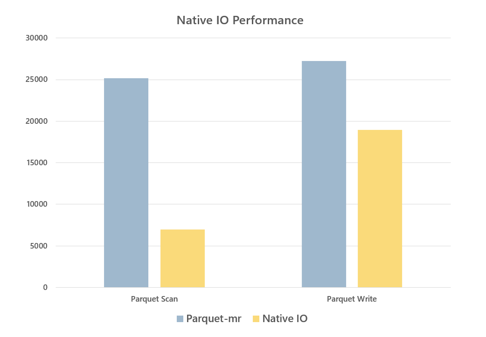
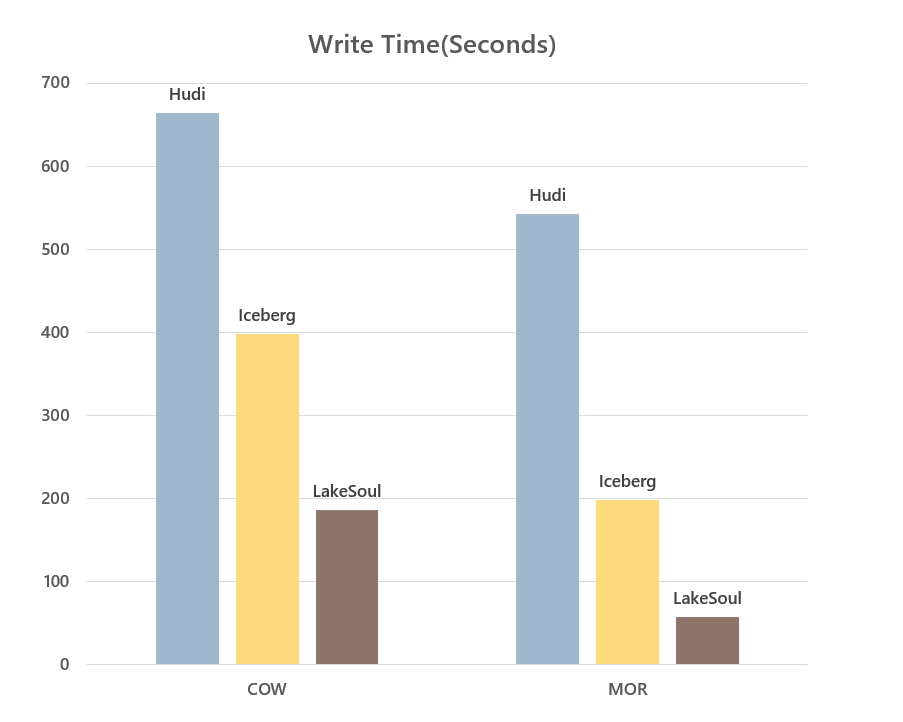
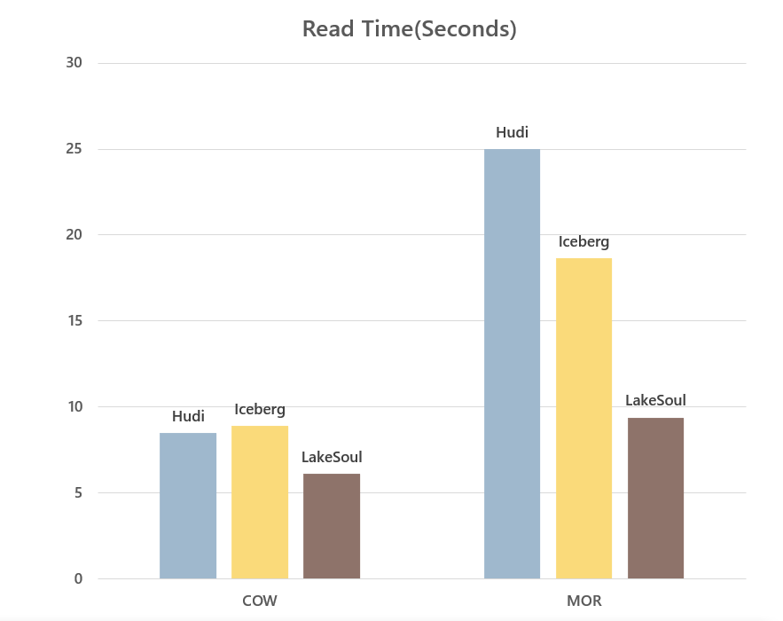

# What's new in version 2.2.0

Recently, after months of research and development, LakeSoul released version 2.2.0([Github Release Notes](https://github.com/lakesoul-io/LakeSoul/releases/tag/v2.2.0)). The most important upgrade in this version is that the new Native IO is enabled by default in both Spark and Flink, and LakeSoul's performance has once again significantly been improved and expanded its performance leadership advantage in the field of Cloud Native Data Lakehouse.This article provides you with a detailed explanation of the updates to LakeSoul version 2.2.0 and the technical details of Native IO.

## LakeSoul Version 2.2.0 Update Content

In version 2.2.0, LakeSoul implemented a brand-new Native IO, migrating full and incremental read-write logic to the new IO layer, and conducting extensive performance and correctness testing. The new IO layer was enabled by default in Spark and Flink.

Version 2.2.0 also released several new interfaces in Spark, such as [snapshot reading, rollback and cleaning](https://lakesoul-io.github.io/docs/Tutorials/snapshot-manage), [incremental batch reading, and incremental streaming reading](https://lakesoul-io.github.io/docs/Tutorials/incremental-query), which more perfectly supports the high-performance streaming incremental ETL data modeling process. Below, we will provide a detailed explanation of these new improvements and feature points.

### 1. Native IO Detailed Explanation

As a Cloud Native Data Lakehouse Framework, the read-write performance of  HDFS and Cloud storage is the top priority. LakeSoul supports the feature of streaming and batch integration, and supports Upsert update writing and Merge on Read reading for the primary key table in storage. The implementation of the IO layer has complexity. Previously, LakeSoul's Upsert writing mainly relied on computational frameworks for implementation. For example, in Spark, the primary key needs to be shuffled and sorted by Spark before being written to storage. When reading, a set of orderly file merging Reader is implemented in Spark. This implementation brings several issues:

1. Performance has room for optimization. LakeSoul primary key model adopts a hash bucket to store in an ordered manner, which does not need to merge with history during Upsert writing, resulting in high write throughput. However, MOR reading requires the orderly merging of multiple files, which has a greater impact on read performance in the case of more files, especially in the scenario of high latency object storage, and needs to be optimized.
2. The original solution is tightly coupled with Spark, making it inconvenient to reuse read-write logic in other computing engines such as Flink, especially the more complex MOR read logic.
3. The original solution was implemented in Java, which does not facilitate interfacing with computational engines implemented in other languages such as C++.

Considering the above issues, LakeSoul chose to use Native Code (Rust language) to re-implement the read-write logic of IO layer and provide CFFI based interface to the upper layer to facilitate further encapsulation in other languages such as Java, Python, etc., so as to interface with the computing engine. The specific design and implementation includes the following points:

1. Using Apache Arrow and Rust

   LakeSoul uses Parquet as the physical storage format, so we choose to use Arrow as the in-memory intermediate representation layer for IO. On the one hand, Arrow is a mature in-memory column format with rich library support, such as Rust's implementation of Arrow-rs, and on the other hand, the column format is chosen to gain vectorization acceleration capability and can be easily interfaced with vectorization computation engines.

   LakeSoul relies on Arrow's Rust implementation, namely [arrow-rs](https://github.com/apache/arrow-rs), which already includes Parquet Reader, Writer, and object_store abstraction layer, and can well support cloud-native object stores such as S3. The main reason for choosing Rust implementation is that Rust has better support for asynchronous, and the operations on object stores can be implemented as async interfaces, which can be further optimized for IO in an asynchronous way.

2. LakeSoul Native Writer

   LakeSoul's Native Writer implements single-file concurrent writes through the [MultipartUpload](https://docs.amazonaws.cn/en_us/AmazonS3/latest/userguide/mpuoverview.html) function encapsulated in Arrow-rs' object_store library. Specifically, a Parquet file can be organized into multiple RowGroups, each of which is serialized in memory as a contiguous buffer in advance. LakeSoul submits a RowGroup buffer as a part of object storage and asynchronously uploads it to the backend thread. At the same time, the computing thread can continue to organize the content of the next RowGroup, thus achieving concurrent writing of a single file on object storage. 

   LakeSoul Native Writer supports sorting primary keys on write, using the [Arrow DataFusion](https://github.com/apache/arrow-datafusion) library's Sort implementation, which supports spilling the intermediate results of the sort to disk so that Writer can support large amounts of data writes, which is important in Flink Sink. The reason is that primary key sorting only sorts the same batch of written files, while LakeSoul's Flink Sink only writes files when Flink performs a checkpoint, which can be a long interval between checkpoints. With disk overflow writes, the problem of OOM due to excessive memory consumption is avoided.

   MultipartUpload with object stores also has the advantage of eliminating the overhead of staging intermediate files and copying files at commit time. staging files were originally designed to avoid incomplete writes to the target table or partition directory, which could cause incomplete data to be read downstream. Both Flink and Spark need to write the staging file in a temporary directory first, and then rename the temporary directory to the final target directory when committing, which brings additional overhead for overwriting, especially when the object store does not support atomic renaming, and requires a complete copy of the data. And the Staging file also makes maintaining Flink Sink state more complex. LakeSoul supports the abort operation of MultipartUpload, which aborts the unwritten file if the write is cancelled in the middle, and LakeSoul's metadata layer implements a two-stage commit protocol in Spark and Flink to ensure consistency.

3. LakeSoul Native Reader

   In the Reader section, we have optimized the object store for accessing Parquet files and MOR for merging multiple ordered files.

   Object storage typically has high latency, the object_store library in arrow-rs has been optimized for small request merges (coalesce) and concurrent requests, but the results are still not good enough in our actual tests. Therefore, we made further optimizations in two areas:

   One is to split read requests into multiple concurrent requests. The underlying object storage is actually the HTTP protocol, and you can specify the range of object files to be accessed in the HTTP request body. We limit the range size of a single request to 8M, and requests larger than 8M are automatically split into multiple concurrent requests to avoid long blocking waits caused by accessing too large a range of files in one request.

   The second optimization is to do background asynchronous prefetching of Parquet's RowGroup, again to allow the compute and IO threads to work simultaneously, masking latency with prefetching. By default, a RowGroup is prefetched to avoid taking up too much memory.

   For MOR ordered merging, we implement multiple Arrow RecordBatch asynchronous streams merging based on arrow-rs. The implementation uses the Row Format provided by arrow-rs to optimize the performance of comparing primary key order relationships and interleave to optimize the performance of merging multiple streams into one RecordBatch.

4. Spark, Flink Engine Interfacing with Native IO Layer

   As mentioned earlier, the Native IO layer is implemented in Rust. On top of it, we encapsulate a C interface to provide read and write functionality. Both synchronous blocking and asynchronous callbacks are supported for reads, so that the upper layer can choose according to its needs (for writes only the blocking interface is provided, because the underlying layer has already done the concurrency of Multipart uploads). On top of the C interface, the Java interface is implemented using [jnr-ffi](https://github.com/jnr/jnr-ffi). Finally, the Reader and Writer interfaces are implemented on the Spark and Flink sides respectively.

5. LakeSoul IO Performance Review

   LakeSoul's Native IO layer implements vectorized read and write to Parquet file format, and does asynchronous concurrency, prefetching and other performance optimizations for object storage. The direct read and write to Parquet files has significant performance improvement over the native parquet-mr and Hadoop S3A implementations in Spark and Flink:

   

   We also did a read/write performance comparison of LakeSoul with Hudi and Iceberg in COW and MOR scenarios. The evaluation scenario is to first write 10 million lines of data and then Upsert 10 times, 2 million lines each time. The data and code for this performance evaluation are publicly available in the [performance evaluation code base](https://github.com/meta-soul/ccf-bdci2022-datalake-contest-examples/tree/mor). The performance comparison is as follows:

   

   In terms of write performance, for COW mode, all three frameworks require full rewrite data, and the computational overhead is basically the same, LakeSoul is the best with the Native IO optimization. For MOR mode, LakeSoul uses the primary key bucketing mode, which does not need to maintain index updates, so it achieves high write throughput, significantly better than the other two frameworks.

   

   In terms of read performance, for COW mode, both read the merged file without merge overhead, LakeSoul also benefits from IO layer optimization to get ahead. For MOR mode, although LakeSoul's ordered merge has a theoretical performance disadvantage compared to Hudi's bloom filter filter and Iceberg's pos-delete filter, LakeSoul still has a 1X read performance lead over Iceberg with several optimizations in the IO layer.

   It is worth mentioning that LakeSoul has the smallest CPU and memory consumption among the three frameworks in the read and write process. In addition, LakeSoul's MOR read, after splitting incremental data into 100 Upsert writes, the read performance only decreases by about 15%, which means LakeSoul can guarantee better read performance even with high frequency writes without compaction.

### 2. Introduction to Snapshot and Incremental Read Functions

LakeSoul 2.2.0 provides a series of new interfaces for snapshot, incremental scenarios. lakeSoul uses MVCC multi-version control mechanism, which records the files corresponding to each version in the metadata. Therefore, it is easy to support snapshot reading (also known as Time Travel), which means reading the snapshot version of data at a previous point in time. LakeSoul can also support rollback to a point in time, so that if there is a problem with the latest data, it can be restored to the previous correct version.

For snapshot read, snapshot rollback and snapshot cleanup, users only need to provide the snapshot timestamp, expressed as a timestamp string, e.g. `"2022-01-01 15:15:15"`, the timestamp does not need to strictly correspond to the actual write time, this time will be used as the upper bound of the timestamp of the write version, and LakeSoul will automatically find the snapshot corresponding to a timestamp less than or equal to this version.

Snapshot-related function points can be found in the [snapshot usage tutorial](https://lakesoul-io.github.io/docs/Tutorials/snapshot-manage).

LakeSoul also provides incremental reads. In streaming ETL, the incremental read function is of great significance. Incremental read can convert the entire ETL link to incremental computing, improve real-time performance, and save computing resources.LakeSoul 2.2.0 supports incremental batch reads and incremental streaming reads in Spark. When incremental streaming read, LakeSoul will act as Spark's Streaming data source and automatically discover and read incremental data of the table. For details, please refer to the [incremental query tutorial](https://lakesoul-io.github.io/docs/Tutorials/incremental-query).

It is worth mentioning that, unlike Hudi and Iceberg, LakeSoul can support incremental reads for both primary and non-primary key tables, and for LakeSoul CDC tables ([refer to LakeSoul CDC table format](https://lakesoul-io.github.io/docs/Tutorials/flink-cdc-sink)), it can also read incremental CDC streams, which represent incremental changes to the LakeSoul table itself, including insert, update and delete operations, enabling flexible downstream incremental computation. In the next release, LakeSoul will support incremental reading of LakeSoul table CDC as Flink ChangeLog Stream, which can be used for efficient incremental ETL development with Flink SQL.

## Summary

LakeSoul 2.2.0 releases a new Native IO that further extends the performance benefits of the cloud-native LakeSoul framework domain. Snapshot and incremental interfaces are provided to better support streaming data modeling development.

In the next release, LakeSoul will release global automatic Compaction, Flink Stream SQL Source and other important features, so stay tuned.

