# LakeSoul Flink CDC 整库同步使用教程

LakeSoul Flink CDC Sink 支持从 MySQL 数据源整库同步到 LakeSoul，能够支持自动建表、自动 Schema 变更、Exactly Once 语义等。

详细使用文档请参考 [LakeSoul Flink CDC 整库千表同步](../../03-Usage%20Docs/05-flink-cdc-sync.md)

这个教程中，我们完整地演示从将一个 MySQL 库整库同步到 LakeSoul 中，涵盖自动建表、DDL 变更等操作。

## 1. 准备环境

### 1.1 启动一个本地 MySQL 数据库
推荐使用 MySQL Docker 镜像来快速启动一个 MySQL 数据库实例：
```bash
docker run --name lakesoul-test-mysql -e MYSQL_ROOT_PASSWORD=root -e MYSQL_DATABASE=test_cdc -p 3306:3306 -d mysql:8
```

### 1.2 配置 LakeSoul 元数据库以及 Spark 环境
这部分请参考 [搭建本地测试环境](../../01-Getting%20Started/01-setup-local-env.md)

然后启动一个 `spark-sql` SQL 交互式查询命令行环境：
```bash
$SPARK_HOME/bin/spark-sql --conf spark.sql.extensions=com.dmetasoul.lakesoul.sql.LakeSoulSparkSessionExtension --conf spark.sql.catalog.lakesoul=org.apache.spark.sql.lakesoul.catalog.LakeSoulCatalog --conf spark.sql.defaultCatalog=lakesoul --conf spark.sql.warehouse.dir=/tmp/lakesoul --conf spark.dmetasoul.lakesoul.snapshot.cache.expire.seconds=10
```

:::tip
这里启动 Spark 本地任务，增加了两个选项：
1. spark.sql.warehouse.dir=/tmp/lakesoul
   设置这个参数是因为 Spark SQL 中默认表保存位置，需要和 Flink 作业产出目录设置为同一个目录。
2. spark.dmetasoul.lakesoul.snapshot.cache.expire.seconds=10
   设置这个参数是因为 LakeSoul 在 Spark 中缓存了元数据信息，设置一个较小的缓存过期时间方便查询到最新的数据。
:::

启动 Spark SQL 命令行后，可以执行：
```sql
SHOW DATABASES;
SHOW TABLES IN default;
```

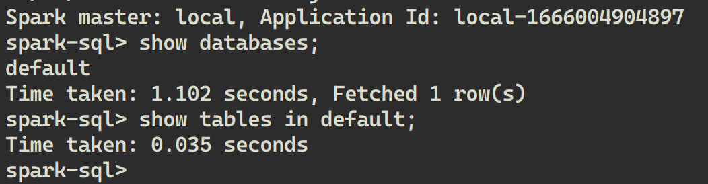 

可以看到 LakeSoul 中目前只有一个 `default` database，其中也没有表。

### 1.3 预先在 MySQL 中创建一张表并写入数据
1. 安装 mycli
   ```bash
   pip install mycli
   ```
2. 启动 mycli 并连接 MySQL 数据库
   ```bash
   mycli mysql://root@localhost:3306/test_cdc -p root
   ```
3. 创建表并写入数据
   ```sql
   CREATE TABLE mysql_test_1 (id INT PRIMARY KEY, name VARCHAR(255), type SMALLINT);
   INSERT INTO mysql_test_1 VALUES (1, 'Bob', 10);
   SELECT * FROM mysql_test_1;
   ```

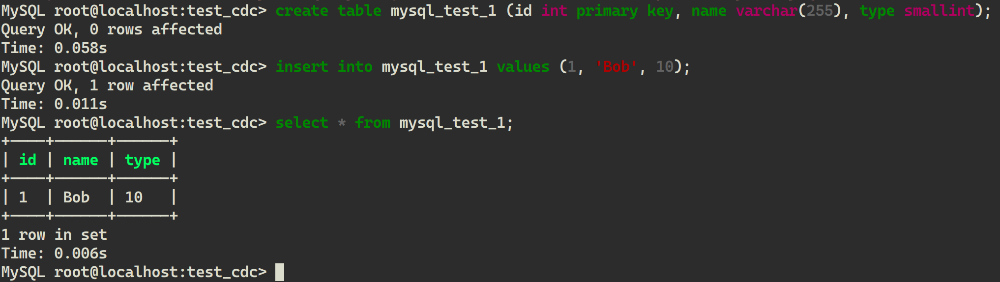  

## 2. 启动同步作业

### 2.1 启动一个本地的 Flink Cluster
可以从 Flink 下载页面下载 [Flink 1.14.5](https://archive.apache.org/dist/flink/flink-1.14.5/flink-1.14.5-bin-scala_2.12.tgz)，也可以从我们的[国内镜像地址下载](https://dmetasoul-bucket.obs.cn-southwest-2.myhuaweicloud.com/releases/lakesoul/flink-1.14.5-bin-scala_2.12.tgz)（与Apache官网完全相同）。

解压下载的 Flink 安装包：
```bash
tar xf flink-1.14.5-bin-scala_2.12.tgz
export FLINK_HOME=${PWD}/flink-1.14.5
```

然后启动一个本地的 Flink Cluster：
```bash
$FLINK_HOME/bin/start-cluster.sh
```

可以打开 http://localhost:8081 查看 Flink 本地 cluster 是否已经正常启动：
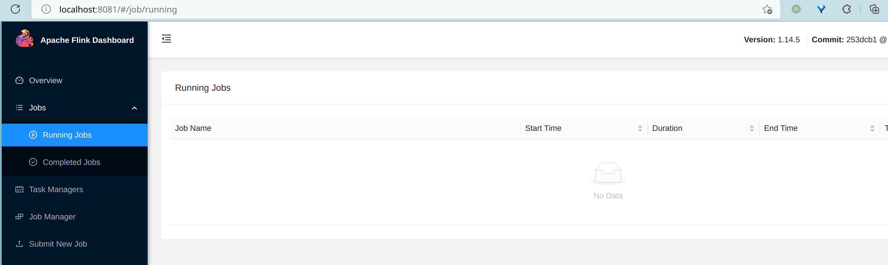  


### 2.2 提交 LakeSoul Flink CDC Sink 作业

向上面启动的 Flink cluster 提交一个 LakeSoul Flink CDC Sink 作业：
```bash
./bin/flink run -ys 1 -yjm 1G -ytm 2G \
   -c org.apache.flink.lakesoul.entry.MysqlCdc \
   lakesoul-flink-2.3.0-flink-1.14.jar \
   --source_db.host localhost \
   --source_db.port 3306 \
   --source_db.db_name test_cdc \
   --source_db.user root \
   --source_db.password root \
   --source.parallelism 1 \
   --sink.parallelism 1 \
   --warehouse_path file:/tmp/lakesoul \
   --flink.checkpoint file:/tmp/flink/chk \
   --flink.savepoint file:/tmp/flink/svp \
   --job.checkpoint_interval 10000 \
   --server_time_zone UTC
```

其中 lakesoul-flink 的 jar 包可以从 [Github Release](https://github.com/lakesoul-io/LakeSoul/releases/) 页面下载。如果访问 Github 有问题，也可以通过这个链接下载：https://dmetasoul-bucket.obs.cn-southwest-2.myhuaweicloud.com/releases/lakesoul/lakesoul-flink-2.3.0-flink-1.14.jar

在 http://localhost:8081 Flink 作业页面中，点击 Running Job，进入查看 LakeSoul 作业是否已经处于 `Running` 状态。

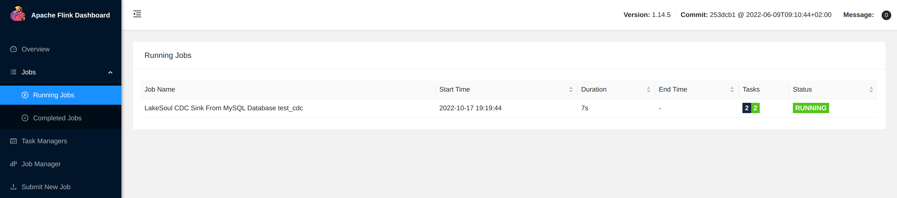  

可以点击进入作业页面，此时应该可以看到已经同步了一条数据：
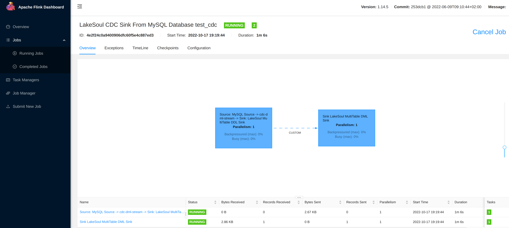  

### 2.3 使用 Spark SQL 读取 LakeSoul 表中已经同步的数据

在 Spark SQL Shell 中执行：
```sql
SHOW DATABASES;
SHOW TABLES IN test_cdc;
DESC test_cdc.mysql_test_1;
SELECT * FROM test_cdc.mysql_test_1;
```

可以看到每条语句的运行结果，即 **LakeSoul 中自动新建了一个 `test_cdc` database，其中自动新建了一张 `mysql_test_1` 表，表的字段、主键与 MySQL 相同**（多了一个 rowKinds 列，参考 [LakeSoul CDC 表](../../03-Usage%20Docs/04-cdc-ingestion-table.mdx)中的说明）。

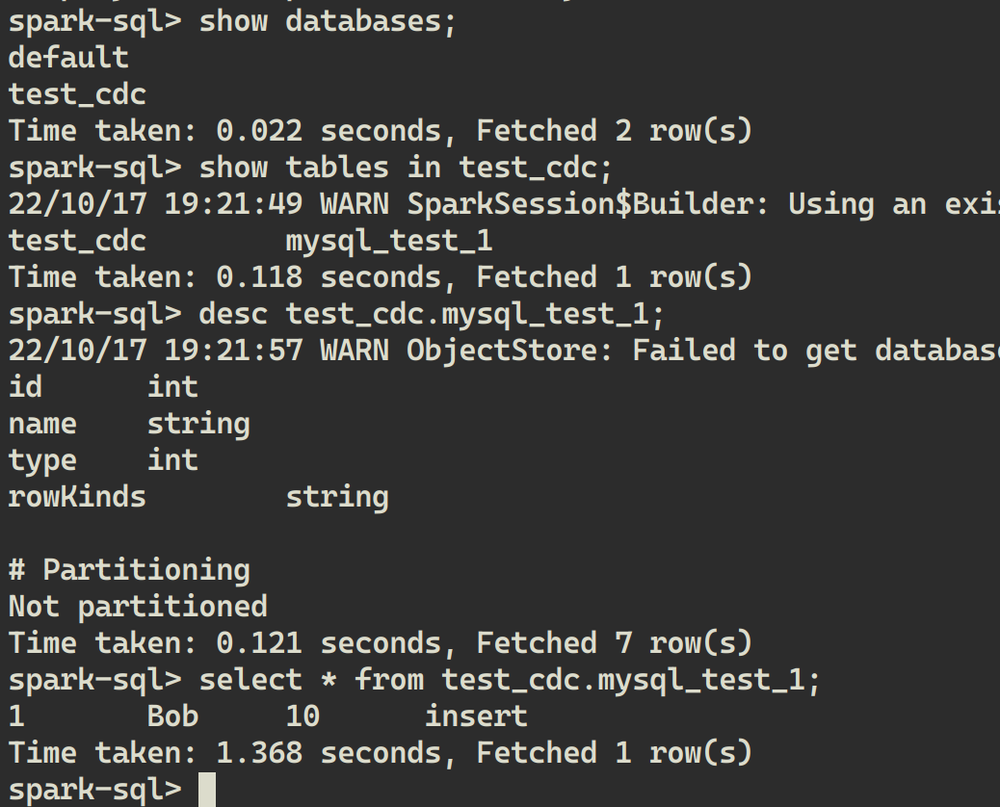  

### 2.4 MySQL 中执行 Update 后观察同步情况
在 mycli 中执行更新：
```sql
UPDATE mysql_test_1 SET name='Peter' WHERE id=1;
```

然后在 LakeSoul 中再次读取：
```sql
SELECT * FROM test_cdc.mysql_test_1;
```

可以看到已经读到了最新的数据：
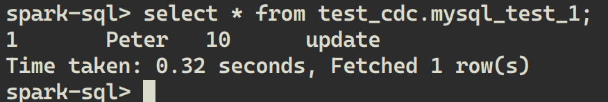  

### 2.5 MySQL 中执行 DDL 后观察同步情况，并读取新、旧数据
在 mycli 中修改表的结构：
```sql
ALTER TABLE mysql_test_1 ADD COLUMN new_col FLOAT;
```

即在最后新增一列，默认为 null。在 mycli 中验证执行结果：
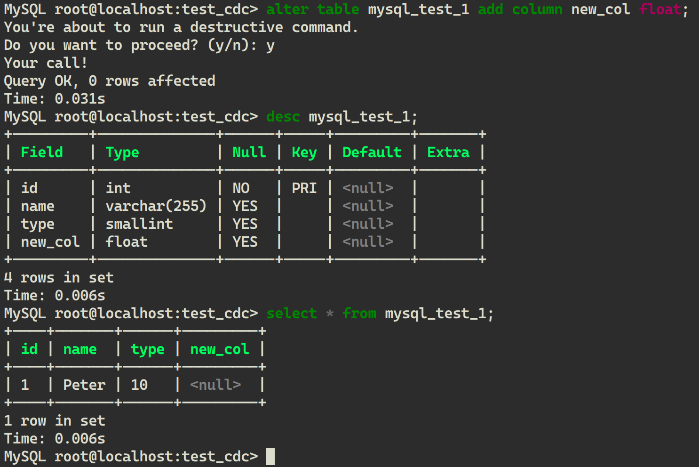  

此时，LakeSoul 中已经同步了表结构，我们可以在 spark-sql 中查看表结构：
```sql
DESC test_cdc.mysql_test_1;
```

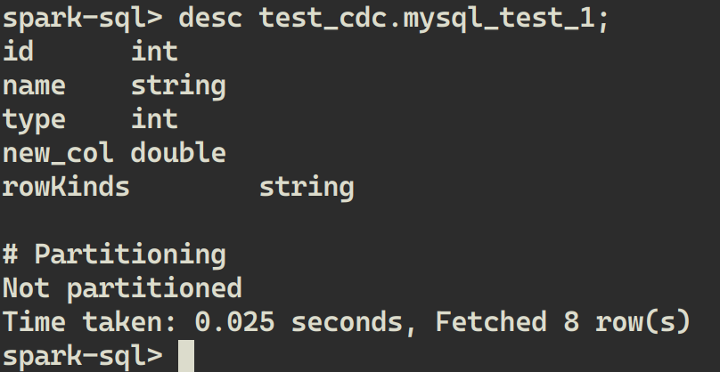  

这时，从 LakeSoul 中读取数据，新增列同样为 null：
```sql
SELECT * FROM test_cdc.mysql_test_1;
```

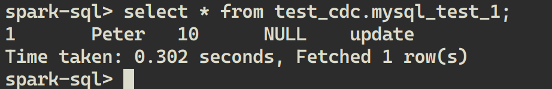  

向 MySQL 中新插入一条数据：
```sql
INSERT INTO mysql_test_1 VALUES (2, 'Alice', 20, 9.9);
```
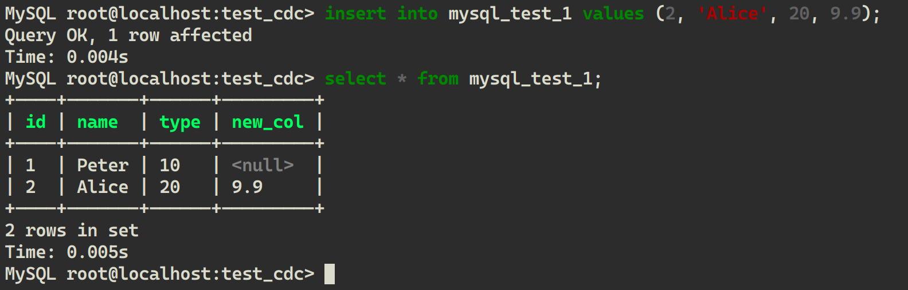  

从 LakeSoul 中再次读取：
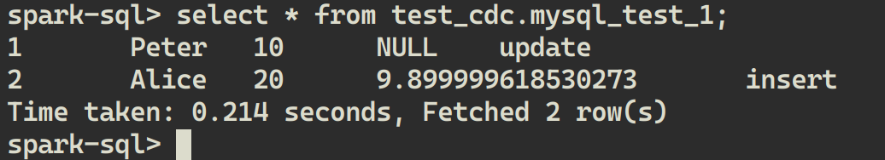  

从 MySQL 中删除一条数据：
```sql
delete from mysql_test_1 where id=1;
```

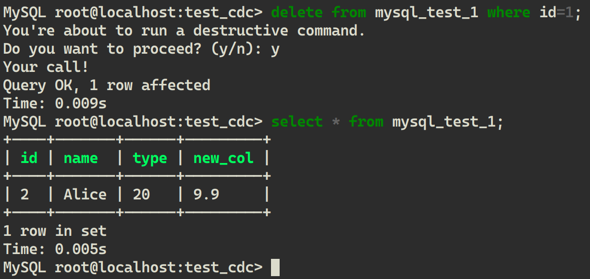  

从 LakeSoul 中读取：
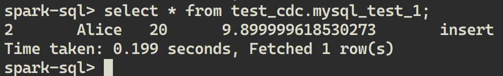  


**可以看到 LakeSoul 每次都读取到了同步后的结果，与 MySQL 中完全一致。**

### 2.6 MySQL 中新建表后观察同步情况
在 MySQL 中新建一张表，schema 与之前表不同：
```sql
CREATE TABLE mysql_test_2 (name VARCHAR(100) PRIMARY KEY, phone_no VARCHAR(20));
```
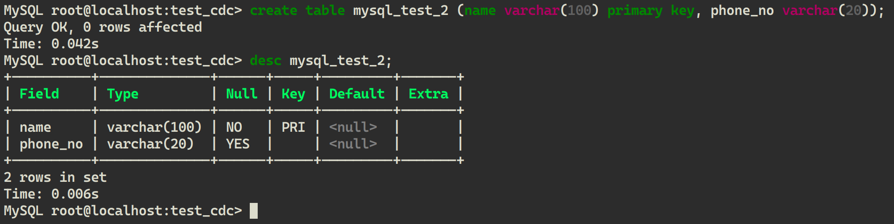  

在 LakeSoul 可以看到新表已经自动创建，可以查看表结构：
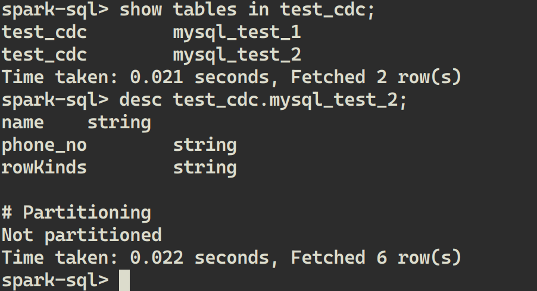  

往 MySQL 新表中插入一条数据：
```sql
INSERT INTO mysql_test_2 VALUES ('Bob', '10010');
```

LakeSoul 中也成功同步并读取到新表的数据：
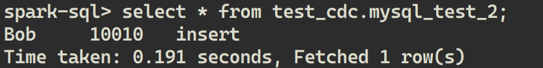  