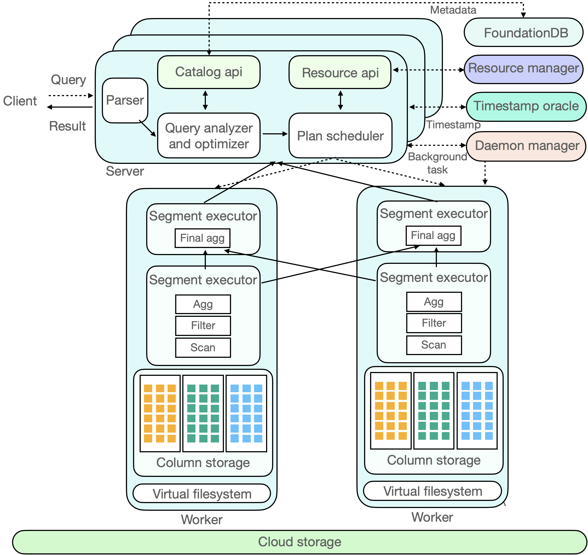

# ByConity

<p align="center">
    
</p>

ByConity is a data warehouse designed for changes in modern cloud architecture. It adopts a cloud-native architecture design to meet the requirements of data warehouse users for flexible scaling, separation of reads and writes, resource isolation, and strong data consistency. At the same time, it provides excellent query and write performance.

ByConity is using a large number of mature OLAP technologies, such as column storage engine, MPP execution, intelligent query optimization, vectorized execution, Codegen, indexing, and data compression; it also makes special technological innovations for the cloud scenarios and storage-computing separation architecture.

ByConity is built on top of [ClickHouse](https://github.com/ClickHouse/ClickHouse). We appreciate the excellent work of the ClickHouse team.

## Try ByConity

You can quickly bring up a ByConity playground by following this simple [guide](https://github.com/ByConity/byconity-docker).

A minimal ByConity cluster include:

- A [FoundationDB](https://www.foundationdb.org/) database cluster to store meta data.
- An [HDFS](https://hadoop.apache.org/docs/r1.2.1/hdfs_design.html) cluster to store data.
- A ByConity server to receive request from clients.
- A ByConity read worker to carry execution of read requests forward from server.
- A ByConity write worker to carry execution of write requests forward from server.
- A ByConity TSO server to provide timestamp.
- A ByConity daemon manager to manage background jobs that run in server.

## Build ByConity

The easiest way to build ByConity is built in [docker](https://github.com/ByConity/ByConity/tree/master/docker/builder). ByConity executable file depend on Foundation DB library `libfdb_c.so`. So in order to run it, we need to install the FoundationDB client package. This [link](https://apple.github.io/foundationdb/getting-started-linux.html) tells how to install. We can download client package from FoundationDB GitHub release pages, for example [here](https://github.com/apple/foundationdb/releases/tag/7.1.0). 

It can also be built through the following operating systems in physical machine:

- Linux

### 1. Prepare Prerequisites

The following packages are required:

- Git
- CMake 3.17 or newer
- Ninja
- C++ compiler: clang-11 or clang-12
- Linker: lld

```sh
sudo apt-get update
sudo apt-get install git cmake ccache python3 ninja-build libssl-dev libsnappy-dev apt-transport-https

# install llvm 12
sudo apt install lsb-release wget software-properties-common gnupg # pre-requisites of llvm.sh
wget https://apt.llvm.org/llvm.sh
chmod +x llvm.sh
sudo ./llvm.sh 12
```

### 2. Checkout Source Code

```sh
git clone --recursive https://github.com/ByConity/ByConity.git
```

### 3. Build

```sh
cd ByConity
mkdir build && cd build
export CC=clang-12
export CXX=clang++-12
cmake ..
ninja
```

Then you can find the binary in the programs folder

```sh
clickhouse-client    # byconity client
clickhouse-server    # byconity server
clickhouse-worker    # byconity worker
tso_server           # byconity tso
daemon_manager       # byconity daemon manager
resource_manager     # byconity resource manager
```

## Run ByConity Locally

The most convinience way for local development is to use `docker-compose`. You can use `docker-compose` to quickly create a [byconity cluster](/docker/local-deploy/README.md) from your local build binary. By using this approach, you do not need to worry about the setup of ByConity dependencies (FoundationDB and HDFS), it automatically launches them all. It is recommended to use this approach for ByConity development.

## Deploy ByConity in cluster

There are ways to deploy ByConity to physical machines:

- Deploy using [package manager](https://byconity.github.io/docs/deployment/package-deployment)
- Deploy via docker [wrapper](https://byconity.github.io/docs/deployment/docker-wrapper)

## Test ByConity in development enviroment

To test ByConity in development enviroment, follow this [guide](https://github.com/ByConity/ByConity/tree/master/Testing.md).

## 项目官网地址
https://github.com/ByConity/ByConity
