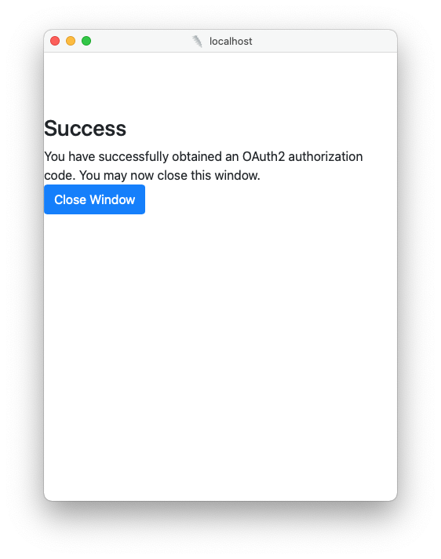

# OAuth2.0 Authentication in Drill
Many APIs use OAuth2.0 as a means of authentication. Drill can connect to APIs that use OAuth2 for authentication but OAuth2 is significantly more complex than simple 
username/password authentication.

The good news, and bottom line here is that you can configure Drill to handle all this automagically, but you do have to understand how to configure it so that it works. First, 
let's get a high level understanding of how OAuth works.  Click here to [skip to the section on configuring Drill](#configure-drill).

### Understanding the OAuth2 Process
There are many tutorials as to how OAuth works which we will not repeat here.  There are some slight variations but this is a good enough high level overview so you will understand the process works. 
Thus, we will summarize the process as four steps:

#### Step 1:  Obtain an Authorization Code
For the first step, a user will have to log into the API's front end, and authorize the application to access the API.  The API will issue you a `clientID` and a 
`client_secret`.  We will use these tokens in later stages.  

You will also need to provide the API with a `callbackURL`.  This URL is how the API sends your application the `authorizationCode` which we will use in step 2.  
Once you have the `clientID` and the `callbackURL`, your application will make a `GET` request to the API to obtain the `authorizationCode`. 

#### Step 2:  Swap the Authorization Code for an Access Token
At this point, we need to obtain the `accessToken`.  We do so by sending a `POST` request to the API with the `clientID`, the `clientSecret` and the `authorizationCode` we 
obtained in step 1.  Note that the `authorizationCode` is a short lived token, but the `accessToken` lasts for a longer period.  When the access token expires, you may need to 
either re-authorize the application or use a refresh token to obtain a new one.

#### Step 3:  Call the Protected Resource with the Access Token
Once you have the `accessToken` you are ready to make authenticated API calls. All you have to do here is add the `accessToken` to the API header and you can make API calls 
just like any other. 

#### Step 4: (Optional) Obtain a new Access Token using the Refresh Token
Sometimes, the `accessToken` will expire.  When this happens, the API will respond with a `401` not authorized response. When this happens, the application will make a `POST` 
request containing the `clientSecret`, the `clientID` and the `refreshToken` and will obtain new tokens.

## The Artifacts
Unlike simple username/password authentication, there are about 5 artifacts that you will need to authenticate using OAuth and it is also helpful to understand where they come 
from and to whom they "belong".  Let's start with the artifacts that you will need to manually obtain from the API when you register your application:  (These are not the Drill 
config variables, but the names are similar.  More on that later.)
* `clientID`:  A token to uniquely identify your application with the API.
* `clientSecret`:  A sort of password token which will be used to obtain additional tokens.
* `callbackURL`:  The URL to which access and refresh tokens will be sent. You have to provide this URL when you register your application with the API.  If this does not match 
  what you provide the API, the calls will fail.
* `scope`:  An optional parameter which defines the scope of access request for the given access token. The API will provide examples, but you have to pick what accesses you 
  are requesting.

You will need to find two URLs in the API documentation:

* `authorizationURL`:  This is the URL from which you will request the `authorizationCode`.  You should find this in the API documentation.
* `tokenURL`: The URL from which you can request the `accessToken`. 

There are two other artifacts that you will need, but these artifacts are generated by the API.  One thing to note is that while all the other artifacts are owned by the 
application, these two are unique (and "owned by") the user.  These artifacts are:
* `accessToken`: The token which is used to grant access to a protected resource
* `refreshToken`: The token used to obtain a new `accessToken` without having to re-authorize the application.

Currently, Drill does not allow per-user credentials.  However, future work may permit this.

<h1 id="configure-drill">Configuring Drill for OAuth</h1>
Configuring Drill to connect to OAuth2.0 enabled APIs is a little complicated as part of the configuration parameters are stored in the REST plugin and others are stored in the 
credentialProvider.

To use OAuth2.0, you will have to create an `oAuthConfig` in the plugin configuration.  Within the `oAuthConfig`, define the `callbackURL` and `authorizationURL` parameters:
* The `authorizationURL` is provided by the API and is the URL where the authorization code is obtained. 
* The `callbackURL` parameter is the URL where the API will send the access token.  You must provide this when you register and obtain your client ID and client secret.  This 
  will be in the format: `http(s)://<your drill host>/storage/<storage plugin name>update_oauth2_authtoken`
* (Optional)`scope`: The scope parameter limits the scope of your access.  This is something which can be found in the remote API documentation.

### The Credential Provider
The actual tokens are stored using Drill's Credential Provider.  In addition to the `oAuthConfig` section of the plugin configuration, you must also add a section for the 
`credentialProvider` as shown in the example below.  At a minimum, that section must contain:
* `clientID`
* `clientSecret`
* `tokenURI`

All those parameters are provided by the API once you register.  Currently, only the `PlainCredentialProvider` is supported for this, but future work will likely include the 
`VaultCredentialProvider`.  

## Obtaining the Access Token
Once you have set up the configuration, you will see an additional button labeled `Get Access Token` at the bottom of the configuration screen.


If everything is configured correctly, you will be taken to your API's authentication page, where the user will be asked to authenticate with the API and grant your application 
permission to access protected resources.  Once the user does this, you will see the window below:


When you close that window, you will see an updated configuration which includes the access and refresh tokens.  At this point you are ready to query!

## Example Configuration
The example configuration below demonstrates how to connect Drill to the API available at clickup.com.
```json
{
  "type": "http",
  "connections": {
    "team": {
      "url": "https://api.clickup.com/api/v2/team",
      "requireTail": false,
      "method": "GET",
      "headers": {
        "Content-Type": "application/json"
      },
      "dataPath": "teams",
      "authType": "none",
      "inputType": "json",
      "xmlDataLevel": 1,
      "verifySSLCert": true
    }
  },
  "proxyType": "direct",
  "oAuthConfig": {
    "callbackURL": "http://localhost:8047/storage/clickup/update_oath2_authtoken",
    "authorizationURL": "https://app.clickup.com/api"
  },
  "credentialsProvider": {
    "credentialsProviderType": "PlainCredentialsProvider",
    "credentials": {
      "clientID": "<your client ID>",
      "clientSecret": "<your client secret>",
      "tokenURI": "https://app.clickup.com/api/v2/oauth/token"
    }
  },
  "enabled": true
}

```

## Optional Parameters
There are a few optional parameters in the OAuth config which you may need to set in order for Drill to successfully.  These parameters are completely optional.

* `tokenType`:  Some OAuth enabled APIs provide a `Bearer` token.  If that is the case, this should be set to `Bearer`.
* `authorizationParams`:  A key value parameters which are sent during the authentication process.
